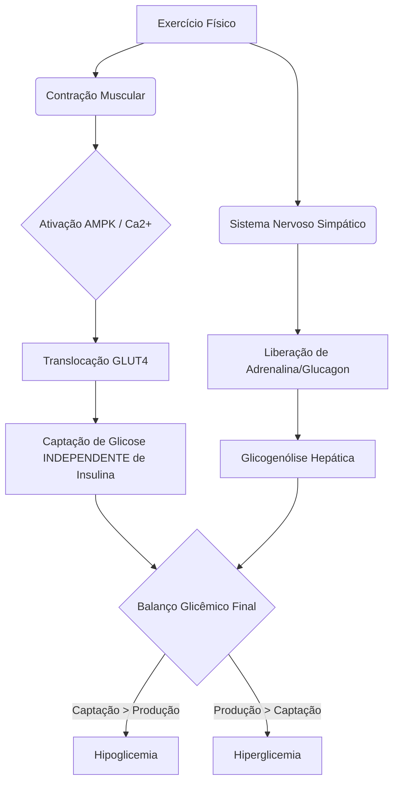

# Documento 08 — Exercício Físico e Diabetes

> [!CAUTION]
> **AVISO MÉDICO E DE SEGURANÇA**
> Este documento constitui um material de referência técnica para o desenvolvimento de sistemas de suporte à decisão clínica (Clinical Decision Support Systems - CDSS). As recomendações aqui descritas baseiam-se em diretrizes internacionais (ADA, ISPAD, SBD), mas não substituem o julgamento médico individualizado. Pacientes com diabetes devem sempre consultar suas equipes de saúde antes de iniciar ou alterar rotinas de exercícios, ajustar doses de insulina ou modificar ingestão de carboidratos. O sistema Amanda Bot V4 atuará como um co-piloto educacional e de monitoramento, não como um prescritor médico autônomo.

---

## 1. Fisiologia do Exercício e Glicemia

O exercício físico impõe um desafio metabólico agudo ao organismo, exigindo uma orquestração complexa entre a utilização de substratos energéticos e a regulação hormonal. Em indivíduos sem diabetes, a secreção de insulina é rapidamente suprimida, enquanto hormônios contrarreguladores (glucagon, catecolaminas, cortisol e GH) aumentam para prevenir a hipoglicemia e garantir o aporte de glicose aos músculos em atividade. No diabetes tipo 1 (DM1) e no diabetes tipo 2 avançado insulinodependente, a insulina exógena circulante não diminui automaticamente, criando um descompasso fisiológico severo.

### Mecanismos de Consumo de Glicose Durante o Exercício

Durante a contração muscular, a demanda por Adenosina Trifosfato (ATP) aumenta exponencialmente. O músculo utiliza sequencialmente:
1. ATP armazenado e Creatina Fosfato (primeiros segundos).
2. Glicogênio muscular local (glicólise).
3. Glicose plasmática e ácidos graxos livres circulantes.

### Papel da Insulina e do Glucagon no Exercício

- **Insulina:** Em condições normais, a queda da insulina no sangue venoso portal permite que o fígado libere glicose. No DM1, o nível de insulina (Insulin on Board - IOB) depende da última administração. Se o IOB for alto (hiperinsulinemia sistêmica), a produção hepática de glicose é bloqueada, levando à hipoglicemia rápida.
- **Glucagon:** Principal hormônio estimulador da glicogenólise (quebra de glicogênio) e gliconeogênese (formação de nova glicose) hepática. No DM1 de longa data, a resposta do glucagon à hipoglicemia mediada por exercício é frequentemente abolida (falência autonômica associada à hipoglicemia).

### GLUT4 e Ativação Muscular

A captação de glicose pela célula muscular ocorre via transportadores GLUT4.
Existem duas vias principais para a translocação do GLUT4 para a membrana celular:
1. **Via dependente de Insulina:** Ativada em repouso e no período pós-prandial.
2. **Via dependente de Contração (Independente de Insulina):** O aumento do cálcio intracelular e a ativação da enzima AMPK (Proteína Quinase Ativada por AMP) induzida pelo estresse mecânico translocam o GLUT4 de forma independente da presença de insulina.

**Fórmula Glicêmica Simplificada do Exercício:**
`Δ Glicemia = (Taxa de Aparecimento de Glicose Hepática) - (Taxa de Desaparecimento de Glicose Muscular)`



### Glicólise Anaeróbica vs. Aeróbica

- **Aeróbica (Presença de O2):** Queima contínua de glicose e lipídios. Alta eficiência na produção de ATP. Reduz a glicemia de forma constante.
- **Anaeróbica (Ausência/Déficit de O2):** Exercícios de alta intensidade e curta duração. Depende exclusivamente da glicólise muscular, gerando lactato. O intenso estresse dispara catecolaminas (adrenalina), o que causa uma superprodução hepática de glicose, frequentemente resultando em hiperglicemia transitória.

### Mobilização de Glicogênio Hepático e Muscular

O fígado possui cerca de 100g de glicogênio (usado para manter a glicemia sistêmica). Os músculos possuem cerca de 400g (usado exclusivamente pelo próprio músculo, pois carecem da enzima glicose-6-fosfatase). A depleção destas reservas determina o impacto tardio do exercício na sensibilidade à insulina (fenômeno de reposição bifásica).

---

## 2. Tipos de Exercício e Impacto Glicêmico

Abaixo está o mapeamento detalhado dos 10 perfis de atividade física previstos no sistema para parametrização do motor de regras.

### 2.1 Musculação (Resistência / Treino de Força)
- **Tipo de metabolismo:** Predominantemente Anaeróbico e Misto (dependendo do tempo de intervalo).
- **Impacto na glicemia durante o exercício:** Estável ou leve elevação (devido ao estresse adrenérgico localizado).
- **Impacto pós-exercício imediato (0-2 horas):** Queda gradual à medida que o músculo começa a repor glicogênio.
- **Impacto pós-exercício tardio (2-24 horas):** Alta elevação da sensibilidade à insulina (risco significativo de hipoglicemia noturna devido à reparação das microlesões musculares e hipertrofia).
- **Recomendações de glicemia inicial:** 120 - 180 mg/dL.
- **Ajuste de bolus pré-exercício:** Redução de 25-50% do bolus da refeição se ocorrer nas 2h anteriores.
- **Ajuste de basal (bomba) ou basal temporária:** Geralmente não necessita redução durante o treino; considerar redução de 10-20% na madrugada seguinte.
- **Risco de hipoglicemia:** Baixo durante, Moderado-Alto na madrugada (tardio).
- **Estratégia de snack preventivo:** Se <100 mg/dL no início, 10-15g de CHO simples. Para evitar queda noturna, ceia com CHO complexo e proteína.

### 2.2 Corrida (Moderada, 60-70% FCmax)
- **Tipo de metabolismo:** Aeróbico estrito.
- **Impacto na glicemia durante o exercício:** Queda rápida e acentuada. Consumo contínuo de glicose circulante.
- **Impacto pós-exercício imediato (0-2 horas):** Queda contínua (necessidade iminente de reposição se IOB > 0).
- **Impacto pós-exercício tardio (2-24 horas):** Aumento moderado da sensibilidade à insulina por até 12-16 horas.
- **Recomendações de glicemia inicial:** 150 - 200 mg/dL (com tendência de alta no CGM, preferencialmente).
- **Ajuste de bolus pré-exercício:** Redução drástica de 50-75% do bolus prandial prévio.
- **Ajuste de basal (bomba) ou basal temporária:** Reduzir 50-80% da basal, iniciando 60 a 90 minutos **ANTES** do início da corrida.
- **Risco de hipoglicemia:** MUITO ALTO durante e imediato.
- **Estratégia de snack preventivo:** Se < 150 mg/dL iniciar com 15-20g CHO. Ingerir 10-15g CHO a cada 30-45 minutos de corrida contínua.

### 2.3 Corrida Intensa (>80% FCmax / Sprints)
- **Tipo de metabolismo:** Anaeróbico Lático.
- **Impacto na glicemia durante o exercício:** Elevação (pico hiperglicêmico por ação das catecolaminas suplantando o consumo muscular).
- **Impacto pós-exercício imediato (0-2 horas):** Queda vertiginosa assim que a adrenalina cessa e os transportadores GLUT4 continuam ativos na membrana.
- **Impacto pós-exercício tardio (2-24 horas):** Alta sensibilidade sistêmica para reposição de glicogênio profundo.
- **Recomendações de glicemia inicial:** 120 - 180 mg/dL.
- **Ajuste de bolus pré-exercício:** Redução de 25-50%.
- **Ajuste de basal (bomba) ou basal temporária:** Redução de 20-40% 1h antes. Não suspender basal completamente, para não agravar o pico hiperglicêmico adrenérgico.
- **Risco de hipoglicemia:** Baixo durante, Alto no pós-imediato.
- **Estratégia de snack preventivo:** Evitar CHO simples antes, a menos que glicemia <100 mg/dL (dar 10g CHO).

### 2.4 Caminhada
- **Tipo de metabolismo:** Aeróbico leve.
- **Impacto na glicemia durante o exercício:** Queda moderada.
- **Impacto pós-exercício imediato (0-2 horas):** Estabilização rápida.
- **Impacto pós-exercício tardio (2-24 horas):** Retorno rápido à sensibilidade basal normal.
- **Recomendações de glicemia inicial:** 100 - 150 mg/dL.
- **Ajuste de bolus pré-exercício:** Redução de 25-30% se a caminhada for logo após a refeição (Caminhada Pós-Prandial).
- **Ajuste de basal (bomba) ou basal temporária:** Desnecessário para durações <45 min. Para caminhadas longas, reduzir 20-30%.
- **Risco de hipoglicemia:** Moderado se IOB for alto (logo após refeição).
- **Estratégia de snack preventivo:** Se < 100 mg/dL, ingerir 15g CHO.

### 2.5 HIIT (High-Intensity Interval Training)
- **Tipo de metabolismo:** Misto (picos anaeróbicos intercalados com recuperação aeróbica).
- **Impacto na glicemia durante o exercício:** Altamente variável. A alternância cria um efeito estabilizador ("efeito âncora" do sprint sobre a queda aeróbica). Glicemia costuma ficar estável.
- **Impacto pós-exercício imediato (0-2 horas):** Risco de queda aguda após o resfriamento.
- **Impacto pós-exercício tardio (2-24 horas):** Elevado risco de hipoglicemia noturna severa devido ao EPOC (Excesso de Consumo de Oxigênio Pós-Exercício) elevado.
- **Recomendações de glicemia inicial:** 130 - 180 mg/dL.
- **Ajuste de bolus pré-exercício:** Redução de 50%.
- **Ajuste de basal (bomba) ou basal temporária:** Redução de 30-50% 1h antes; manter redução de 20% por até 2-4h após.
- **Risco de hipoglicemia:** Médio durante, MUITO ALTO tardiamente.
- **Estratégia de snack preventivo:** Se <120 mg/dL, 15g CHO antes. Lanche noturno (proteína + gordura + CHO complexo) obrigatório se feito à noite.

### 2.6 Pedalar (Ciclismo)
- **Tipo de metabolismo:** Predominantemente Aeróbico (Pode ser Misto em subidas ou sprints).
- **Impacto na glicemia durante o exercício:** Queda sustentada e profunda. O recrutamento dos grandes grupos musculares das pernas (quadríceps, glúteos) consome glicose maciçamente.
- **Impacto pós-exercício imediato (0-2 horas):** Queda contínua severa.
- **Impacto pós-exercício tardio (2-24 horas):** Sensibilidade aumentada por 12-24h.
- **Recomendações de glicemia inicial:** 150 - 200 mg/dL.
- **Ajuste de bolus pré-exercício:** Redução de 50-75%.
- **Ajuste de basal (bomba) ou basal temporária:** Reduzir 50-80% cerca de 90 min antes. Em passeios longos (>2h), pode ser necessário reduzir 80-100% (suspensão temporária intermitente).
- **Risco de hipoglicemia:** Extremo (o maior consumidor de glicose contínuo).
- **Estratégia de snack preventivo:** Reposição ativa intra-treino: 15-30g de CHO a cada hora de pedal, independentemente da glicemia inicial se IOB > 0.

### 2.7 Natação
- **Tipo de metabolismo:** Aeróbico / Resistência (Misto dependendo da intensidade).
- **Impacto na glicemia durante o exercício:** Queda severa. Agravado pela temperatura da água (água fria aumenta gasto calórico para termorregulação).
- **Impacto pós-exercício imediato (0-2 horas):** Queda continuada.
- **Impacto pós-exercício tardio (2-24 horas):** Sensibilidade elevada.
- **Recomendações de glicemia inicial:** 150 - 180 mg/dL.
- **Ajuste de bolus pré-exercício:** Redução de 50%.
- **Ajuste de basal (bomba) ou basal temporária:** Usuários de bomba muitas vezes precisam desconectar. A desconexão não deve ultrapassar 1.5h a 2h para evitar DKA (Cetoacidose Diabética).
- **Risco de hipoglicemia:** Muito alto (e perigoso pelo ambiente aquático e perda de sensibilidade aos sintomas).
- **Estratégia de snack preventivo:** Ingerir 15-20g CHO antes de entrar na água se < 150 mg/dL. Checar a cada 30-45 min.

### 2.8 Futebol / Esportes de Quadra (Basquete, Tênis, Vôlei)
- **Tipo de metabolismo:** Misto intermitente (sprints curtos e trotes/paradas).
- **Impacto na glicemia durante o exercício:** Tende à estabilidade inicial, seguida de queda acentuada no segundo tempo/final da partida devido à depleção de glicogênio.
- **Impacto pós-exercício imediato (0-2 horas):** Risco acentuado de hipoglicemia.
- **Impacto pós-exercício tardio (2-24 horas):** Efeito prolongado de sensibilidade.
- **Recomendações de glicemia inicial:** 140 - 180 mg/dL.
- **Ajuste de bolus pré-exercício:** Redução de 30-50%.
- **Ajuste de basal (bomba) ou basal temporária:** Redução de 30-50% 1h antes.
- **Risco de hipoglicemia:** Moderado no início, Alto no final e pós-jogo.
- **Estratégia de snack preventivo:** Uso de bebidas isotônicas em pequenos goles durante as pausas (10g CHO/hora) se glicemia começar a cair no CGM.

### 2.9 Yoga / Pilates
- **Tipo de metabolismo:** Resistência isométrica / Aeróbico de baixíssima intensidade.
- **Impacto na glicemia durante o exercício:** Estável ou queda muito leve. Algumas modalidades (Bikram/Hot Yoga) podem causar estresse térmico e elevar ligeiramente a glicemia.
- **Impacto pós-exercício imediato (0-2 horas):** Estável.
- **Impacto pós-exercício tardio (2-24 horas):** Melhoria basal da sensibilidade, sem riscos agudos de hipo.
- **Recomendações de glicemia inicial:** 100 - 140 mg/dL.
- **Ajuste de bolus pré-exercício:** Sem alteração ou redução mínima (10-20%).
- **Ajuste de basal (bomba) ou basal temporária:** Geralmente não é necessário.
- **Risco de hipoglicemia:** Baixo.
- **Estratégia de snack preventivo:** Apenas se glicemia < 90 mg/dL no início (10-15g CHO).

### 2.10 Esportes de Combate (Jiu-Jitsu, Boxe, Muay Thai)
- **Tipo de metabolismo:** Misto extremo (Alta intensidade anaeróbica intercalada com força isométrica e aeróbica).
- **Impacto na glicemia durante o exercício:** Forte liberação de adrenalina, frequentemente causando HIPERGLICEMIA severa durante o treino, mascarando o brutal consumo de glicogênio muscular subjacente.
- **Impacto pós-exercício imediato (0-2 horas):** Queda abrupta ("crash") da glicemia assim que a adrenalina cai no vestiário.
- **Impacto pós-exercício tardio (2-24 horas):** Elevadíssimo risco de hipoglicemia tardia por dano/reparo muscular e reposição de reservas.
- **Recomendações de glicemia inicial:** 130 - 180 mg/dL.
- **Ajuste de bolus pré-exercício:** Redução de 30-50%.
- **Ajuste de basal (bomba) ou basal temporária:** Redução de 30-50% prévia. Atenção: usuários de bomba geralmente devem desconectar para evitar danos ao equipo no combate corpo-a-corpo. Reconectar imediatamente ao fim.
- **Risco de hipoglicemia:** Falsa segurança (hiperglicemia intra-treino) seguida de altíssimo risco de queda imediata e tardia.
- **Estratégia de snack preventivo:** Não corrigir a hiperglicemia durante o treino com insulina rápida. O "crash" pós-treino exige carboidrato complexo na primeira refeição pós-exercício.

---

## 3. Glicemia de Referência para Início do Exercício

As diretrizes do ISPAD e da ADA fornecem faixas de segurança rígidas para o início seguro da atividade física.

### Tabela de Glicemia Alvo por Tipo de Exercício

| Tipo de Exercício | Alvo Ideal Inicial (mg/dL) | Tendência (Seta CGM) Desejada | Risco Iminente Associado |
| :--- | :--- | :--- | :--- |
| Aeróbico Contínuo | 150 - 200 | ↗️ ou ➡️ | Hipoglicemia rápida |
| Anaeróbico / Força | 120 - 180 | ➡️ | Hiperglicemia adrenérgica |
| Misto (HIIT, Luta) | 130 - 180 | ➡️ | Efeito montanha-russa |
| Atividades Aquáticas | 150 - 200 | ↗️ ou ➡️ | Hipo assintomática na água |

### Protocolos de Ação baseados na Glicemia Inicial

- **Se Glicemia < 90 mg/dL antes do exercício:**
  - **Ação:** NÃO iniciar o exercício.
  - **Conduta:** Ingerir 15 a 30g de carboidratos de rápida absorção (ex: glicose líquida, suco, jujubas).
  - **Espera:** Aguardar 15-20 minutos. Testar novamente. Iniciar apenas quando > 100 mg/dL e com tendência estável ou de alta.

- **Se Glicemia > 250 mg/dL antes do exercício:**
  - **Ação:** Checar cetonas imediatamente (sangue ou urina).
  - **Sem Cetonas (< 0.6 mmol/L):** O exercício PODE ser realizado. Recomenda-se atividade aeróbica leve a moderada. Evitar anaerobic intenso. Corrigir com 50% do fator de sensibilidade habitual para não causar "stacking" de insulina com o efeito do exercício.
  - **Com Cetonas Leves (0.6 a 1.5 mmol/L):** Exercício vigoroso CONTRAINDICADO. Risco de deficiência severa de insulina. Pode fazer caminhada leve enquanto resolve a hiperglicemia.
  - **Com Cetonas Moderadas/Altas (> 1.5 mmol/L):** EXERCÍCIO TOTALMENTE CONTRAINDICADO. O exercício nesta fase agravará a cetogênese (o fígado receberá sinais de estresse e produzirá mais corpos cetônicos, precipitando uma cetoacidose diabética - DKA). Administrar insulina de correção, hidratar vigorosamente e aguardar resolução.

> [!WARNING]
> **O Mito de "Queimar o Açúcar":** Orientar o paciente a correr ou fazer exercícios extenuantes para "baixar a glicose de 300 mg/dL" sem checar cetonas é um erro grave e letal, podendo precipitar uma DKA aguda.

---

## 4. Hipoglicemia Induzida por Exercício

A hipoglicemia é a barreira mais formidável para a prática esportiva no DM1.

### Fases de Risco:
1. **Hipoglicemia Durante (Intra-treino):** Causada por IOB excessivo (insulina de refeição ativa) ou falha na redução da basal. Ocorre principalmente em exercícios aeróbicos.
2. **Hipoglicemia Pós-Exercício Imediata (0-2h):** Os transportadores GLUT4 continuam inseridos na membrana plasmática das células musculares por até 2 horas, "sugando" glicose sanguínea mesmo sem insulina, enquanto o fígado está exausto de liberar glicogênio.
3. **Hipoglicemia Pós-Exercício Tardia / Noturna (PELOH - Post-Exercise Late-Onset Hypoglycemia) (2-24h):** É a reposição do glicogênio. Ocorre em duas fases: a fase inicial rápida independente de insulina (primeiras 2 horas) e a fase lenta dependente de insulina (até 48h). O músculo fica com a sensibilidade à insulina aumentada, demandando muito menos basal durante a madrugada.

### Protocolos de Prevenção e O que Comer:
- **Regra de Ouro do Carboidrato:** Ingerir 0.5 a 1.0 g de CHO por Kg de peso corporal para cada hora de exercício aeróbico intenso, se a insulina não foi previamente reduzida.
- **Snack Pós-Treino:** Refeição mista (Proteína para síntese muscular + CHO complexo de baixo índice glicêmico para estabilização lenta + Gordura para atrasar o esvaziamento gástrico) antes de dormir reduz o risco da hipoglicemia noturna em 50%.

---

## 5. Hiperglicemia por Exercício Anaeróbico

Exercícios como sprints máximos, levantamento de peso pesado e lutas causam um disparo maciço de hormônios contrarregulatórios (Catecolaminas, Cortisol).

- **Fisiopatologia:** A adrenalina estimula os receptores beta-adrenérgicos no fígado, resultando numa taxa de glicogenólise hepática que excede em muito a taxa de captação de glicose pelo músculo. O resultado é um pico hiperglicêmico intra e imediatamente pós-treino (ex: saltar de 120 para 250 mg/dL em 30 minutos de Crossfit).
- **Quando Corrigir e Quando Esperar:**
  - **NÃO CORRIGIR IMEDIATAMENTE** com a dose total do fator de sensibilidade. O "crash" (queda) natural ocorrerá em 60-90 minutos quando as catecolaminas forem eliminadas.
  - Se a correção for absoluta e necessária, aplicar apenas 50% (meia correção) ou aguardar a primeira hora de resfriamento para observar o comportamento (a menos que seja usuário de bomba com sistema de alça fechada, que fará as micro-correções via microbolus basais de forma automatizada).

---

## 6. Ajustes de Insulina para Exercício

A gestão refinada da insulina no exercício requer antecedência.

### Redução de Bolus Pré-Refeição (Prandial)
Se o exercício vai ocorrer até 2 horas APÓS uma refeição, o principal perigo não é a insulina basal, mas sim o pico de ação da insulina rápida.
- Exercício Leve (<45 min): Reduzir bolus em 25%.
- Exercício Moderado (~60 min): Reduzir bolus em 50%.
- Exercício Intenso Aeróbico (>60 min): Reduzir bolus em 75%.

### Basal Temporária (Bombas de Insulina)
A insulina tem um tempo de ação e absorção no subcutâneo. Reduzir a basal *no momento* de iniciar o exercício é ineficaz para a primeira hora.
- **Ajuste Ideal:** Configurar uma Basal Temporária de -50% a -80% começando de **60 a 90 minutos ANTES** de pisar na esteira.
- **Reativação:** Desligar a basal temporária ou reconectar a bomba 15-30 minutos ANTES de terminar o exercício, para permitir que o depósito subcutâneo volte a se formar e evite o rebote hiperglicêmico do pós-exercício.

### Quando Suspender a Bomba
Em esportes aquáticos, de contato (Artes Marciais) e desportos que envolvam risco de avaria no hardware. O tempo máximo de desconexão segura, sem substituição por análogos rápidos, é de 1h30m a 2h. Acima disto, administrar um pequeno bolus de compensação ou reconectar temporariamente a cada 1 hora.

---

## 7. Diretrizes ADA/ISPAD para Exercício

As diretrizes consolidadas da **American Diabetes Association (ADA)** e **International Society for Pediatric and Adolescent Diabetes (ISPAD)** orientam:

1. **Atividade Física Mínima:** 150 minutos semanais de atividade aeróbica moderada a vigorosa, não ficando mais de 2 dias consecutivos sem exercício. Para crianças, 60 minutos/dia.
2. **Treinamento de Resistência:** 2 a 3 sessões por semana, preferencialmente intercaladas ou precedendo os treinos aeróbicos (a musculação antes da esteira estabiliza a glicemia e previne a queda abrupta que a esteira causaria).
3. **Uso de CGM (Continuous Glucose Monitoring):**
   - Reconhecer o **Lag Time** (Tempo de atraso): Durante o exercício, o líquido intersticial lido pelo sensor tem um atraso de 10 a 15 minutos em relação à glicose capilar (sangue). Se o sensor marcar 100 mg/dL com uma seta vertical para baixo durante uma corrida, a glicemia real do sangue já pode estar em 70 mg/dL.
   - Usar as setas de tendência, não apenas o número estático, para agir profilaticamente.

---

## 8. Implementação no Sistema (Amanda Bot V4)

A arquitetura do **Amanda Bot V4** deve tratar o Exercício Físico como um evento de alta prioridade, impactando diretamente os algoritmos de predição de Hipoglicemia e o cálculo de IOB modificado por estresse térmico/mecânico.

### 8.1 Modelagem de Dados Agnostic (Redis L2)

Para gerenciar o estado da sessão de exercício com alta performance (sem saturar o banco principal via operações lentas), utilizaremos a infraestrutura de cache **Redis L1/L2**.

O objeto de estado de exercício gravado no Redis (expiração definida para duração_treino + 2h) será estruturado em JSON:

```json
{
  "sessionId": "ex_98a7f6c5",
  "userId": "usr_LID_9999",
  "eventType": "EXERCISE_SESSION",
  "status": "ACTIVE",
  "parameters": {
    "exerciseType": "AEROBIC",
    "intensityZone": "ZONE_4",
    "durationExpectedMinutes": 60,
    "startTimestamp": "2026-07-28T16:15:00Z"
  },
  "glycemicContext": {
    "startGlucose": 145,
    "startTrend": "FLAT",
    "iobAtStart": 1.2
  },
  "predictiveAlerts": {
    "hypoRiskImmediate": "HIGH",
    "pelohRiskNighttime": "MODERATE"
  }
}
```

### 8.2 Motor de Regras e Alertas (Arquitetura RYB)

Seguindo o padrão de semáforo da economia mental (RYB) e Lid Support:

1. **Início do Exercício:**
   - O usuário digita: *"Amanda, vou correr na esteira por 45 minutos."*
   - O parser NLP interpreta e checa o IOB e o valor CGM atual.
   - **Regra de Disparo:** Se IOB > 0.5U e Glicemia < 150 mg/dL, Amanda dispara um alerta Vermelho (Red/Critical): *"⚠️ Seu IOB está ativo e sua glicose não está alta o suficiente para correr. Ingira 15g de carbo AGORA e espere 15 min. Confirme quando comer."*

2. **Cálculo de Sensibilidade Dinâmica (L1 Cache):**
   - Durante o evento (status `ACTIVE`), o módulo de Sensibilidade multiplica a *Insulin Sensitivity Factor* (ISF) do paciente por um escalar `1.5x` a `2.0x`. Isso impede o sistema de sugerir correções agressivas se o paciente reportar uma hiperglicemia reativa.

3. **Alerta Preditivo Pós-Exercício (PELOH Alert):**
   - Uma cron-task em background (Node.js + BullMQ/Redis) é agendada para 22h00 daquele dia se o exercício foi intenso: *"Olá! Lembrete da sua corrida intensa hoje: reduza sua basal noturna em 20% ou coma um lanche extra para evitar hipoglicemia na madrugada."*

### 8.3 Fluxograma da Arquitetura V4 (Decisão de Exercício)

```mermaid
graph LR
    U[User via WhatsApp] -->|Webhook Agnostic (LID)| B(Amanda V4 Gateway)
    B --> C{NLP: Detecção de 'Exercício'}
    C --> D[Consultar CGM & IOB L1 Cache]
    D --> E{Validador de Segurança}
    E -->|< 90 ou IOB Alto| F[Alerta Intervenção: Carbo]
    E -->|> 250| G[Alerta Intervenção: Cetonas]
    E -->|Safe Zone| H[Gravar Sessão no Redis L2]
    H --> I[Ajustar Multiplicador ISF Dinâmico]
    I --> J[Agendar Alertas PELOH Tardios via BullMQ]
```

### Resumo das Necessidades de Tela/UX
- **Inputs necessários:** Tipo (Aeróbico, Força, Misto), Intensidade (Leve, Moderada, Intensa) e Duração estimada.
- **Saídas do Sistema (Feedbacks V4):**
  - Orientação de consumo de carboidrato preventivo.
  - Aviso de ajuste de basal (com delay/lag warning).
  - Bloqueio temporário de sugestões de bolus corretivo alto logo após atividades anaeróbicas.

---
*Fim do Documento.*
