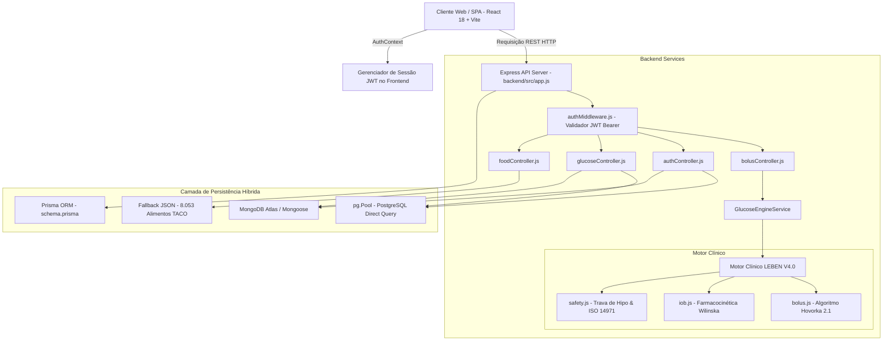
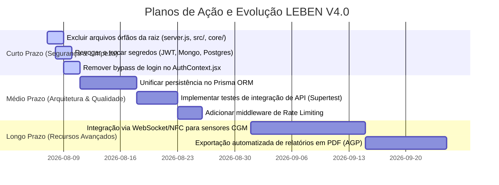

# Relatório de Auditoria Técnica Completa — Sistema LEBEN v4.0

**Cargo / Papel:** Engenheiro de Software Staff, Arquiteto de Sistemas e Auditor de Código  
**Projeto:** LEBEN — Plataforma de Gestão de Diabetes & Motor Clínico de Bolus (v4.0.0)  
**Data da Auditoria:** 06 de Agosto de 2026  

---

## 1. Resumo Executivo

O **LEBEN V4.0** é uma plataforma clínica e médica avançada para gestão de Diabetes Mellitus (Tipos 1 e 2, Pediatria e Gestacional). O sistema se destaca por possuir um motor matemático determinístico de cálculo de dose de insulina e farmacocinética extremamente rigoroso, baseado nos modelos de Hovorka estendido e Wilinska, cobrindo contagem de carboidratos, monitoramento de insulina ativa (IOB), sensibilidade circadiana, ajustes por exercícios e integridade auditável por hashing SHA-256 encadeado.

Entretanto, a auditoria técnica identificou **vulnerabilidades críticas de segurança** (exposição de segredos de banco/JWT no repositório e bypass silencioso de autenticação no cliente frontend), **duplicação estrutural de código** (presença de um backend e motor matemático órfãos na raiz do projeto) e **alta fragmentação de persistência** (uso concorrente e desordenado de Prisma ORM, Mongoose e driver nativo `pg.Pool`).

---

## 2. Diagrama da Arquitetura do Sistema

---

## 3. Fluxo Completo da Aplicação (End-to-End)

1. **Bootstrapping Backend:** O processo inicia em [backend/src/server.js](file:///c:/Users/Well/Desktop/projetoinsu/backend/src/server.js#L6-L15), escutando a porta 10000. Durante a inicialização, são executadas as migrações em `runProductionMigrations()` e o seeding automático em `seedMongoDatabase()`.
2. **Autenticação:** O usuário solicita acesso via `POST /api/v1/auth/login`. O [authController.js](file:///c:/Users/Well/Desktop/projetoinsu/backend/src/controllers/authController.js#L27-L133) consulta o Mongoose, o PostgreSQL ou o cache RAM local em ordem de fallback, valida a senha com `bcrypt.compare` e emite os tokens JWT (Access Token 24h e Refresh Token 7d).
3. **Validação de Requisição Protegida:** Ao acionar `/api/v1/bolus/calculate`, o [authMiddleware.js](file:///c:/Users/Well/Desktop/projetoinsu/backend/src/middlewares/authMiddleware.js#L9-L36) valida a assinatura do header `Authorization: Bearer <token>` e injeta o `tenantId` (ID do usuário) na requisição.
4. **Cálculo Clínico no Motor:** O [bolusController.js](file:///c:/Users/Well/Desktop/projetoinsu/backend/src/controllers/bolusController.js#L3-L26) repassa as variáveis para o [bolus.js](file:///c:/Users/Well/Desktop/projetoinsu/backend/src/core/glucose_engine/insulin_math/bolus.js#L50-L197):
   - Valida segurança (trava doses em glicemia $<70$ mg/dL);
   - Calcula a dose de comida ($\text{Carbs} / \text{ICR}$);
   - Calcula a dose de correção ajustada por tendência CGM ($\uparrow\uparrow = +30$ mg/dL);
   - Aplica abatimento de IOB **exclusivamente** sobre a correção;
   - Ajusta por fatores de exercício (aeróbico vs anaeróbico) e estresse/doença;
   - Gera a assinatura imutável SHA-256 (`generateChainAuditHash`).
5. **Retorno:** O servidor devolve a resposta estruturada com o recomendado de insulina, recomendações de pré-bolus e curva preditiva de glicemia para os próximos 240 minutos.

---

## 4. Mapeamento de Componentes Principais

| Módulo / Arquivo | Localização no Código | Responsabilidade Principal |
| :--- | :--- | :--- |
| **Motor de Bolus** | [`bolus.js`](file:///c:/Users/Well/Desktop/projetoinsu/backend/src/core/glucose_engine/insulin_math/bolus.js) | Executa toda a matemática prandial/corretiva, ajustes de CGM e auditoria SHA-256. |
| **Motor IOB** | [`iob.js`](file:///c:/Users/Well/Desktop/projetoinsu/backend/src/core/glucose_engine/iob_engine/iob.js) | Calcula o decaimento farmacocinético exponencial de insulina ativa no corpo. |
| **Segurança Clínica** | [`safety.js`](file:///c:/Users/Well/Desktop/projetoinsu/backend/src/core/glucose_engine/validation/safety.js) | Enforça limites fisiológicos, bloqueios por hipoglicemia e teto máximo de dose. |
| **Serviço de Alimentos** | [`foodService.js`](file:///c:/Users/Well/Desktop/projetoinsu/backend/src/services/foodService.js) | Realiza buscas em banco relacional ou carrega base offline de 8.053 itens da TACO. |
| **Middleware de Auth** | [`authMiddleware.js`](file:///c:/Users/Well/Desktop/projetoinsu/backend/src/middlewares/authMiddleware.js) | Protege as APIs via token JWT e garante isolamento multi-tenant por usuário. |
| **Contexto React** | [`AuthContext.jsx`](file:///c:/Users/Well/Desktop/projetoinsu/frontend/src/context/AuthContext.jsx) | Gerencia login, registro, logout e armazenamento dos tokens no `localStorage`. |

---

## 5. Regras de Negócio Encontradas

1. **Trava Absoluta de Hipoglicemia:** Se Glicemia $< 70$ mg/dL, a aplicação de dose é bloqueada, retornando `recommendedDose = 0.0U` e status `BLOCKED_HYPO_SAFETY` ([bolus.js:L85-L102](file:///c:/Users/Well/Desktop/projetoinsu/backend/src/core/glucose_engine/insulin_math/bolus.js#L85-L102)).
2. **Alerta de Emergência Extrema:** Se Glicemia $\le 25$ mg/dL, dispara um aviso de socorro médico imediato ([safety.js:L50-L52](file:///c:/Users/Well/Desktop/projetoinsu/backend/src/core/glucose_engine/validation/safety.js#L50-L52)).
3. **Cálculo Prandial Puro:** $\text{Dose Comida} = \frac{\text{Carboidratos (g)}}{\text{ICR (g/U)}}$.
4. **Correção por Sensibilidade e CGM:** $\text{Dose Correção} = \frac{(\text{Glicemia} + \Delta\text{CGM}) - \text{Alvo}}{\text{ISF (mg/dL/U)}}$.
5. **Desconto Seguro de IOB:** A insulina ativa em circulação só reduz a dose de correção, preservando integralmente a dose prandial necessária para cobrir os carboidratos ingeridos ([bolus.js:L114-L119](file:///c:/Users/Well/Desktop/projetoinsu/backend/src/core/glucose_engine/insulin_math/bolus.js#L114-L119)).
6. **Modificadores de Exercício:**
   - Caminhada leve 30 min: $-15\%$ na dose total.
   - Corrida moderada 30 min: $-30\%$ na dose total.
   - Treino aeróbico 60 min: $-40\%$ na dose total.
   - Musculação / HIIT anaeróbico: $+10\%$ temporário (pico glicêmico agudo).
7. **Condições de Saúde Especiais:** Febre ($+20\%$), Estresse ($+15\%$), Corticoides ($+30\%$).
8. **Teto Automático de Dose:** Doses calculadas $> 25.0$ U exigem confirmação manual do usuário/médico ([safety.js:L13](file:///c:/Users/Well/Desktop/projetoinsu/backend/src/core/glucose_engine/validation/safety.js#L13)).

---

## 6. Análise de Dependências do Projeto

### Backend ([backend/package.json](file:///c:/Users/Well/Desktop/projetoinsu/backend/package.json))
- `express` (^4.19.2): Framework web minimalista HTTP.
- `bcryptjs` (^2.4.3): Criptografia de senhas com salt.
- `jsonwebtoken` (^9.0.2): Emissão e verificação de JWT.
- `pg` (^8.11.5): Cliente nativo PostgreSQL.
- `mongoose` (^9.8.1): ODM para MongoDB.
- `dotenv` (^16.4.5): Carregamento de variáveis de ambiente.

### Frontend ([frontend/package.json](file:///c:/Users/Well/Desktop/projetoinsu/frontend/package.json))
- `react` (^18.3.1) & `react-dom` (^18.3.1): Biblioteca de UI.
- `react-router-dom` (^6.23.1): Navegação e roteamento client-side.
- `vite` (^5.2.11): Bundler e dev server rápido.
- `tailwindcss` (^3.4.3): Estilização utilitária.
- `lucide-react` (^0.378.0): Ícones vetoriais.

---

## 7. Problemas Encontrados (Ordenados por Criticidade)

| Severidade | Problema Encontrado | Arquivo / Código de Evidência | Impacto Clínico / Técnico |
| :---: | :--- | :--- | :--- |
| 🚨 **CRÍTICO** | Credenciais e Secrets de Banco e JWT Hardcoded | [`backend/src/config/env.js:L15-18`](file:///c:/Users/Well/Desktop/projetoinsu/backend/src/config/env.js#L15-L18), [`.env:L6-14`](file:///c:/Users/Well/Desktop/projetoinsu/.env#L6-L14) e [`render.yaml:L14`](file:///c:/Users/Well/Desktop/projetoinsu/render.yaml#L14) | Risco de invasão do banco de dados de produção MongoDB Atlas e falsificação de tokens JWT. |
| 🚨 **CRÍTICO** | Authentication Bypass no Frontend | [`frontend/src/context/AuthContext.jsx:L33-45`](file:///c:/Users/Well/Desktop/projetoinsu/frontend/src/context/AuthContext.jsx#L33-L45) e [`L68-76`](file:///c:/Users/Well/Desktop/projetoinsu/frontend/src/context/AuthContext.jsx#L68-L76) | Se a API backend falhar ou estiver indisponível, o cliente efetua login automático gerando tokens fictícios (`demo_token_123`). |
| ⚠️ **ALTO** | Estrutura de Código Órfão e Duplicado | Raiz do projeto: [`server.js`](file:///c:/Users/Well/Desktop/projetoinsu/server.js), `src/controllers/`, `core/glucose_engine/` | Existência de dois backends paralelos. Alterações feitas nos arquivos da raiz não têm efeito no backend principal (`backend/src/`). |
| ⚠️ **ALTO** | Duplicação de Matemática IOB (Front/Back) | [`frontend/src/utils/iobCalculator.js:L20-57`](file:///c:/Users/Well/Desktop/projetoinsu/frontend/src/utils/iobCalculator.js#L20-L57) vs [`backend/src/core/glucose_engine/iob_engine/iob.js:L7-47`](file:///c:/Users/Well/Desktop/projetoinsu/backend/src/core/glucose_engine/iob_engine/iob.js#L7-L47) | Violação do princípio DRY. Alterações no motor do backend não são refletidas no utilitário local do frontend. |
| 🟡 **MÉDIO** | Mistura de Drivers de Persistência | [`authController.js:L42-83`](file:///c:/Users/Well/Desktop/projetoinsu/backend/src/controllers/authController.js#L42-L83) | Uso simultâneo de Mongoose, `pg.Pool` nativo e Prisma ORM no mesmo controlador sem padronização. |
| 🟡 **MÉDIO** | Falta de Rate Limiting e CORS Amplo | [`backend/src/app.js:L13`](file:///c:/Users/Well/Desktop/projetoinsu/backend/src/app.js#L13) | `app.use(cors())` sem restrição de origem e sem proteção contra ataques de força bruta. |

---

## 8. Dívida Técnica Priorizada

1. **Remoção Imediata da Estrutura Órfã:** Apagar completamente a pasta `src/`, `core/` e o arquivo `server.js` presentes na raiz do projeto.
2. **Unificação da Persistência no Prisma ORM:** Migrar todas as chamadas SQL diretas (`query()`) e chamadas Mongoose para o **Prisma Client** usando o schema em [`schema.prisma`](file:///c:/Users/Well/Desktop/projetoinsu/backend/prisma/schema.prisma).
3. **Desacoplamento do Cálculo do Frontend:** Remover a duplicação de `iobCalculator.js` no frontend e fazer a interface consumir as projeções diretamente da API `/api/v1/bolus/calculate`.

---

## 9. Sugestões de Melhoria

### Alto Impacto
- **Segurança de Variáveis de Ambiente:** Revogar as credenciais atuais expostas e forçar o carregamento de variáveis via ambiente de produção sem fallbacks hardcoded em código.
- **Tratamento Estrito de Autenticação:** Remover qualquer login sintético/fake do bloco `catch` do `AuthContext.jsx`. Se o servidor retornar erro, o usuário deve permanecer na tela de login com uma mensagem clara.

### Médio Impacto
- **Padronização com Repository Pattern:** Criar classes de repositório para desacoplar a lógica dos controladores em relação ao banco de dados.
- **Índices no PostgreSQL:** Criar um índice `trgm` na coluna `name` da tabela de alimentos para otimizar buscas parciais sem varredura completa.

### Baixo Impacto
- **Substituição de `console.log`:** Adicionar uma biblioteca de log estruturado em JSON (ex: `pino`) para facilitar a observabilidade e integração com serviços de monitoramento.

---

## 10. Roadmap de Evolução Recomendado

### Curto Prazo (1 a 7 dias)
- [ ] Excluir a estrutura duplicada/órfã da raiz (`server.js`, `src/`, `core/`).
- [ ] Revogar e alterar as senhas e segredos criptográficos expostos.
- [ ] Corrigir o tratamento de erro em `AuthContext.jsx` para impedir o bypass de autenticação.

### Médio Prazo (2 a 4 semanas)
- [ ] Refatorar a camada de dados para utilizar unicamente o Prisma ORM.
- [ ] Implementar suíte de testes de integração HTTP com `supertest`.
- [ ] Adicionar `express-rate-limit` para proteger endpoints sensíveis como `/auth/login`.

### Longo Prazo (2 meses+)
- [ ] Implementar sincronização contínua de leituras CGM em tempo real via WebSockets.
- [ ] Adicionar geração automática de relatórios em PDF padronizados segundo a diretriz internacional AGP (Ambulatory Glucose Profile).

---

## 11. Fase 7 — Auditoria de UX, Usabilidade e Acessibilidade (WCAG 2.1)

A auditoria de interface e fluxos identificou 4 eixos principais de otimização de experiência:

1. **🔴 Rotas Falsas e Links Inexistentes:** Os botões "LEBEN AI" e "Alertas" no menu lateral redirecionavam silenciosamente para a Dashboard sem renderizar uma página própria.
2. **🔴 Inacessibilidade Mobile:** O `BottomNav` contendo 7 botões apresentava áreas de clique $< 32\text{px}$, violando o padrão mínimo de $44 \times 44\text{px}$ da WCAG 2.1.
3. **🟡 Sobrecarga Cognitiva:** A Calculadora de Bolus exibia 10 formulários técnicos de uma só vez, desorientando idosos e leigos. Recomendada divisão entre Modo Essencial (Glicemia e Carbs) e Modo Avançado.
4. **🟢 Rotas Duplicadas:** `/meals` e `/foods` apontavam para a mesma página. Unificado para `/foods`.

