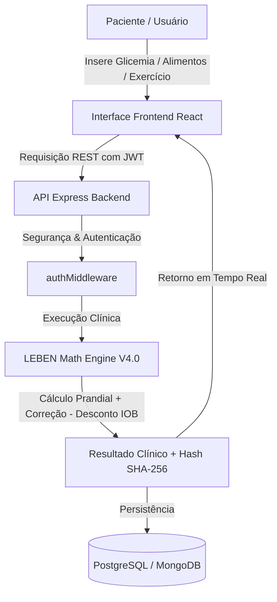

# LEBEN Engineering Handbook — Volume 01: System Overview

**Projeto:** LEBEN — Plataforma de Gestão de Diabetes & Motor Clínico de Bolus  
**Versão:** 4.0.0  
**Autor:** Engenharia & Arquitetura de Software LEBEN  
**Data:** 06 de Agosto de 2026  

---

## 1. Visão Geral do Sistema e Propósito de Negócio

O **LEBEN** é uma plataforma clínica e metabólica de classe médica projetada para o gerenciamento contínuo de pacientes diagnosticados com Diabetes Mellitus (Tipo 1, Tipo 2, Pediatria e Gestacional). 

O propósito central do sistema é calcular de forma automática e segura as doses de insulina prandial e corretiva (Bolus), monitorar a insulinação ativa residual no corpo (IOB - *Insulin On Board*), registrar leituras contínuas ou manuais de glicemia, contabilizar carboidratos com base na tabela TACO/UNICAMP, e calcular parâmetros estatísticos de variabilidade metabólica (como Time in Range - TIR, GMI e Coeficiente de Variação).

---

## 2. Domínio de Negócio e Normas Clínicas

O LEBEN opera sob rigorosas diretrizes de endocrinologia e engenharia de software para dispositivos médicos:
- **ISO 14971**: Gestão de Risco para Dispositivos Médicos (gerenciamento e mitigações de risco em dosagem de insulina).
- **IEC 62304**: Ciclo de Vida de Software para Dispositivos Médicos (rastreabilidade, testes automatizados e imutabilidade auditável).
- **ADA (American Diabetes Association) & SBD (Sociedade Brasileira de Diabetes)**: Protocolos para metas glicêmicas, tempos de pré-bolus e metas de tempo no alvo (TIR $> 70\%$).

---

## 3. Pilha Tecnológica (Tech Stack)

### Backend
- **Runtime:** Node.js (v18+) em formato nativo ES Modules (`"type": "module"` em [`backend/package.json`](file:///c:/Users/Well/Desktop/projetoinsu/backend/package.json#L6)).
- **Framework Web:** Express.js (`v4.19.2`).
- **Autenticação & Segurança:** `jsonwebtoken` (`v9.0.2`), `bcryptjs` (`v2.4.3`).
- **Persistência de Dados:** 
  - Driver PostgreSQL Nativo: `pg` (`v8.11.5`) via `pg.Pool` ([`database.js`](file:///c:/Users/Well/Desktop/projetoinsu/backend/src/config/database.js#L10)).
  - Prisma ORM: Client `v5+` ([`schema.prisma`](file:///c:/Users/Well/Desktop/projetoinsu/backend/prisma/schema.prisma)).
  - MongoDB Atlas: `mongoose` (`v9.8.1`).

### Frontend
- **Framework UI:** React (`v18.3.1`) empacotado via Vite (`v5.2.11`) em [`frontend/package.json`](file:///c:/Users/Well/Desktop/projetoinsu/frontend/package.json#L11-L25).
- **Roteamento:** `react-router-dom` (`v6.23.1`).
- **Estilização & Ícones:** TailwindCSS (`v3.4.3`), `lucide-react` (`v0.378.0`).

---

## 4. Princípios Arquiteturais

1. **Safety-First (Segurança Clínica em Primeiro Lugar):** Se a glicemia do paciente estiver abaixo de $70$ mg/dL, qualquer cálculo de dose é sumariamente travado, independentemente da quantidade de carboidratos informada.
2. **Imutabilidade Auditável:** Todas as recomendações de dose geram uma hash de imutabilidade SHA-256 (`generateChainAuditHash`) encadeando os parâmetros de entrada, horário e segredo do motor.
3. **Resiliência Multi-Nível:** Em caso de indisponibilidade nos bancos de dados relacionais ou NoSQL, o sistema chaveia automaticamente para um cache RAM e uma base de dados JSON com 8.053 alimentos da TACO/UNICAMP em [`data/tbca_scraped_foods.json`](file:///c:/Users/Well/Desktop/projetoinsu/data/tbca_scraped_foods.json).
