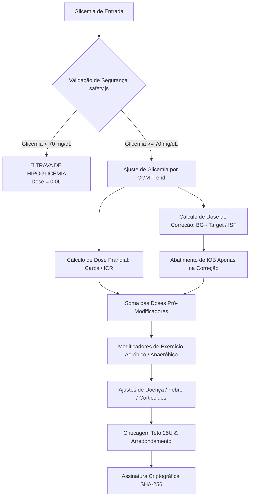

# LEBEN Engineering Handbook — Volume 03: Clinical Engine & Mathematical Logic

**Projeto:** LEBEN — Plataforma de Gestão de Diabetes & Motor Clínico de Bolus  
**Versão:** 4.0.0  

---

## 1. Fundamentos Científicos e Algorítmicos

O **LEBEN Clinical Engine V4.0** implementa os modelos fisiológicos determinísticos de **Hovorka estendido** (para estimativa da resposta glicêmica à insulinação e ingestão de carboidratos) e o modelo de **Wilinska** para a curva de farmacocinética de insulina ativa no sangue (IOB).

---

## 2. Formulário Matemático Detalhado

### 2.1 Dose Prandial (Comida)
$$\text{Bolus}_{\text{Prandial}} = \frac{\text{Carboidratos (g)}}{\text{ICR (g/U)}}$$
- **ICR (Insulin-to-Carbohydrate Ratio):** Gramas de carboidrato cobertos por 1 unidade de insulina ultrarrápida.

### 2.2 Dose de Correção com Tendência CGM
$$\text{Glicemia}_{\text{Ajustada}} = \text{Glicemia}_{\text{Medida}} + \Delta_{\text{CGM}}$$

Onde $\Delta_{\text{CGM}}$ é definido pela tabela de tendências do sensor ([`bolus.js:L18-26`](file:///c:/Users/Well/Desktop/projetoinsu/backend/src/core/glucose_engine/insulin_math/bolus.js#L18-L26)):
- `DOUBLE_UP` ($\uparrow\uparrow$): $+30$ mg/dL
- `SINGLE_UP` ($\uparrow$): $+15$ mg/dL
- `FORTY_FIVE_UP` ($\nearrow$): $+8$ mg/dL
- `FLAT` ($\rightarrow$): $0$ mg/dL
- `FORTY_FIVE_DOWN` ($\searrow$): $-8$ mg/dL
- `SINGLE_DOWN` ($\downarrow$): $-15$ mg/dL
- `DOUBLE_DOWN` ($\downarrow\downarrow$): $-30$ mg/dL

$$\text{Bolus}_{\text{Correção Brutal}} = \frac{\text{Glicemia}_{\text{Ajustada}} - \text{Glicemia}_{\text{Alvo}}}{\text{ISF (mg/dL/U)}}$$

### 2.3 Regra Protegida de Desconto de IOB
Para evitar empilhamento perigoso de insulina (*insulin stacking*), a insulina ativa em circulação ($\text{IOB}$) reduz **apenas** a dose de correção:

$$\text{Correção}_{\text{Efetiva}} = \max\left(0, \text{Bolus}_{\text{Correção Brutal}} - \text{IOB}\right)$$

Se a glicemia estiver na meta ou abaixo dela ($\text{Bolus}_{\text{Correção Brutal}} \le 0$), o IOB **NÃO** desliga a dose alimentar prandial, garantindo a cobertura dos carboidratos a serem consumidos.

### 2.4 Fatores de Exercício e Modificadores Clínicos
$$\text{Dose}_{\text{Ajustada}} = \text{Dose}_{\text{Base}} \times (1 + \text{Fator}_{\text{Condição}}) \times (1 - \text{Fator}_{\text{Exercício}})$$

- **Caminhada Leve (30 min):** Desconto de $15\%$ (`discountFactor = 0.15`).
- **Corrida Moderada (30 min):** Desconto de $30\%$ (`discountFactor = 0.30`).
- **Treino Aeróbico Intenso (60 min):** Desconto de $40\%$ (`discountFactor = 0.40`).
- **Musculação / HIIT (Anaeróbico):** Acréscimo de $+10\%$ por pico de catecolaminas (`discountFactor = -0.10`).
- **Febre / Infecção:** Acréscimo de $+20\%$ por resistência ao cortisol.
- **Estresse Intenso:** Acréscimo de $+15\%$.
- **Uso de Corticoides:** Acréscimo de $+30\%$.

---

## 3. Equações Farmacocinéticas de IOB (Wilinska Model)

A fração de insulina ativa restante em um tempo $t$ (em minutos) decorrido após a aplicação é modelada pelas curvas polinomiais de 4º grau ([`iob.js:L7-36`](file:///c:/Users/Well/Desktop/projetoinsu/backend/src/core/glucose_engine/iob_engine/iob.js#L7-L36)):

$$\text{Seja } \tau = \frac{t}{\text{DIA} \times 60}$$

### Insulina Ultrarrápida Padrão (Humalog / Novorapid / Apidra - DIA 4h)
$$f(\tau) = \max\left(0, 1 - 3.75\tau^2 + 4.25\tau^3 - 1.5\tau^4\right)$$

### Insulina Super-Ultrarrápida (Fiasp / Lumjev - DIA 3h - Pico Precoce)
$$f(\tau) = \max\left(0, 1 - 4.2\tau^2 + 4.8\tau^3 - 1.6\tau^4\right)$$

### Insulina Regular Humana (DIA 6h)
$$f(\tau) = \max\left(0, 1 - 3.0\tau^2 + 3.2\tau^3 - 1.2\tau^4\right)$$

---

## 4. Garantia de Imutabilidade Médica (SHA-256 Hash Chain)

Para cada recomendação gerada, o motor calcula um hash de integridade imutável ([`bolus.js:L218-241`](file:///c:/Users/Well/Desktop/projetoinsu/backend/src/core/glucose_engine/insulin_math/bolus.js#L218-L241)):

$$\text{Hash} = \text{SHA256}\left(\text{EngineVersion} \mid \text{Glucose} \mid \text{Carbs} \mid \text{IOB} \mid \text{ICR} \mid \text{ISF} \mid \text{Dose} \mid \text{Status} \mid \text{Secret}\right)$$

Isso garante auditabilidade jurídica e impossibilita a alteração retroativa dos parâmetros de uma dosagem recomendada ao paciente.
