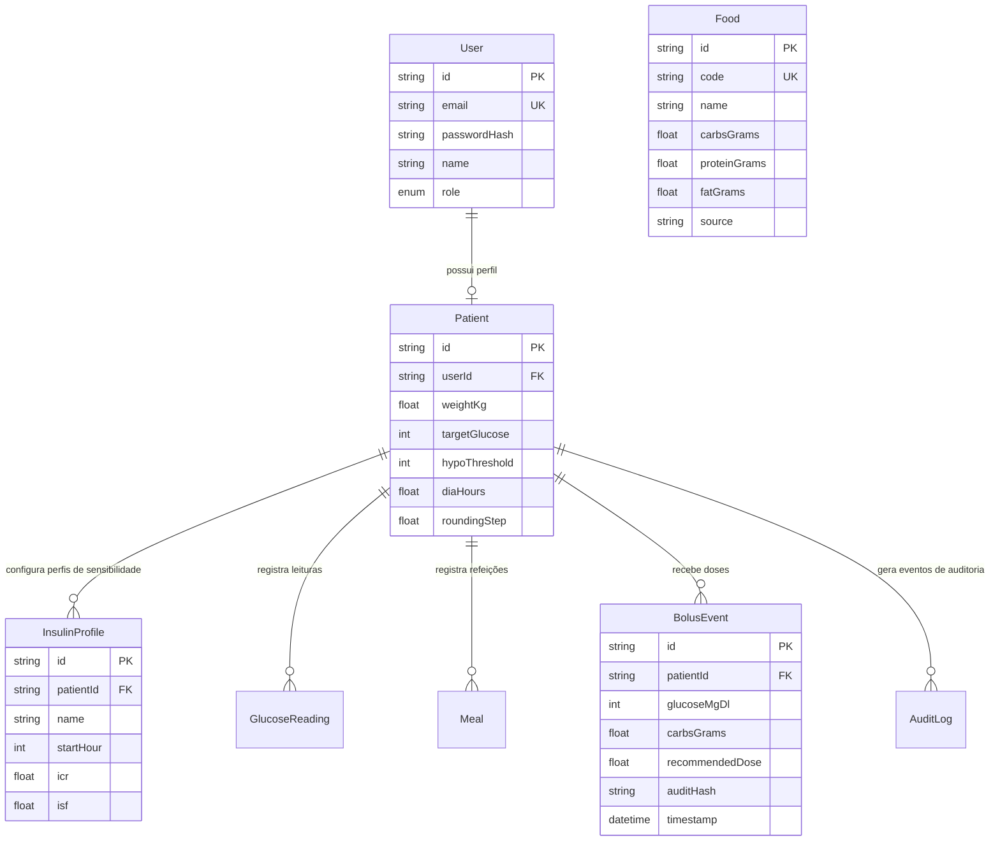

# LEBEN Engineering Handbook — Volume 04: Database Architecture & Data Models

**Projeto:** LEBEN — Plataforma de Gestão de Diabetes & Motor Clínico de Bolus  
**Versão:** 4.0.0  

---

## 1. Visão Geral da Camada de Persistência Híbrida

O LEBEN utiliza uma arquitetura de armazenamento multi-banco projetada para suportar alta disponibilidade e failover:



---

## 2. Modelagem Relacional PostgreSQL (Prisma Schema)

O schema do PostgreSQL está definido em [`backend/prisma/schema.prisma`](file:///c:/Users/Well/Desktop/projetoinsu/backend/prisma/schema.prisma):

- **Tabela `User`**: Guarda autenticação, credenciais criptografadas e perfil de acesso (`PATIENT`, `DOCTOR`, `GUARDIAN`).
- **Tabela `Patient`**: Registra dados fisiológicos básicos do paciente, limites de segurança e fatores globais de sensibilidade.
- **Tabela `InsulinProfile`**: Suporta perfis de insulinação circadiana (diferentes razões ICR e fatores ISF para Café da Manhã, Almoço, Jantar e Madrugada).
- **Tabela `BolusEvent`**: Armazena o histórico completo de dosagens calculadas com o hash SHA-256 e o detalhamento (*breakdown*) da dose recomendada.
- **Tabela `Food`**: Tabela nutricional indexada por `name` com a contagem de carboidratos, proteínas, gorduras e calorias.

---

## 3. Persistência NoSQL (MongoDB Atlas / Mongoose)

Utilizado como banco de documentos secundário em [`backend/src/controllers/glucoseController.js`](file:///c:/Users/Well/Desktop/projetoinsu/backend/src/controllers/glucoseController.js#L23-L29) para séries temporais de leituras contínuas de glicemia (CGM / NFC):

```javascript
const GlucoseReadingSchema = new mongoose.Schema({
  patient_id: mongoose.Schema.Types.Mixed,
  glucose_mgdl: Number,
  read_at: Date,
  trend: String,
  record_type: String, // AUTOMATIC_CGM ou MANUAL_ENTRY
  source: String
});
```

---

## 4. Estratégia de Fallback em Memória e JSON

Quando o PostgreSQL ou o MongoDB estão inacessíveis (como em ambiente de desenvolvimento isolado offline), o sistema ativa o failover sem exceções:

1. **Cache de Usuários (`registeredUsersCache`):** Armazena usuários cadastrados na sessão em um `Map` de memória ([`authController.js:L13`](file:///c:/Users/Well/Desktop/projetoinsu/backend/src/controllers/authController.js#L13)).
2. **Cache de Leituras (`userReadingsMap`):** Armazena os históricos de glicemia isolados por `userId` ([`glucoseController.js:L11`](file:///c:/Users/Well/Desktop/projetoinsu/backend/src/controllers/glucoseController.js#L11)).
3. **Backup de Alimentos TACO (`tbca_scraped_foods.json`):** O [`foodService.js:L20-34`](file:///c:/Users/Well/Desktop/projetoinsu/backend/src/services/foodService.js#L20-L34) lê o arquivo JSON local contendo 8.053 alimentos e realiza buscas com ordenação por relevância em memória.

---

## 5. Diagnóstico de Performance do Banco de Dados

- 🛑 **Busca `ILIKE %q%` sem Índice Trigram:** A consulta de busca de alimentos em [`foodService.js:L48`](file:///c:/Users/Well/Desktop/projetoinsu/backend/src/services/foodService.js#L48) utiliza SQL puro sem índice `gin_trgm_ops`, podendo ocasionar degradação com o aumento de acessos concorrentes.
- 💡 **Recomendação de Otimização:**
  ```sql
  CREATE EXTENSION IF NOT EXISTS pg_trgm;
  CREATE INDEX idx_food_name_trgm ON food_database USING gin (name gin_trgm_ops);
  ```
