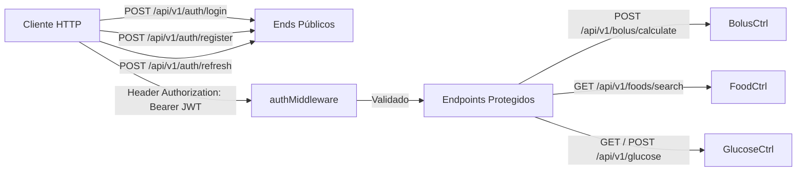

# LEBEN Engineering Handbook — Volume 05: REST API Reference & Endpoints

**Projeto:** LEBEN — Plataforma de Gestão de Diabetes & Motor Clínico de Bolus  
**Versão:** 4.0.0  

---

## 1. Visão Geral da API REST (v1)

A API REST do LEBEN é exposta na rota base `/api/v1` ([`routes/index.js`](file:///c:/Users/Well/Desktop/projetoinsu/backend/src/routes/index.js)). Todas as respostas utilizam o padrão JSON estruturado com status explícito (`status: "success"` ou `status: "error"`).



---

## 2. Especificação dos Endpoints

### 🔓 2.1 Autenticação e Registro (Públicos)

#### `POST /api/v1/auth/login`
- **Controller:** [`authController.js:loginHandler`](file:///c:/Users/Well/Desktop/projetoinsu/backend/src/controllers/authController.js#L27)
- **Body Requerido:**
  ```json
  {
    "email": "paciente@leben.com",
    "password": "senha123"
  }
  ```
- **Resposta Sucesso (200 OK):**
  ```json
  {
    "status": "success",
    "message": "Login realizado com sucesso no LEBEN.",
    "token": "eyJhbGciOiJIUzI1NiIsInR5cCI6IkpXVCJ9...",
    "refreshToken": "eyJhbGciOiJIUzI1NiIsInR5cCI6IkpXVCJ9...",
    "user": {
      "id": "usr_demo_1001",
      "name": "Dr. Paciente LEBEN",
      "email": "paciente@leben.com",
      "role": "PATIENT",
      "diabetesType": "TYPE_1"
    }
  }
  ```

#### `POST /api/v1/auth/register`
- **Controller:** [`authController.js:registerHandler`](file:///c:/Users/Well/Desktop/projetoinsu/backend/src/controllers/authController.js#L135)
- **Body Requerido:** `name`, `email`, `password`, `diabetesType` (opcional).

---

### 🔒 2.2 Motor Clínico e Operações Protegidas

#### `POST /api/v1/bolus/calculate`
- **Header:** `Authorization: Bearer <token>`
- **Controller:** [`bolusController.js:calculateBolusHandler`](file:///c:/Users/Well/Desktop/projetoinsu/backend/src/controllers/bolusController.js#L3)
- **Body Requerido:**
  ```json
  {
    "glucose": 180,
    "carbs": 45,
    "iob": 1.5,
    "icr": 10,
    "isf": 40,
    "insulinType": "HUMALOG",
    "cgmTrend": "DOUBLE_UP",
    "exercise": "NONE",
    "condition": "NONE"
  }
  ```
- **Resposta Sucesso (200 OK):**
  ```json
  {
    "status": "success",
    "data": {
      "success": true,
      "status": "APPROVED",
      "recommendedDose": 6.5,
      "rawTotal": 6.75,
      "requiresManualConfirmation": false,
      "cappedDose": 6.75,
      "confidenceScore": 95,
      "breakdown": {
        "foodBolus": 4.5,
        "correctionBolus": 2.75,
        "effectiveCorrection": 2.25,
        "iobDiscount": 0.5,
        "exerciseDiscount": 0.0,
        "conditionAdjustment": 0.0,
        "rawTotal": 6.75
      },
      "clinicalGuidance": {
        "preBolusTiming": { "minutes": 15, "advice": "Glicemia 120-180 mg/dL: Pré-bolus ideal de 15 minutos." }
      },
      "auditHash": "d8e8f8a9b7c6d5e4f3a2b1c0d9e8f7a6b5c4d3e2f1a0b9c8d7e6f5a4b3c2d1e0",
      "timestamp": "2026-08-06T10:00:00.000Z"
    }
  }
  ```

#### `GET /api/v1/foods/search?q=arroz`
- **Header:** `Authorization: Bearer <token>`
- **Controller:** [`foodController.js:searchFoodsHandler`](file:///c:/Users/Well/Desktop/projetoinsu/backend/src/controllers/foodController.js)

#### `GET` / `POST /api/v1/glucose`
- **Header:** `Authorization: Bearer <token>`
- **Controller:** [`glucoseController.js`](file:///c:/Users/Well/Desktop/projetoinsu/backend/src/controllers/glucoseController.js)
