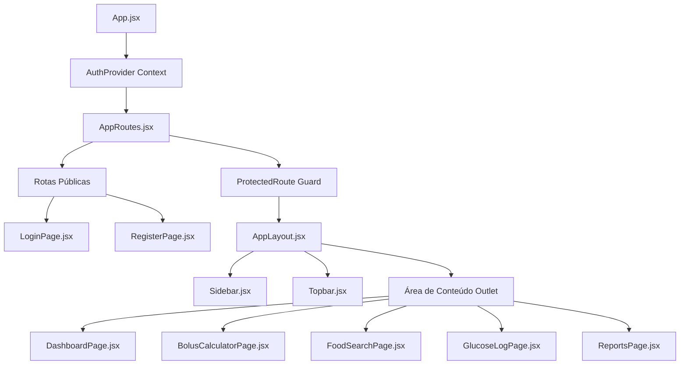

# LEBEN Engineering Handbook — Volume 06: Frontend React Architecture

**Projeto:** LEBEN — Plataforma de Gestão de Diabetes & Motor Clínico de Bolus  
**Versão:** 4.0.0  

---

## 1. Arquitetura da Interface SPA (Single Page Application)

O frontend do LEBEN é uma Single Page Application construída com **React 18** e **Vite**, estruturada em rotas declarativas e protegidas via **React Router v6**.



---

## 2. Estrutura de Componentes e Hierarquia de Páginas

### 2.1 Componentes de Layout (`frontend/src/components/layout/`)
- [`AppLayout.jsx`](file:///c:/Users/Well/Desktop/projetoinsu/frontend/src/components/layout/AppLayout.jsx): Shell principal com grid responsivo contendo Sidebar, Topbar, área de conteúdo e assistente flutuante.
- [`Sidebar.jsx`](file:///c:/Users/Well/Desktop/projetoinsu/frontend/src/components/layout/Sidebar.jsx): Navegação lateral com atalhos para Dashboard, Bolus, Alimentos, Glicemia, Relatórios e Configurações.
- [`Topbar.jsx`](file:///c:/Users/Well/Desktop/projetoinsu/frontend/src/components/layout/Topbar.jsx): Barra superior exibindo status do usuário logado, botão de logout e alertas.
- [`XiviaAIFloating.jsx`](file:///c:/Users/Well/Desktop/projetoinsu/frontend/src/components/layout/XiviaAIFloating.jsx): Widget flutuante de assistente virtual para contagem e suporte ao paciente.

### 2.2 Páginas Principais (`frontend/src/pages/`)
- [`BolusCalculatorPage.jsx`](file:///c:/Users/Well/Desktop/projetoinsu/frontend/src/pages/Bolus/BolusCalculatorPage.jsx): Calculadora interativa de Bolus com seletores de carboidratos, tendências de CGM, gráficos preditivos de glicemia e fracionamento de refeição.
- [`DashboardPage.jsx`](file:///c:/Users/Well/Desktop/projetoinsu/frontend/src/pages/Dashboard/DashboardPage.jsx): Visão geral do dia contendo resumo de insulinação, glicemia média e gráfico de 24h.
- [`GlucoseChart24h.jsx`](file:///c:/Users/Well/Desktop/projetoinsu/frontend/src/components/charts/GlucoseChart24h.jsx): Gráfico SVG/Canvas de leituras de glicemia contínua.
- [`ReportsPage.jsx`](file:///c:/Users/Well/Desktop/projetoinsu/frontend/src/pages/Reports/ReportsPage.jsx): Relatórios métricos de Time in Range (TIR, TAR, TBR) e estimativa de GMI.

---

## 3. Gerenciamento de Estado Global (`AuthContext.jsx`)

O estado de autenticação é centralizado no [`AuthContext.jsx`](file:///c:/Users/Well/Desktop/projetoinsu/frontend/src/context/AuthContext.jsx):

- **Propriedades Expostas:** `user`, `isAuthenticated`, `login(email, password)`, `register(name, email, password, diabetesType)`, `logout()`.
- **Persistência:** Armazena `leben_token` e `leben_user` no `localStorage`.

---

## 4. Diagnóstico de Qualidade e Anti-Padrões no Frontend

- 🚨 **Bypass de Autenticação em Tratamento de Exceção:** Em [`AuthContext.jsx:L33-45`](file:///c:/Users/Well/Desktop/projetoinsu/frontend/src/context/AuthContext.jsx#L33-L45), o bloco `catch` trata qualquer erro de rede gerando um token sintético (`demo_token_123`) e efetuando o login automático do usuário. Isso abre uma falha de segurança grave em que a falha da API concede acesso à aplicação.
- 💡 **Recomendação de Refatoração:**
  ```javascript
  // REMOVER o código de fallback fake no catch:
  catch (err) {
    return { success: false, message: 'Não foi possível conectar ao servidor backend.' };
  }
  ```
