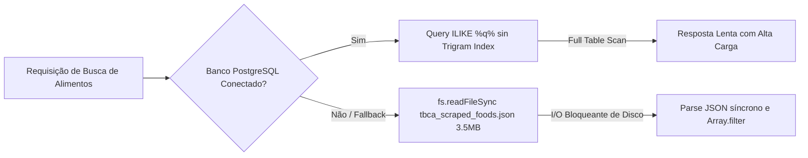

# LEBEN Engineering Handbook — Volume 08: Performance & Optimization Audit

**Projeto:** LEBEN — Plataforma de Gestão de Diabetes & Motor Clínico de Bolus  
**Versão:** 4.0.0  

---

## 1. Gargalos de I/O, Memória e Processamento Identificados



---

## 2. Diagnóstico Técnico dos Gargalos

### 🐢 Gargalo 01: Carregamento Síncrono de Arquivo JSON de 3.5MB
- **Arquivo:** [`backend/src/services/foodService.js:L24`](file:///c:/Users/Well/Desktop/projetoinsu/backend/src/services/foodService.js#L24).
- **Evidência:** `fs.readFileSync(dataPath, 'utf8')`.
- **Problema:** A leitura síncrona de um arquivo JSON de 3.5MB contendo 8.053 alimentos é executada diretamente na *Event Loop* principal do Node.js. Durante a execução, todas as outras requisições HTTP recebidas pelo servidor são temporariamente bloqueadas.
- **Solução:** Carregar o arquivo JSON assincronamente em tempo de inicialização (*startup*) e manter os dados armazenados em memória em um vetor estático.

### 🐢 Gargalo 02: Consulta `ILIKE` sem Índice de Busca Parcial no PostgreSQL
- **Arquivo:** [`backend/src/services/foodService.js:L48`](file:///c:/Users/Well/Desktop/projetoinsu/backend/src/services/foodService.js#L48).
- **Evidência:** `WHERE name ILIKE $1 OR brand ILIKE $1`.
- **Problema:** Consultas utilizando wildcard inicial (`%termo%`) forçam o banco de dados a realizar uma varredura sequencial completa na tabela (*Full Table Scan*), inutilizando índices B-Tree padrão.
- **Solução:** Aplicar a extensão de busca por trigrama do PostgreSQL:
  ```sql
  CREATE EXTENSION IF NOT EXISTS pg_trgm;
  CREATE INDEX idx_food_name_trgm ON food_database USING gin (name gin_trgm_ops);
  ```

---

## 3. Estratégia de Cache e Otimização do Bundle Frontend

1. **Cache de Consultas Nutricionais:** Implementar cache com tempo de vida (TTL) de 1 hora para os termos de busca de alimentos mais pesquisados.
2. **Code-Splitting no React:** Utilizar `React.lazy` e `Suspense` no [`AppRoutes.jsx`](file:///c:/Users/Well/Desktop/projetoinsu/frontend/src/routes/AppRoutes.jsx) para evitar que todas as páginas sejam carregadas no bundle inicial da aplicação.
