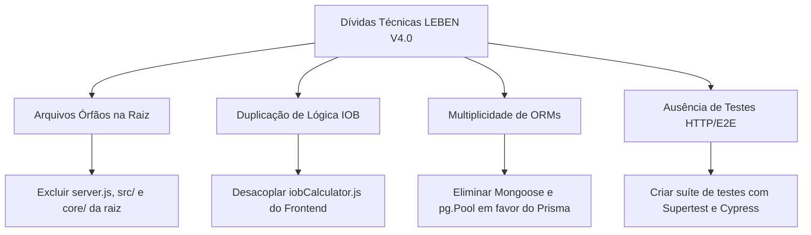

# LEBEN Engineering Handbook — Volume 09: Technical Debt & Refactoring Inventory

**Projeto:** LEBEN — Plataforma de Gestão de Diabetes & Motor Clínico de Bolus  
**Versão:** 4.0.0  

---

## 1. Inventário Detalhado da Dívida Técnica

---

## 2. Classificação das Dívidas Técnicas

| Item | Descrição | Localização no Código | Impacto | Esforço Estimado |
| :--- | :--- | :--- | :---: | :---: |
| **DT-01** | **Arquivos Órfãos na Raiz** | Raiz do projeto (`server.js`, `src/`, `core/`) | ALTO | Baixo (1 hora) |
| **DT-02** | **Duplicação de Cálculo de IOB** | [`iobCalculator.js`](file:///c:/Users/Well/Desktop/projetoinsu/frontend/src/utils/iobCalculator.js) vs [`iob.js`](file:///c:/Users/Well/Desktop/projetoinsu/backend/src/core/glucose_engine/iob_engine/iob.js) | ALTO | Médio (1 dia) |
| **DT-03** | **Persistência Fracionada** | Mongoose + `pg.Pool` em [`authController.js`](file:///c:/Users/Well/Desktop/projetoinsu/backend/src/controllers/authController.js) | MÉDIO | Médio (2 dias) |
| **DT-04** | **Tratamento de Exceções no Front** | Fallback de login sintético em [`AuthContext.jsx`](file:///c:/Users/Well/Desktop/projetoinsu/frontend/src/context/AuthContext.jsx) | ALTO | Baixo (2 horas) |
| **DT-05** | **Ausência de Mocks / Testes HTTP** | [`tests/test_engine.js`](file:///c:/Users/Well/Desktop/projetoinsu/tests/test_engine.js) só cobre unidade | MÉDIO | Médio (3 dias) |

---

## 3. Plano de Execução para Remoção de Código Órfão

Para higienizar a estrutura do projeto sem afetar a produção:

1. **Deletar o servidor legado da raiz:** Excluir [`server.js`](file:///c:/Users/Well/Desktop/projetoinsu/server.js).
2. **Deletar a pasta de controllers legados:** Excluir o diretório `src/` da raiz.
3. **Deletar o motor duplicado da raiz:** Excluir o diretório `core/` da raiz.
4. **Verificar scripts:** Garantir que todos os scripts do [`package.json`](file:///c:/Users/Well/Desktop/projetoinsu/package.json#L7-L11) continuem apontando para `backend/src/server.js`.
