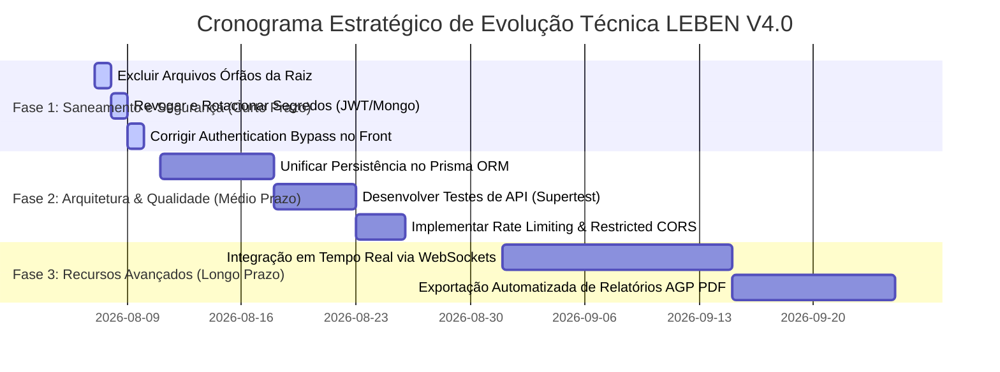

# LEBEN Engineering Handbook — Volume 10: Evolutionary Technical Roadmap

**Projeto:** LEBEN — Plataforma de Gestão de Diabetes & Motor Clínico de Bolus  
**Versão:** 4.0.0  

---

## 1. Visão Geral do Roadmap de Engenharia

O Roadmap de Evolução do **LEBEN V4.0** está estruturado em três horizontes temporais para elevar o software do estado atual até o nível de produção e certificação de dispositivo médico.

---

## 2. Detalhamento dos Planos de Ação

### 🔴 Fase 1 — Saneamento e Segurança Crítica (Semana 1)
- **Ação 1.1:** Deletar `server.js`, `src/` e `core/` na raiz do repositório.
- **Ação 1.2:** Alterar a senha administrativa da instância MongoDB Atlas e rotacionar `JWT_SECRET` e `AUDIT_SECRET` nas variáveis de ambiente da nuvem.
- **Ação 1.3:** Remover a criação de tokens sintéticos no bloco `catch` do [`AuthContext.jsx`](file:///c:/Users/Well/Desktop/projetoinsu/frontend/src/context/AuthContext.jsx#L33-L45).

### 🟡 Fase 2 — Refatoração de Arquitetura e Qualidade (Semanas 2 a 4)
- **Ação 2.1:** Migrar a persistência dos controladores `authController` e `glucoseController` para o **Prisma Client** ([`schema.prisma`](file:///c:/Users/Well/Desktop/projetoinsu/backend/prisma/schema.prisma)).
- **Ação 2.2:** Desenvolver uma suíte de testes de integração HTTP utilizando `supertest` para validar contratos e códigos de resposta HTTP (200, 400, 401, 403, 500).
- **Ação 2.3:** Configurar middleware `express-rate-limit` restringindo o login a no máximo 5 tentativas por minuto.

### 🟢 Fase 3 — Recursos Avançados e Certificação Médica (Meses 2+)
- **Ação 3.1:** Implementar suporte a streaming de dados de glicemia via WebSockets (`socket.io`) para integração com sensores contínuos CGM.
- **Ação 3.2:** Desenvolver módulo de exportação automatizada de relatórios em formato PDF seguindo o padrão internacional AGP (*Ambulatory Glucose Profile*).
