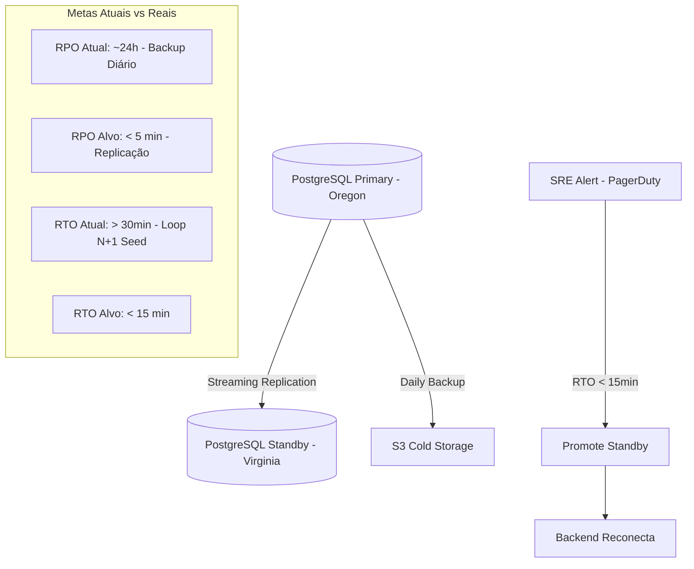

# LEBEN Engineering Handbook — Volume 12: Reliability, Observability & Disaster Recovery (Fase 5)

**Auditor:** SRE Lead, QA Lead & Principal Software Engineer  
**Projeto:** LEBEN — Plataforma de Gestão de Diabetes & Motor Clínico de Bolus (v4.0.0)  
**Data:** 06 de Agosto de 2026  
**Método:** Auditoria de Confiabilidade, Cobertura de Testes, Resiliência e Recuperação de Desastres  

---

## 1. Cobertura de Testes — Estado Atual Completo

### 1.1 Mapa de Cobertura por Camada

| Camada | Arquivos Cobertos | Tipo de Teste | Cobertura Estimada | Ferramenta |
| :--- | :--- | :--- | :---: | :--- |
| **Motor Clínico (`bolus.js`)** | [`bolus.js`](file:///c:/Users/Well/Desktop/projetoinsu/backend/src/core/glucose_engine/insulin_math/bolus.js) | Unitário | ~85% | `node` nativo |
| **Curvas IOB (`iob.js`)** | [`iob.js`](file:///c:/Users/Well/Desktop/projetoinsu/backend/src/core/glucose_engine/iob_engine/iob.js) | Unitário | ~80% | `node` nativo |
| **Validação de Segurança (`safety.js`)** | [`safety.js`](file:///c:/Users/Well/Desktop/projetoinsu/backend/src/core/glucose_engine/validation/safety.js) | Unitário | ~70% | `node` nativo |
| **IOB Calculator Frontend** | [`iobCalculator.js`](file:///c:/Users/Well/Desktop/projetoinsu/frontend/src/utils/iobCalculator.js) | Unitário | ~60% | `node` nativo |
| **Busca de Alimentos TACO** | [`foodService.js`](file:///c:/Users/Well/Desktop/projetoinsu/backend/src/services/foodService.js) | Unitário | ~40% | `node` nativo |
| **Controllers Express** | `authController`, `bolusController`, `glucoseController`, `foodController` | **Ausente** | **0%** | — |
| **Middlewares JWT** | [`authMiddleware.js`](file:///c:/Users/Well/Desktop/projetoinsu/backend/src/middlewares/authMiddleware.js) | **Ausente** | **0%** | — |
| **Rotas REST** | [`routes/index.js`](file:///c:/Users/Well/Desktop/projetoinsu/backend/src/routes/index.js) | **Ausente** | **0%** | — |
| **Migração de Banco** | [`migrate.js`](file:///c:/Users/Well/Desktop/projetoinsu/backend/src/config/migrate.js) | **Ausente** | **0%** | — |
| **Frontend React (E2E)** | Todas as páginas | **Ausente** | **0%** | — |

### 1.2 Lacunas Críticas na Suíte de Testes

**Gap 01: NaN e Entradas Inválidas no Motor**  
Nenhum teste na suíte verifica o que acontece quando `carbs: "texto"`, `glucose: null` ou `iob: -99999` são enviados. O achado RT-02 da Fase 3 mostra que isso causa um crash do servidor com `RangeError`.

```javascript
// Casos ausentes críticos que deveriam existir em test_engine.js:
assert(calculateBolus({ glucose: 100, carbs: "texto", icr: 10, isf: 40 }).success === false,
  'carbs string deve ser rejeitado com erro de validação');

assert(calculateBolus({ glucose: 100, carbs: null, icr: 10, isf: 40 }).success === false,
  'carbs null deve ser tratado como zero ou rejeitado');

assert(calculateBolus({ glucose: Infinity, carbs: 50, icr: 10, isf: 40 }).success === false,
  'glucose Infinity deve ser rejeitado');

assert(calculateBolus({ glucose: 100, carbs: 50, icr: 0, isf: 40 }).success === false,
  'ICR zero causa divisão por zero — deve ser rejeitado');
```

**Gap 02: Cenário de Divisão por Zero (ICR = 0)**  
Se `params.icr = 0` passar pela validação (o limite mínimo é 1), a operação `carbs / icr` resultaria em `Infinity`. O atual `validateBolusInput` protege contra isso com `icr < SAFETY_LIMITS.MIN_ICR`, mas não existe teste confirmando que este guard funciona ao nível de integração da API HTTP.

**Gap 03: Arredondamento com `roundingStep = 0`**  
Nenhum teste verifica `roundingStep = 0`. A linha `Math.round(rawTotal / 0) * 0` em `bolus.js:L147` produziria `NaN` em JavaScript. Não há proteção para isso em `validateBolusInput`.

---

## 2. Idempotência e Consistência de Operações

### 2.1 Análise de Idempotência por Endpoint

| Endpoint | Idempotente? | Problema | Impacto |
| :--- | :---: | :--- | :--- |
| `POST /api/v1/auth/login` | ✅ Sim | — | — |
| `POST /api/v1/auth/register` | ⚠️ Parcial | Race condition sob requisições simultâneas | Token JWT emitido para ID não persistido |
| `POST /api/v1/bolus/calculate` | ✅ Sim | Operação de leitura/cálculo puro | — |
| `POST /api/v1/glucose` | ❌ Não | Sem `Idempotency-Key`. Retry duplica leituras | Distorção das métricas TIR/GMI do relatório |
| `GET /api/v1/glucose` | ✅ Sim | — | — |
| `GET /api/v1/foods/search` | ✅ Sim | — | — |

### 2.2 Rollback e Consistência de Transações

**Cenário: Registro de Usuário com Falha Parcial**

```
Fluxo atual em authController.js:

1. Verifica duplicidade no cache RAM          ✅
2. Gera hash bcrypt da senha                  ✅
3. INSERT no PostgreSQL                       ✅
4. registeredUsersCache.set(email, user)      ✅ (mesmo que o INSERT falhou!)
5. Emite JWT com o userId                     ✅ (mesmo que o DB não salvou!)

PROBLEMA: Passos 4 e 5 executam independentemente do resultado do passo 3.
Se o INSERT falhar silenciosamente (ON CONFLICT DO NOTHING), o usuário
recebe um JWT válido para um ID que não existe no banco de dados.
```

**Correção com verificação de `rowCount`:**
```javascript
const result = await query(
  `INSERT INTO users (...) VALUES (...) ON CONFLICT (email) DO NOTHING RETURNING id`,
  [...]
);
if (!result || result.rowCount === 0) {
  return res.status(409).json({ status: 'error', message: 'E-mail já cadastrado.' });
}
```

---

## 3. Cenários de Falha e Comportamento Observado vs. Esperado

| Cenário de Falha | Comportamento Esperado | Comportamento Atual | Severidade |
| :--- | :--- | :--- | :---: |
| **PostgreSQL indisponível** | Fallback para cache RAM, resposta normal com aviso | Funciona (cache RAM ativo) | 🟡 Médio |
| **MongoDB indisponível** | Fallback para PostgreSQL, sem interrupção | Funciona com log de erro | 🟡 Médio |
| **Ambos os bancos indisponíveis** | Modo offline degradado com cache RAM | Funciona em sessão, perde dados no restart | 🟠 Alto |
| **Token JWT expirado** | HTTP 401 com mensagem clara | Funciona corretamente | 🟢 OK |
| **Token JWT malformado com objeto** | HTTP 403 | HTTP 403 para tokens inválidos, mas NoSQL injection possível via `req.user.id` | 🔴 Crítico |
| **CGM enviando glicemia negativa** | Rejeitado pela validação (`< MIN_GLUCOSE`) | Rejeitado (mínimo 20 mg/dL) | 🟢 OK |
| **`carbs` enviado como string** | Rejeitado pela validação | **Aceito! Gera NaN e crash** | 🔴 Crítico |
| **Múltiplos registros simultâneos** | Detecção de duplicata, HTTP 409 | Race condition — duplo token emitido | 🟠 Alto |
| **Restart do servidor** | Dados em cache RAM perdidos | **Perda total de usuários e leituras em cache** | 🟠 Alto |
| **Leitura de glicemia com retry automático** | Idempotência via `X-Idempotency-Key` | **Duplicação de registros** | 🟠 Alto |

---

## 4. Observabilidade e Ausências Críticas de Monitoramento

### 4.1 Estado Atual dos Pilares de Observabilidade

| Pilar | Ferramenta Esperada | Estado Atual | Impacto |
| :--- | :--- | :---: | :--- |
| **Logs Estruturados** | `pino` / `winston` (JSON) | ❌ `console.log` livre | Impossível agregar em Datadog/Elastic |
| **Métricas APM** | Prometheus + Grafana | ❌ Ausente | Sem visibilidade de latência $p_{95}$/$p_{99}$ |
| **Distributed Tracing** | OpenTelemetry / Jaeger | ❌ Ausente | Sem rastreabilidade de requisição end-to-end |
| **Health Check Profundo** | `/health/ready`, `/health/live` | ⚠️ Apenas `/health` superficial | Sem validação de conectividade do banco |
| **Alertas Automatizados** | PagerDuty / OpsGenie | ❌ Ausente | Sem notificação em falhas de produção |
| **Error Budget / SLO** | SLOTH / Google SRE Toolkit | ❌ Ausente | Sem base para SLA com clínicas |

### 4.2 Health Check Atual vs. Necessário

**Implementação Atual** em [`backend/src/app.js:L20-L26`](file:///c:/Users/Well/Desktop/projetoinsu/backend/src/app.js#L20-L26):
```javascript
app.get('/health', (req, res) => {
  res.status(200).json({ status: 'OK', service: 'LEBEN', timestamp: new Date().toISOString() });
});
```

**Problema:** Este health check retorna 200 mesmo quando o PostgreSQL, o MongoDB e todos os caches estão fora do ar. O provedor de hospedagem (Render) considera o serviço saudável quando o servidor não pode salvar dados médicos de pacientes.

**Health Check Profundo Recomendado:**
```javascript
app.get('/health/ready', async (req, res) => {
  const checks = { postgres: false, mongo: false };
  try {
    await pool.query('SELECT 1');
    checks.postgres = true;
  } catch {}
  try {
    checks.mongo = mongoose.connection.readyState === 1;
  } catch {}
  
  const healthy = checks.postgres && checks.mongo;
  res.status(healthy ? 200 : 503).json({
    status: healthy ? 'READY' : 'NOT_READY',
    checks,
    timestamp: new Date().toISOString()
  });
});
```

---

## 5. Definição de SLO/SLA Clínico Recomendado

| Indicador | SLO Alvo | Janela | Ação em Violação |
| :--- | :---: | :---: | :--- |
| **Disponibilidade da API de Bolus** | 99.95% | Mensal | Failover automático |
| **Latência cálculo de bolus** ($p_{99}$) | < 150ms | 5 min | Alerta SRE |
| **Taxa de erro 5xx na API** | < 0.01% | 1 hora | Rollback imediato |
| **Integridade dos logs de auditoria** | 100% | Contínuo | Alerta crítico imediato |
| **Tempo de recuperação após crash (RTO)** | < 15 min | Por incidente | Revisão post-mortem |
| **Perda máxima de dados (RPO)** | < 5 min | Por incidente | Replicação em streaming |

---

## 6. Plano de Disaster Recovery (DRP)



### Gap de RTO: Por que o restart atual demora mais de 30 minutos

O servidor executa na inicialização um loop N+1 de 8.053 `INSERT` individuais para popular a tabela de alimentos ([`migrate.js:L97-L115`](file:///c:/Users/Well/Desktop/projetoinsu/backend/src/config/migrate.js#L97-L115)). Este processo bloqueia a inicialização completa do HTTP server e atrasa o health check, causando timeout do provedor de hospedagem.

**Correção:** Substituir o loop individual por uma inserção em lote com `COPY` ou multi-row `INSERT`:
```javascript
// Batch insert com chunks de 100 registros por query
const CHUNK_SIZE = 100;
for (let i = 0; i < foods.length; i += CHUNK_SIZE) {
  const chunk = foods.slice(i, i + CHUNK_SIZE);
  const values = chunk.map((_, j) => `($${j*7+1}, $${j*7+2}, ..., $${j*7+7})`).join(',');
  await query(`INSERT INTO food_database (...) VALUES ${values} ON CONFLICT DO NOTHING`, chunk.flatMap(...));
}
```

---

## 7. Matriz de Risco Consolidada (Fases 1 a 5)

| ID | Severidade | Categoria | Descrição do Achado | Probabilidade | Esforço |
| :---: | :---: | :--- | :--- | :---: | :---: |
| CROSS-01 | 🔴 Crítico | Motor Clínico | `targetGlucose` ignorado — superdosagem em idosos/gestantes | Alta | 15 min |
| CROSS-02 | 🔴 Crítico | Banco/Prisma | Migração SQL incompatível com Schema Prisma | Certa | 2 horas |
| CROSS-03 | 🔴 Crítico | Motor/Banco | `Patient.diaHours` nunca consumido — IOB subestimado | Alta | 1 hora |
| CROSS-04 | 🔴 Crítico | Banco/UI | `InsulinProfile` nunca consultada — ICR/ISF hardcoded | Alta | 2 dias |
| CROSS-05 | 🟠 Alto | Motor Clínico | Interação Febre+Exercício matematicamente subótima | Média | 1 dia |
| RT-02 | 🔴 Crítico | Safety/Engine | `carbs: "string"` gera NaN e crash do servidor | Alta | 30 min |
| RT-04 | 🔴 Crítico | SRE | Maps sem TTL causam Out-of-Memory sob carga | Alta | 2 horas |
| RT-06 | 🔴 Crítico | OWASP A03 | NoSQL Injection expõe leituras de todos os pacientes | Média | 15 min |
| RT-07 | 🔴 Crítico | Auth/LGPD | Fallback `'anonymous'` vaza dados entre usuários | Alta | 15 min |
| VULN-01 | 🔴 Crítico | Segurança | Credenciais MongoDB Atlas e JWT no repositório Git | Alta | 30 min |
| VULN-02 | 🔴 Crítico | Auth | Login sintético no `catch` do `AuthContext.jsx` | Alta | 5 min |
| RT-05 | 🟠 Alto | Concorrência | Race condition no registro — token para ID inexistente | Média | 1 hora |
| RT-08 | 🟠 Alto | Frontend | Request thrashing no `useEffect` de cálculo | Média | 1 hora |
| RT-09 | 🟠 Alto | Performance | Pool de 20 conexões estoura sob 1.000 usuários | Alta | 1 dia |
| GAP-01 | 🔴 Crítico | Testes | Cobertura 0% em Controllers, Middlewares e E2E | Certa | 1 semana |
| GAP-03 | 🟠 Alto | Testes | `roundingStep = 0` não é validado — crash por NaN | Média | 30 min |
| DRP-01 | 🟠 Alto | SRE | RTO real > 30min por loop N+1 no seed de alimentos | Alta | 2 horas |
| DRP-02 | 🟠 Alto | SRE | RPO real ~24h por ausência de replicação em streaming | Alta | 1 semana |
| IDEM-01 | 🟠 Alto | Confiabilidade | `POST /glucose` não idempotente — duplica registros em retry | Alta | 1 dia |
| OBS-01 | 🟡 Médio | Observabilidade | Sem logs estruturados, APM, tracing ou alertas | Certa | 1 semana |
