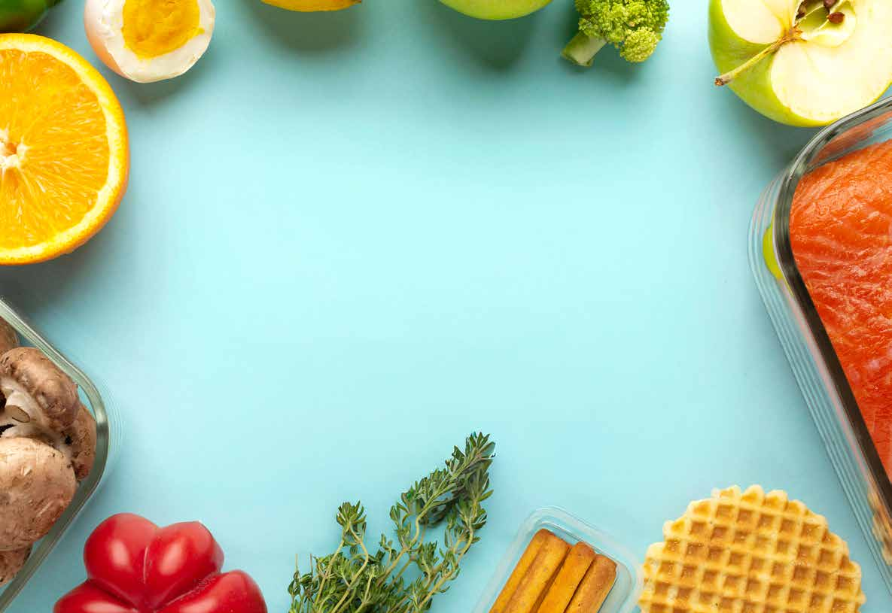
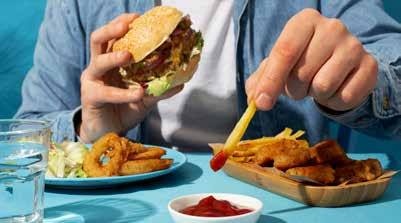
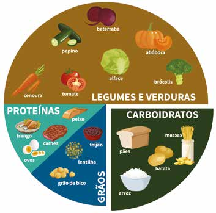
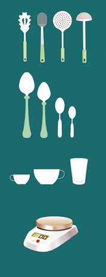

# 📘 Manual Oficial de Contagem de Carboidratos — SBD

> **Sociedade Brasileira de Diabetes (SBD)**  
> *Documento técnico formatado para consulta e desenvolvimento.*

---

## 📄 Página 1

MANUAL DE 
CONTAGEM DE 
CARBOIDRATOS
MANUAL DE 
CONTAGEM DE 
CARBOIDRATOS
Para Pessoas com Diabetes
?

---

## 📄 Página 2

MANUAL DE 
CONTAGEM DE 
CARBOIDRATOS
MANUAL DE 
CONTAGEM DE 
CARBOIDRATOS
Para Pessoas com Diabetes

---

## 📄 Página 3

2
MANUAL DE CONTAGEM 
DE CARBOIDRATOS PARA 
PESSOAS COM DIABETES
A 
estratégia de Contagem de Carboidratos já é reco-
mendada pelas Sociedades Científicas, no Brasil 
e no mundo, há mais de 20 anos - em especial, 
para o tratamento do Diabetes tipo 1. Essa estratégia 
se diferencia das demais, principalmente por melho-
rar a qualidade de vida e oferecer um leque de opções 
alimentares para as pessoas com diabetes. A Contagem 
de Carboidratos é baseada na proposta da alimentação 
saudável, na qual devem ser utilizados todos os grupos 
de alimentos.
O segredo está na relação entre a quantidade adequa-
da do alimento e sua associação com o tratamento me-
dicamentoso. Sendo assim, é fundamental o trabalho 
do profissional Nutricionista na equipe multiprofissio-
nal, especificamente para a individualização do plano 
alimentar, de acordo com as necessidades nutricionais 
do indivíduo. Para usufruir de toda a eficácia dessa es-
tratégia, faz-se necessário ter um Manual consistente 
sobre a informação nutricional dos alimentos.
A Sociedade Brasileira de Diabetes lançou o primeiro 
Manual Oficial de Contagem de Carboidratos em 2003 
que, desde então, vem sendo aperfeiçoado com am-
pliação da lista de alimentos, para atender as necessi-
dades das pessoas com diabetes. 
O novo Manual aqui apresentado está com uma forma-
tação mais moderna e textos com linguagem de fácil 
PREFÁCIO

---

## 📄 Página 4

3
entendimento. Para melhorar o acesso à informação, 
mais ilustrações foram incluídas, visando auxiliar no 
manuseio por pessoas de todas as idades. Além disso, 
para facilitar o uso rotineiro, o alimento foi listado por 
ordem alfabética e de acordo com a sua medida caseira.
A versão eletrônica do novo manual estará disponível 
no hotsite de Nutrição, bem como, em um aplicativo 
que poderá ser baixado em celulares e tablets. A ela-
boração da última versão do Manual, publicado em 
2016, teve a coordenação da nutricionista Luciana Bru-
no e contou com a expertise de nutricionistas das O5 
regiões do Brasil, integrantes do Departamento de Nu-
trição (gestão 2014-2015).
A versão atual, coordenada pela nutricionista Débora 
Bohnen, contou com uma revisão detalhada da tabela 
já existente e com a inclusão de novos alimentos, além 
de incluir orientações atualizadas sobre a Contagem de 
Carboidratos Avançada com assuntos como Contagem 
de proteínas e gorduras e Carboidratos líquidos.
A realização desse material foi fruto do grande es-
forço e dedicação de várias pessoas e, sobretudo, da 
perseverança daqueles que transformam com ética, o 
saber técnico em qualidade de vida para as pessoas 
com diabetes. Sendo assim, é com orgulho que apre-
sentamos a nova edição do Manual Oficial de Conta-
gem de Carboidratos – 2025, esperamos que seja uma 
ferramenta prática, acessível e transformadora, con-
tribuindo para o autocuidado, para a prática profis-
sional e para a promoção de um viver com mais saúde 
e autonomia.

---

## 📄 Página 5

Presidente
Ruy Lyra da Silva Filho
Vice-Presidente
João Eduardo Nunes Salles 
Marcello Casaccia Bertoluci 
Reine Marie Chaves Fonseca 
Saulo Cavalcanti da Silva 
Solange Travassos de Figueiredo Alves
1º Tesoureiro
Fernando Valente
2º Tesoureira
Silmara Aparecida de Oliveira Leite
1º Secretario
Maria Edna de Melo
2º Secretario
Nelson Rassi
Diretoria SBD - Gestão 2024-2025
Coordenadora do Manual de Contagem  
de Carboidratos
Débora Bohnen Guimarães 
(Minas Gerais) 
Coordenadoras do Departamento de 
Nutrição da SBD 2024/2025 
Marlice Silva Marques (Goiás)
Daniela Lopes Gomes (Pará)
Comissão de Revisão do Manual 
de Contagem de Carboidratos do 
Departamento de Nutrição da SBD – 
2024/2025
Débora Bohnen Guimarães 
Débora Lopes Souto  
Maristela Bassi Strufaldi  
Marlice Silva Marques 
Silvia Ramos   
Tarcila Ferraz de Campos
AUTORAS
NUTRICIONISTAS MEMBROS DO 
DEPARTAMENTO DE NUTRIÇÃO DA SBD 
2022/2023 
Daniela Lopes Gomes (Pará) 
Débora Bohnen Guimarães 
(Minas Gerais)
Débora Lopes Souto (Rio de Janeiro)
Deise Regina Baptista (Paraná)
Letícia Fuganti Campos (Paraná)
Maristela Bassi Strufaldi (São Paulo)
Marlice Silva Marques (Goiás)
Natália Fenner (Minas Gerais)
Sabrina Soares Sousa (Bahia)
Silvia Ramos (São Paulo)
Tarcila Beatriz Ferraz de Campos 
(São Paulo)
Diagramação: 
Jun Ilyt T. Normanha
Ilustrações e fotos: 
Designed by Freepik

---

## 📄 Página 6

SUMÁRIO
01.	O que é a contagem de carboidratos.	
6
02.	Efeitos dos alimentos na glicemia.	
7
03.	Quem pode utilizar a contagem de carboidratos?	
9
04.	Quais alimentos tem carboidratos?	
10
O5.	Quais os esquemas de tratamentos atuais?	
11
O6	Como começo a contagem de carboidratos?	
12
O7.	E as proteínas e gorduras?	
13
08.	E o açúcar, pode ser consumido?	
19
09.	Quais alimentos não precisamos contar carboidratos?	
20
10.	E o índice glicêmico?	
21
11.	 Alimentação saudável e a contagem de carboidratos.	
23
12.	Praticando a contagem de carboidratos.	
24
13.	 Como ler a informação nutricional?	
25
14.	Treinando o olhômetro 1.	
30
15.	Treinando o olhômetro 2.	
31
16.	Bebida alcoólica e contagem de carboidratos.	
32
17.	A contagem de carboidratos e o diabetes tipo 2.	
33
18.	A contagem de carboidratos e o diabetes tipo 1. 
	
• Esquema insulínico tradicional.	
34
19.	A contagem de carboidratos e o diabetes tipo 1. 
	
• Esquema insulínico intensivo.	
35
20.	A contagem de carboidratos e o diabetes tipo 1. 
	
• Alguns conceitos importantes.	
36
21.	A contagem de carboidratos e o diabetes tipo 1. 
	
• Vamos praticar?	
37
22.	Como saber se estou no caminho certo?	
38
23.	Tratamento da hipoglicemia.	
39
24.	Carboidratos líquidos ou “net carbs”.	
41
25.	Calculando receitas.	
46
26.	Tabela de alimentos.	
47

---

## 📄 Página 7

6
01. O QUE É A CONTAGEM DE 
CARBOIDRATOS
É uma estratégia nutricional que oferece à pessoa 
com diabetes maior flexibilidade em sua alimenta-
ção, de acordo com seu estilo de vida.
Objetivo
O objetivo maior é encontrar o equilíbrio entre a 
glicemia, a quantidade de carboidratos ingerida e a 
quantidade de insulina necessária.

---

## 📄 Página 8

7
02. EFEITOS DOS 
ALIMENTOS NA GLICEMIA
O carboidrato é o nutriente que tem maior efeito sobre 
a glicemia, já que a totalidade (100%) do que é ingeri-
do transforma-se em glicose. Esta é a razão principal 
que o coloca como foco do nosso tratamento.
Por outro lado, com relação a proteína, um valor en-
tre 35% e 60% pode influenciar nos níveis de glicose 
e da gordura, somente 10%.

---

## 📄 Página 9

8
EM QUANTO TEMPO 
TEMOS A RESPOSTA DO 
ALIMENTO NA GLICEMIA?
Carboidratos
15 min - 2 horas
Proteínas
3 - 4 horas
Gorduras
5 horas
efeito nos níveis de glicose
100%
35 a 60%
10%
EFEITOS DOS ALIMENTOS NA GLICEMIA

---

## 📄 Página 10

9
03. QUEM PODE UTILIZAR 
A CONTAGEM DE 
CARBOIDRATOS?
Toda pessoa com Diabetes pode se beneficiar da 
contagem de carboidratos como estratégia nutricio-
nal. Para ser um bom candidato à contagem de car-
boidratos, é preciso:
•	 Motivação
•	 Disciplina
•	 Trabalho em equipe
•	 Compromisso com o método durante o período de 
implementação

---

## 📄 Página 11

10
04. QUAIS ALIMENTOS TEM 
CARBOIDRATOS?
•	 Açúcar
•	 Alimentos que  
contenham açúcar
•	 Arroz
•	 Aveia
•	 Batata (doce, baroa, 
inglesa)
•	 Biscoitos
•	 Cereais
•	 Ervilha
•	 Feijão
•	 Frutas
•	 Grão de bico
•	 logurtes
•	 Leite
•	 Lentilha
•	 Mandioca (aipim e 
macaxeira)
•	 Mandioquinha
•	 Massas
•	 Mel
•	 Milho
•	 Pães
•	 Soja 
•	 Sucos
•	 entre outros

---

## 📄 Página 12

11
O5. QUAIS OS ESQUEMAS DE 
TRATAMENTOS ATUAIS?
DIABETES TIPO 2
No caso de Diabetes tipo 2, o tratamento pode acon-
tecer com alimentação, atividade física, medicações 
orais ou injetáveis e insulina. Na maioria dos casos, 
a terapia de contagem de carboidratos utilizada é a 
denominada nível primário (método básico).
Nível primário ou método de substituição de carboi-
dratos, onde 1 porção ou escolha contém em média 
15g de carboidratos.
A contagem nível 
secundário e 
avançado, pode 
ser utilizada 
na terapia com 
múltiplas doses 
e na terapia de 
bomba de insulina 
em pessoas com 
Diabetes tipo 1, tipo 
2 ou outros tipos.
DIABETES TIPO 1
Terapia Tradicional
•	 Insulina de ação intermediária
•	 Insulina de ação rápida
Terapia de Múltiplas Doses (ou Intensiva)
•	 Insulina ultralenta (ou intermediária)
•	 Insulina ultrarrápida (ou rápida)
Terapia de Infusão Contínua de Insulina  
(bomba de insulina)
•	 Insulina ultrarrápida
Leite
01 porção de CHO = 15 g
01 maça
01 copo de 
leite
01 fatia de 
pão
01 colher de 
açucar
=
=
=

---

## 📄 Página 13

12
O6 COMO COMEÇO 
A CONTAGEM DE 
CARBOIDRATOS?
1
O seu nutricionista te ajudará a descobrir quantas 
calorias você deve ingerir ao dia para manter-se sau-
dável. A partir daí definirá quanto de carboidrato 
deve ser consumido diariamente e em cada refeição.
2
Anote o que você come! A partir do diário alimentar, 
pode-se conhecer a quantidade, a qualidade e a dis-
tribuição dos carboidratos consumidos ao longo do 
dia, levando em consideração a prática de atividade 
física e o estilo de vida.
3
Medir as glicemias antes de cada refeição e duas ho-
ras após iniciá-las é importante para verificar o efeito 
dos alimentos e da medicação sobre a sua taxa gli-
cêmica.

---

## 📄 Página 14

13
ATENÇÃO
Em refeições nas quais o consumo de gorduras e 
proteínas é maior (como pizzas, churrasco, lasanhas, 
hambúrgueres e outros), a glicemia pode se elevar em  
2 a 6 horas após a ingestão.
O7. E AS PROTEÍNAS E 
GORDURAS?
PROTEÍNAS
As proteínas garantem ao nosso corpo 
os aminoácidos essenciais para o cres-
cimento, para a manutenção e para a re-
paração dos tecidos. Cerca de 15 - 20% 
das calorias devem vir das proteínas.
SÃO FONTES: OVOS, LEITES, QUEIJOS, IOGURTES, 
CARNES, AVES, PESCADOS, FEIJÃO, SOJA, LENTILHA, 
ERVILHA E GRÃO DE BICO.
GORDURAS
Enquanto isso, as gorduras fornecem 
também energia, são importantes con-
dutores de vitaminas lipossolúveis (A, D, 
E e K) e possuem ácidos graxos essen-
ciais. Recomenda-se sua ingestão diária 
correspondente a até 35% das calorias.
SÃO FONTES: ÓLEOS VEGETAIS, BANHA ANIMAL, 
MARGARINAS, MANTEIGAS, MAIONESES, CREME DE 
LEITE.

---

## 📄 Página 15

14
Precisamos contar  
proteínas e gorduras?
E
mbora o carboidrato seja o nu-
triente que mais impacta a glice-
mia após a refeição, no dia a dia 
observamos que a gordura e a proteína 
da dieta também podem afetar signifi-
cativamente a glicose após a refeição.
O excesso desses nutrientes pode in-
fluenciar a glicose, aumentando a 
chance de hiperglicemia tardia, ou 
seja, após 2 horas da ingestão da refei-
ção. Dessa forma, ajustar a dose de in-
sulina para esses nutrientes pode ser 
benéfico para o controle glicêmico.
Alguns estudos com pessoas com Dia-
betes tipo 1 mostraram que a proteína 
e a gordura consumidas em refeições 
juntamente com carboidratos, redu-
zem o aumento glicêmico pós-prandial

---

## 📄 Página 16

15
precoce, ou seja, logo após a refeição, 
mas contribui para a hiperglicemia pós-
-prandial tardia (2 a 6h após a refeição).
Na prática clínica, o monitoramento 
contínuo da glicose (sensores) desta-
ca os efeitos glicêmicos de diferentes 
tipos de refeições, demonstrando que 
estratégias de dosagem de insulina 
das refeições baseadas somente em 
contagem de carboidratos apresentam 
limitações. Porém, não há, até o mo-
mento, um algoritmo único e seguro 
para consideração desses macronu-
trientes na dose de insulina que cabe 
a todas as pessoas com Diabetes, pois 
os efeitos de tais macronutrientes são 
individualizados, sendo necessários 
mais estudos para o desenvolvimento 
de método prático e assertivo.
PRECISAMOS CONTAR PROTEÍNAS E GORDURAS?

---

## 📄 Página 17

16
De qualquer forma, uma revisão 
com análise de vários estudos 
bem conduzidos nesse tema, 
sugeriu que pode ser necessário 
um adicional de cerca de 30-35% 
da dose de insulina calculada 
pela contagem de carboidratos 
em refeições que apresentem 
maior quantidade de proteínas 
e gorduras nos pacientes que 
observem tal efeito tardio.
Tal adição, pode ser um ponto de partida para ajus-
tes — posteriores com seu médico ou nutricionista 
educador em diabetes. Outro algoritmo que pode ser 
considerado é o teor calórico da refeição provenien-
te das proteínas e gorduras, onde a cada 100 kcal de 
proteínas e gorduras, considera-se mais 10g de car-
boidratos na refeição.
Na prática clínica, a grande preocupação é que o adi-
cional dessa dose, se aplicada previamente ou no 
momento da refeição, possa gerar maior risco de hi-
poglicemia precoce (até 2 h após a refeição), uma vez 
que o esvaziamento gástrico de refeições com essa 
natureza tende a ser mais lento, além desses ma-
cronutrientes apresentarem efeito de conversão de 
glicose mais tardio. Essa adição de dose é sugerida 
então, em torno de 1 a 2 horas após a refeição, quan-
do em terapia de múltiplas doses de insulina, ou, se 
em uso de bomba de insulina, é possível ativar o uso 
de bolus duplo/multionda (sendo disponibilizada 
50% da dose de insulina imediatamente antes da re-
feição e 50% em bolus estendido em 2h a 2h30min do 
início da refeição).
PRECISAMOS CONTAR PROTEÍNAS E GORDURAS?

---

## 📄 Página 18

17
Exemplo do método 1  
(30-35% adicional de dose):
PRECISAMOS CONTAR PROTEÍNAS E GORDURAS?
Para pessoas em uso de bomba de insulina, as do-
ses extras para a contagem de proteínas e gorduras 
tornam-se mais seguras. Isso porque, existe a possi-
bilidade do uso de bolus diferenciados, como o es-
tendido/quadrado ou duplo/multionda.
•	 22 g de CHO por fatia = 44 g CHO (se relação  
ins: CHO = 1 U: 10 g)
•	 44 g / 10 g = 4,4 UI, arredondando para caneta ou 
seringa 4 UI ou 4,5 UI.
•	 Adicional para proteínas e gorduras - 30 - 35 % de  
4,4 UI = em média 1,5 UI a serem aplicadas 1 h 
após a refeição, se em uso de múltiplas injeções 
diárias.
•	 Ou em bomba de insulina: Total das doses: 
4,4 UI + 1,5 UI = 5,9 UI, sendo 50% liberado 
imediatamente (3,0 UI) e 50% (2,9 UI) em bolus 
estendidos em 2 h.
2 fatias de Pizza 
de mussarela:

---

## 📄 Página 19

18
Esses bolus podem ser programados para que a in-
sulina adicional seja liberada em um tempo deter-
minado e não somente imediato, coincidindo com o 
padrão tardio de conversão de glicose provenientes 
desses nutrientes e assim, diminuindo o risco de hi-
poglicemias. Atualmente, podemos contar também 
com bombas de insulina mais modernas, as quais 
apresentam automação nos ajustes de doses de in-
sulinas conforme a glicose do sensor, diminuindo a 
preocupação com os efeitos lentos das proteínas e 
gorduras na glicemia.
 Contudo, destaca-se que, apesar de todos os avanços 
sobre o conhecimento do efeito das proteínas e gor-
duras na glicemia pós-prandial, até o momento não 
está estabelecido um único algoritmo, seguro e de 
fácil utilização para definição da dose do bolus pran-
dial. Logo, ter metas realistas, fazer a monitorização 
da glicemia e avaliar cada situação de forma indivi-
dual junto com seu médico ou nutricionista educador 
em diabetes parece ser o caminho mais seguro.
PRECISAMOS CONTAR PROTEÍNAS E GORDURAS?

---

## 📄 Página 20

19
08. E O AÇÚCAR, PODE SER 
CONSUMIDO?
Sim, desde que o total de carboidratos fornecidos 
por ele seja contabilizado dentro de uma proposta 
de alimentação saudável.
É importante lembrar que, em geral, doces e açúcares 
não possuem fibras, vitaminas e minerais e, além dis-
so, mesmo que em pequenas porções, contém muitas 
calorias, podendo colaborar com o ganho de peso.
A sua sobremesa favorita, defina quantas vezes na 
semana irá consumi-la e em que quantidade de 
carboidrato ela será contabilizada.

---

## 📄 Página 21

20
09. QUAIS ALIMENTOS 
NÃO PRECISAMOS CONTAR 
CARBOIDRATOS?
•	 Água
•	 Carne Suína
•	 Adoçantes não calóricos 
•	 Chá
•	 Aves 
•	 Maionese
•	 Azeite 
•	 Ovos
•	 Creme de Leite 
•	 Pescados
•	 Café 
•	 Queijo
•	 Carne Bovina
•	 Vegetais
Carnes em geral (boi, porco, aves e pescados) 
desde que não ultrapassem a 1 porção de  
150 gramas.
Vegetais crus e cozidos em pequenas 
quantidades (até 1 xícara de vegetal cru  
ou meia xícara de vegetal cozido).

---

## 📄 Página 22

21
10. E O ÍNDICE GLICÊMICO?
O
s alimentos se diferem quanto 
sua resposta glicêmica e em-
bora as dietas com baixo índice 
glicêmico possam reduzi-las em situ-
ação pós-prandial, os estudos a longo 
prazo não têm confirmado considerá-
vel benefício.
Dessa forma, a monitorização das gli-
cemias ainda é considerada um guia 
eficaz para identificar as respostas 
específicas de cada alimento sobre a 
glicemia, para cada pessoa.
A glicemia pós-prandial (medida 2 ho-
ras após o início da refeição) contri-
bui para o tempo no alvo e é um foco 
para um melhor controle glicêmico. 
Escolhas alimentares, planejamento 
de refeições e rotina alimentar são 
conhecidos por influenciar os resulta-
dos glicêmicos pós-prandiais.
Aplicar a insulina de ação rápida 5-15 
minutos antes da refeição pode ser 
benéfico para o controle glicêmico.

---

## 📄 Página 23

|  |  |  |  |  |  |
| --- | --- | --- | --- | --- | --- |
| prato |  | rão |  |  |  |
|  | de macar |  |  |  |  |
|  |  |  |  |  |  |
|  |  |  |  |  |  |
|  |  |  |  |  |  |
|  |  |  |  |  |  |

|  |  |  |  |  |  |
| --- | --- | --- | --- | --- | --- |
| salada | antes do | prato d | e macarr | ão |  |
|  |  |  |  |  |  |
| prato | de mac | arrão |  |  |  |
|  |  |  |  |  |  |
|  |  |  |  |  |  |
|  |  |  |  |  |  |
|  |  |  |  |  |  |

---

## 📄 Página 24

23
11. ALIMENTAÇÃO SAUDÁVEL 
E A CONTAGEM DE 
CARBOIDRATOS
A contagem de carboidratos é a chave do tratamento 
do diabetes e deve ser inserida no contexto de uma 
alimentação saudável. Esses carboidratos devem vir 
das frutas, dos vegetais e de grãos integrais e como 
vimos anteriormente combinar os carboidratos com 
fibras, proteínas e gorduras de boa qualidade pode 
refletir em melhor controle glicêmico. Um guia para 
compor as refeições é planejar um prato saudável 
nas suas refeições.
50%
12,5%
12,5%
25%
Para baixar a 
Revista Diabetes 
Magazine sobre 
Alimentação 
Saudável,  
acesse QR code.

---

## 📄 Página 25

24
12. PRATICANDO 
A CONTAGEM DE 
CARBOIDRATOS
Imagine que, em seu dia a dia, 
no café da manhã, você ingira:
•	 O1 pão francês com queijo;
•	 O1 copo de leite com café;
•	 O1 fruta.
Agora, imagine que está na 
casa de um amigo no final de 
semana e deseja mudar seu 
café da manhã, sem alterar a 
glicemia.
O que deve ser feito é desco-
brir o quanto de carboidrato 
você geralmente ingere no 
seu café da manhã e, a partir 
daí, fazer as contas para in-
cluir os alimentos que deseja 
comer na casa de seu amigo.
 Agora que já sabe a quan-
tidade de carboidratos que 
normalmente consome, é só 
escolher os alimentos que 
deseja comer, baseados nes-
se valor em relação aos valo-
res do manual da SBD. 
plano 
alimentar
• café da 
   manhã
• almoço
• jantar
01 pão 
frances
de 
carboidratos
= 29g
01 copo de  
leite
de 
carboidratos
= 12g
1/2 mamão 
papaya
de 
carboidratos
= 13g
de carboidratos
= 54g
café da manhã 
habitual
Total do café  
da manhã

---

## 📄 Página 26

25
13. COMO LER A INFORMAÇÃO 
NUTRICIONAL?
O QUE OLHAR?
1.	 Tamanho da porção do alimento
2.	 Quantidade total de carboidratos
3.	 Quantidade total de gorduras (procure opções 
com até 5 gramas de gorduras na porção)
4.	 Quantidade total de fibras (acima de 2,5 gramas 
por porção é considerado rico em fibras)
INFORMAÇÃO NUTRICIONAL
Porção: 25 g (1 xícara)
Porções por embalagem: 6
100 g     25 g     %VD*
Valor energético (kcal)
Carboidratos (g)
   Açucares totais (g)
   Açucares adicionais (g)
Proteínas
Gorduras totais (g)
   Gorduras saturadas (g)
   Gorduras trans (g)
Fibra alimentar (g)
Sódio (mg)
505     126       6
53        13        4
5        1,2          
4,8      1,2        2
4,0       1          2
31,0    7,8      13
31,0    7,8      13
0        0         0
3,0    0,8        3
600    150       8
* Percentual de valores diários fornecidos pela porção.
2.
3.
4.
1.

---

## 📄 Página 27

26
13. COMO LER 
A INFORMAÇÃO 
NUTRICIONAL?
Quando a informação nutricional não estiver no ró-
tulo, deve-se procurar a informação no manual de 
contagem de carboidratos.
E quando a porção que você for comer não for a mes-
ma descrita no rótulo ou no manual?
Vamos usar a “regra de 3“.
Exemplo: Vou comer 01 banana prata e, segundo o 
manual SBD, 01 banana, que pesa 40 gramas, tem 
9 gramas de carboidratos (não confundir o peso do 
alimento com a quantidade em gramas de carboi-
drato)
Pesei uma banana (sem casca) e ela pesa 70 gramas.
Então:
7O X 9 = 630 : 40 = 15,7
A banana que vou comer 
tem 16 g de CHO
	 40 g	
9 g
	 70	
x g

---

## 📄 Página 28

| Alto conteúdo de | Alimentos sólidos e semi sólidos | Alimentos líquidos |
| --- | --- | --- |
| Açucar adicionado | 15 g ou mais por 100 g de alimento | 7,5 g ou mais por 100 ml de alimento |
| Gordura saturada | 6 g ou mais por 100 g de alimento | 3 g ou mais por 100 ml de alimento |
| Sódio | 600 mg ou mais por 100 g de alimento | 300 mg ou mais por 100 ml de alimento |

---

## 📄 Página 29

|  |  | 100 g | 000 g | %VD* |
| --- | --- | --- | --- | --- |
|  |  |  |  |  |
|  |  |  |  |  |
| Açucares totais (g) Açucares adicionais (g) |  |  |  |  |
|  |  |  |  |  |
|  |  |  |  |  |
|  |  |  | B |  |
|  |  |  |  |  |
|  |  |  |  |  |
|  |  |  |  |  |
|  |  |  |  |  |
|  |  |  |  |  |

---

## 📄 Página 30

29
NOVA ROTULAGEM 
NUTRICIONAL DE ALIMENTOS 
NO BRASIL
LISTA DE INGREDIENTES
A lista de ingredientes deve estar em ordem decres-
cente, com aquele de maior quantidade.
QUANTO MAIS SIMPLES, MELHOR!
Se o produto possui uma lista enorme de ingredien-
tes ou nomes muitos estranhos, isso não é um bom 
sinal. Nomes estranhos são, na sua maioria, aditivos 
químicos ou componentes adicionados pela indús-
tria para aumentar o sabor, a durabilidade, dar cor e 
não são benéficos à saúde.
COMO LER A INFORMAÇÃO NUTRICIONAL?
COMPARE
Se você possui produ-
tos com lista de ingre-
dientes semelhantes, 
faça comparações nu-
méricas das informa-
ções nutricionais. Por 
exemplo, o valor caló-
rico pode dar uma no-
ção melhor do quanto 
há de açúcar, óleo ou 
farinha refinada no 
alimento.

---

## 📄 Página 31

30
14. TREINANDO O 
OLHÔMETRO 1
Para que a contagem de carboidratos seja cada vez 
mais exata, vale a pena treinar seu “olhômetro”, co-
nhecendo os tamanhos das colheres, copos e xícaras, 
além de pesar alguns alimentos.
•	 Pegador de macarrão
•	 Colher de arroz
•	 Escumadeira
•	 Concha
•	 Colher de sopa
•	 Colher de sobremesa
•	 Colher de chá
•	 Colher de café
•	 Xícara de café
•	 Xícara de chá
•	 Copo americano
•	 Balança

---

## 📄 Página 32

31
1 5. TREINANDO O 
OLHÔMETRO 2
Para facilitar sua leitura no dia a dia, utilize sua mão 
como medida.
1
PALMA DA MÃO = 
= O1 PORÇÃO DE CARNE
2
O1 UNHA = 
= O1 COLHER DE CHÁ DE 
MARGARINA OU AZEITE
3
O1 POLEGAR = 
= 30 GRAMAS DE QUEIJO
4
01 PUNHO =  O1 XÍCARA DE 
CHÁ DE ARROZ OU MACAR-
RÃO OU 01 BATATA PEQUENA

---

## 📄 Página 33

32
16. BEBIDA ALCOÓLICA 
E CONTAGEM DE 
CARBOIDRATOS
A ingestão de bebidas alcoólicas sem alimentos pode 
provocar hipoglicemias tanto em pessoas que usam 
insulina como naquelas que utilizam antidiabéticos 
orais.
Assim, não se deve beber, especialmente de estôma-
go vazio. Recomenda-se observar o comportamento 
do organismo, realizando as medidas de glicemia an-
tes e após a ingestão.
Consulte sua equipe de saúde 
para saber se será necessário 
contar os carboidratos das 
bebidas alcoólicas de forma 
individual e diferenciada.
É importante destacar que não existe nível seguro 
de consumo de bebida alcoólica. Caso opte por 
beber, controle quantidade e frequência e siga as 
recomendações da sua equipe de saúde.

---

## 📄 Página 34

33
17. A CONTAGEM DE 
CARBOIDRATOS E O 
DIABETES TIPO 2
Para aplicar a contagem de carboidratos no Diabetes 
tipo 2, com controle apenas com alimentação e ativi-
dade física associado ou não a medicações, deve-se 
conhecer a quantidade de carboidratos que deve ser 
ingerida em cada refeição e manter esta quantidade 
sempre.
Essa quantidade de carboidratos 
será definida pelo nutricionista, 
baseada em seu peso, prática  
de atividade física, medicação e 
estilo de vida.
É possível praticar a contagem de 
carboidratos com a substituição dos 
alimentos, podendo incluir todo e 
qualquer alimento à rotina.

---

## 📄 Página 35

34
18. A CONTAGEM DE 
CARBOIDRATOS E O 
DIABETES TIPO 1
ESQUEMA INSULÍNICO TRADICIONAL
Para aplicar a contagem de carboidratos em uma pes-
soa com Diabetes tipo 1, em esquema insulínico tra-
dicional, também deve-se conhecer a quantidade de 
carboidratos a ser ingerida em cada refeição e manter 
este valor constante. Como a insulina intermediária e 
a rápida são utilizadas e ambas têm picos de ação (ou 
seja, momentos em que vão agir mais), é importante 
ter horários para comer e sempre em mesmas quan-
tidades, diminuindo, assim, a chance de hipoglicemia.
Esta quantidade de carboidratos será definida pelo 
nutricionista, baseada em seu peso, atividade física, 
medicação e estilo de vida.
Nível de Insulina Plasmática
tempo (horas)
0
2
4
6
10
12
14
16
18
20
22
24
Regular
NPH
É importante ter 
horários para 
comer e sempre 
nas mesmas 
quantidades

---

## 📄 Página 36

35
19. A CONTAGEM DE 
CARBOIDRATOS E O 
DIABETES TIPO 1
ESQUEMA INSULÍNICO INTENSIVO
Este esquema é o mais fisiológico que temos até o 
momento, no qual a quantidade de insulina ultra rá-
pida é aplicada de acordo com o que o paciente irá 
ingerir. Aqui também deve-se conhecer a quantida-
de de carboidratos a ser ingerida em cada refeição. 
No entanto, o indivíduo pode variar os horários e a 
quantidade de alimentos que quer ingerir (tanto para 
mais quanto para menos), desde que aplique a quan-
tidade de insulina ultra rápida em cada refeição.
A pessoa pode variar o horário de refeição e 
quantidade de alimentos que quer ingerir
0 hs
6 hs
6 hs
12 hs
18 hs
Doses de insulina de ação rápida ou ultrarrápida
Insulina de ação longa

---

## 📄 Página 37

36
20. A CONTAGEM DE 
CARBOIDRATOS E O 
DIABETES TIPO 1
Bolus Alimentar (BA)
É a quantidade de insulina ultrarrápida necessária 
para cobrir os gramas de carboidratos.
Exemplo = 1 unidade de insulina cobre 15 gramas de 
carboidratos.
Este bolus para alimentação é individual e pode variar 
ao longo do dia. Para conhecer sua relação insulina-
-carboidrato, é importante medir as glicemias antes e 
duas horas após as refeições (após a primeira garfada).
*Essa regra é individualizada e deve ser orientada 
como ponto de partida pela sua equipe de saúde.
EXEMPLO: O1 MAÇÃ PEQUENA = 15 G DE CARBOIDRATO
Neste caso seria necessário 1 unidade de insulina ultrarrápida
Bolus de Correção (BC)
É a quantidade de insulina ultrarrápida necessária 
para corrigir sua glicemia. Seu médico pode criar 
uma regra geral de correção glicêmica, ou utilizar a 
“regra 1800”, na qual dividimos 1800 pela dose total 
de insulina utilizada no dia. Aqui, descobrimos sua 
sensibilidade insulínica (fator sensibilidade), ou seja, 
quanto uma unidade de insulina ultrarrápida baixa, 
em pontos, a sua glicemia.

---

## 📄 Página 38

37
21. A CONTAGEM DE 
CARBOIDRATOS E O 
DIABETES TIPO 1
VAMOS PRATICAR?
Suponha que uma pessoa utilize 20 unidades de in-
sulina ultralenta + 15 unidades de ultrarrápida ao dia, 
totalizando 35 unidades diárias.
•	Refeição com 54 g de  
	 carboidratos 
•	Glicose antes da refeição:  
	 212 mg/dL
•	Meta: 120 mg/dL
•	FS: 51
•	Razão insulina para  
	 carboidratos: 1 UI para 15g
BA: 54 g / 15 g = 3,6 UI
BC: 212 - 120 = 92 /51 = 1,8 UI
BA + BC = 3,6 + 1,8 = 5,4 UI
Para caneta ou seringa 
arredonda-se para 5,0 UI ou 
5,5 UI.
A CONTA QUE TEMOS QUE FAZER É:
Glicemia do momento - glicemia meta (definida com 
sua equipe) dividida pela sua sensibilidade insulínica.
Este é apenas um exemplo hipotético.
Recomenda-se sempre conversar com sua equipe a 
respeito. Se está tendo que corrigir sempre suas gli-
cemias, algo em seu tratamento precisa ser revisto.
Isso significa que 1 unidade de insulina 
ultrarrápida baixa 51 pontos na sua glicemia.
= 51
1800
35
= 
–
glicemia do  
momento
glicemia  
meta
Bolus de 
correção
fator sensibilidade
A prática de 
atividade física 
pode requerer 
ajustes de 
insulina e/ou 
na alimentação. 
Converse com 
sua equipe 
multiprofissional.
Exemplo de cálculos:

---

## 📄 Página 39

38
22. COMO SABER SE ESTOU 
NO CAMINHO CERTO?
1
Medindo as glicemias antes e duas horas após as 
refeições (após a primeira garfada).
2
Faça um diário alimentar e tire fotos de seus pratos. 
Assim, — poderá checar se seu “olhômetro”  
está apurado.
3
Leve sempre este diário alimentar e suas glicemias 
para as consultas com sua equipe.

---

## 📄 Página 40

39
23. TRATAMENTO DA 
HIPOGLICEMIA
No início da implementação da contagem de car-
boidratos, você pode ter alguns episódios de hipo-
glicemia (glicemias abaixo de 70 mg/dl). Caso isso 
aconteça, é necessário rever doses de insulina e/ou 
a alimentação. O importante, nesse momento, é o 
tratamento correto, para que você não saia de uma 
glicemia de 40 mgl/dl e vá para 300 mg/dl.
Glicemias de 54 a  
70 mg/dL = ingerir  
15 gramas de carboidratos 
(a partir dos 10 anos  
de idade)
 15 gramas de CHO = 150 ml 
de refrigerante comum ou 
01 colher de sopa de açúcar 
ou 01 gel de glicose ou  
03 balas.
Caso a glicemia esteja abaixo de 54, deve-se duplicar 
essa dose. Aguarde 15 minutos e meça novamente 
sua glicemia. Se ainda estiver em estado hipoglicê-
mico, repita a operação.
62

---

## 📄 Página 41

| HIPOGLICEMIA | CORREÇÃO |
| --- | --- |
| NÍVEL 1 ≤ 70 mg/dL | < 5 anos: 5 g CHO (1 col chá de açúcar ou 50 mL de suco ou 1 sachê de mel) 5-10 anos: 10 g CHO (1 col sobremesa de açúcar ou 100 mL de suco ou 2 sachês de mel) > 10 anos: 15 g CHO |
| NÍVEL 2 ≤ 54 mg/dL | < 5 anos: 10 g CHO 5 - 10 anos: 20 g CHO > 10 anos: 30 g CHO |
| NÍVEL 3 Comprometimento cognitivo grave (desmaio, rebaixa- mento nível de consciência) | Esfregar açúcar puro na mucosa oral (na ausência de Glucagon) e levar para Emergência (Hospital) |

---

## 📄 Página 42

41
24. CARBOIDRATOS 
LÍQUIDOS OU “NET CARBS”
Algumas pessoas que fazem uma alimentação rica 
em fibras podem experimentar uma elevação mais 
lenta da glicose após as refeições, e até muitas vezes 
hipoglicemias, se não levar isso em consideração na 
dose de insulina da refeição.
Como sabemos, a gestão do Diabetes não é tarefa 
fácil. Diversos fatores podem afetar ou mesmo auxi-
liar a gerenciar a concentração de glicose no sangue, 
principalmente em pacientes que necessitam ajustar 
sua dose de insulina nas refeições (bolus alimenta-
ção) ou utilizam a estratégia da Contagem de Carboi-
dratos avançada.
Existem vários tipos de carboidra-
tos e estes podem ser digeridos de 
forma mais lenta ou mais rápida, a 
depender do tamanho da molécula 
(simples ou complexo) ou do seu 
teor de fibras (refinado ou integral). 
É recomendado que pessoas com 
diabetes incluam em suas refei-
ções alimentos ricos em fibras, pois 
estas, podem lentificar a digestão, 
aumentar a saciedade, além de au-
xiliar no controle da glicemia, do 
peso e na redução do risco de do-
enças cardiovasculares.

---

## 📄 Página 43

42
As fibras são exemplos de carboidratos não-digerí-
veis que, de uma forma geral, não causam elevação 
e impacto na glicemia pós-prandial (pós-refeição). A 
fibra passa intacta pelo nosso trato gastrointestinal, 
e por isso, não precisa ser contabilizada nos carboi-
dratos totais. Neste sentido, descontar uma parte das 
fibras do carboidrato total do alimento, pode ser im-
portante na precisão do cálculo da dose de insulina 
ultrarrápida e impactar em melhor controle glicêmi-
co; evitando, por exemplo, uma hipoglicemia.
Os chamados “Carboidratos Líquidos” ou “Net Carbs” 
são aqueles que efetivamente o nosso organismo 
tem a capacidade de digerir e absorver.
Por esse motivo, a quantidade total de carboidrato 
de um alimento, não necessariamente, será absor-
vida e isso impactará na glicemia. Os carboidratos 
líquidos são determinados subtraindo uma parte 
das fibras ou dos polióis do total de carboidratos. 
Os polióis são álcoois de açúcar, tipos de adoçantes 
que não são completamente absorvidos pelo nosso 
organismo.
Veja a conta abaixo:
CARBOIDRATOS LÍQUIDOS OU “NET CARBS”
Carboidratos Líquidos = Carboidratos Totais - 50% da 
quantidade de Fibras e/ou Polióis,  
(se o consumo passar de 5 g na porção).

---

## 📄 Página 44

43
De forma simplificada, no caso das fibras, deve-se seguir a 
seguinte regra:
Carboidratos Líquidos = carboidratos totais - 50% das fibras, 
se consumo > 5 g. Por exemplo, se um alimento contém  
40 gramas de carboidratos e 10 g de fibras, basta subtrair:  
40 - 5 = 35 gramas de carboidrato líquido a contabilizar.
CARBOIDRATOS LÍQUIDOS OU “NET CARBS”
Polióis
Os álcoois de açúcar ou chamados polióis são adoçan-
tes, como: sorbitol, maltitol, xilitol, eritritol e lactitol, os 
quais parecem ter impacto semelhante ao das fibras. 
Os polióis são considerados substitutos do açúcar e 
possuem menos calorias por grama que o mesmo. 
Você poderá encontrar em alguns rótulos, as informa-
ções nutricionais com os carboidratos totais e os po-
lióis. Eles são fabricados a partir da sacarose (açúcar 
simples), glicose e amido, mas pelas mudanças quí-
micas ocorridas no processo de fabricação, possuem 
efeito menor na glicemia e também, não precisam ser 
contabilizados em sua totalidade como carboidratos. 
Embora os polióis se diferenciam entre si com relação 
ao Índice glicêmico principalmente, como a digestão 
dos polióis ocorre de forma parcial e seu rendimento 
calórico geralmente é metade dos carboidratos, a re-
gra geral também é de reduzir metade (cerca de 50%) 
da quantidade presente descrita no produto.
Vamos praticar?
Por exemplo, um alimento que possui 15 gramas de 
carboidratos totais e 8 gramas de maltitol (um tipo de 
poliol) O cálculo será: 15 g - 4 g (metade da quantidade 
de maltitol, ou seja, 50%) = 11 g de carboidratos líqui-
dos a contabilizar na sua contagem de carboidratos.

---

## 📄 Página 45

| INFORMAÇÃO NUTRICIONAL |  |
| --- | --- |
| Porção de 60 g (1 Barra) |  |
| Valor energético | 207 kcal / 864 kj |
| Carboidratos | 19 g |
| Políóis | 9 g |
| Açúcares | 0 g |
| Proteínas | 18 g |
| Gorduras Totais | 9 g |
| Gorduras Saturadas | 4 g |
| Gorduras Trans | 0 g |
| Fibra alimentar | 10 g |
| Sódio | 0,1 mg |

---

## 📄 Página 46

45
Neste exemplo, descreve: carboidratos totais = 19 g e 
podemos subtrair 50% dos polióis e das fibras. Veja: 
19 g (carboidratos totais) – 4,5 g (50% dos polióis) – 
5 g (50% das fibras) = 9,5 g de carboidratos líquidos a 
contabilizar.
CARBOIDRATOS LÍQUIDOS OU “NET CARBS”
NOTA IMPORTANTE
A
s informações mencionadas fornecem um 
ponto de partida para os ajustes em re-
lação ao cálculo dos carboidratos com o 
uso maior de fibras e/ou de polióis, mas toda 
terapia nutricional deve ser individualizada, 
a fim de refinar seu tratamento; visando mais 
qualidade de vida e flexibilidade na rotina. Mo-
nitorar sua glicemia constante e frequentemen-
te será a melhor forma de ajudar a descobrir 
como os carboidratos impactam no seu con-
trole. Consulte seu médico, equipe de saúde e 
preferencialmente um profissional Nutricionista 
especialista em diabetes para verificar a melhor 
opção para o seu caso!

---

## 📄 Página 47

46
25. CALCULANDO RECEITAS
1
Liste todos os ingredientes de sua receita e as 
quantidades de cada um.
2
Procure no manual da SBD a quantidade  
de carboidratos de cada ingrediente.
3
Totalize o valor e divida pelo número de porções  
do rendimento da receita.

---

## 📄 Página 48

26. 
TABELA ALIMENTOS

---

## 📄 Página 49

| Alimento | Medida usual | g ou ml | CHO (g) | Calorias (kcal) |
| --- | --- | --- | --- | --- |
| Abacate | 1 fatia | 90 | 5 | 86 |
| Abacate (picadinho) | 1 colher de sopa | 45 | 3 | 34 |
| Abacaxi | 1 fatia média | 75 | 10 | 44 |
| Abacaxi em calda | 1 fatia média | 64 | 19 | 78 |
| Abacaxi, polpa, congelada | 1 unidade | 100 | 8 | 31 |
| Abacaxi, suco de com acucar | 1 copo duplo cheio | 240 | 25 | 103 |
| Abadejo assado | 1 filé médio | 100 | 0 | 112 |
| Abará | 1 unidade média | 170 | 24 | 414 |
| Abiu cru | 1 unidade | 100 | 15 | 62 |
| Abóbora cabotian, cozida | 1 colher de sopa | 36 | 3 | 14 |
| Abóbora Cabotian, crua | 1 colher de sopa | 36 | 4 | 17 |
| Abóbora d’água (picada) | 1 colher de sopa cheia | 36 | 0 | 10 |
| Abóbora doce (picada) | 1 colher de sopa cheia | 36 | 4 | 18 |
| Abóbora moranga (picada) | 1 colher de sopa cheia | 36 | 1 | 7 |
| Abobrinha recheada | 1 unidade | 100 | 6 | 89 |
| Abobrinha, italiana, cozida | 1 colher de sopa | 20 | 0 | 3 |
| Abobrinha, italiana, crua | 1 colher de sopa | 20 | 1 | 4 |
| Abobrinha, paulista, crua | 1 colher de sopa | 20 | 2 | 6 |
| Abricó-do-pará | 1 fatia média | 100 | 13 | 64 |
| Açafrão em pó | 1 colher de sopa cheia | 16 | 12 | 54 |
| Açaí (polpa concentrada com farinha de mandioca) | 1 copo pequeno | 150 | 85 | 339 |
| Açaí (polpa concentrada com farinha de tapioca) | 1 copo pequeno | 150 | 85 | 340 |
| Açaí (polpa natural concentrada) | 1 copo pequeno | 150 | 55 | 220 |
| Açaí (polpa) com xarope de guaraná e glicose | 1 taça pequena | 100 | 21 | 110 |
| Açai natural Frooty ® | 1 bola | 60 | 13 | 64 |
| Açaí natural Frooty zero ® | 1 bola | 60 | 10 | 35 |

---

## 📄 Página 50

| Alimento | Medida usual | g ou ml | CHO (g) | Calorias (kcal) |
| --- | --- | --- | --- | --- |
| Açaí polpa congelada (sem adição de açúcar) | 1 unidade | 100 | 6 | 58 |
| Açaí, suco de | 1 copo duplo cheio | 240 | 72 | 438 |
| Acarajé | 1 unidade média | 100 | 22 | 282 |
| Acelga (picada) | 1 colher de sopa cheia | 6 | 0 | 2 |
| Acém magro cozido | 1 pedaço médio | 100 | 0 | 215 |
| Acerola | 1 unidade | 12 | 1 | 4 |
| Achocolatado Diet Gold ® | 1 colher de sopa | 5 | 3 | 11 |
| Achocolatado Diet Linea ® | 1 colher de sopa | 5 | 3 | 14 |
| Achocolatado light Nescau ® | 1 colher de sopa | 10 | 8 | 35 |
| Achocolatado light Toddy ® | 1 colher de sopa | 10 | 8 | 36 |
| Achocolatado tradicional Nescau ® | 1 colher de sopa | 10 | 9 | 37 |
| Achocolatado tradicional Toddy ® | 1 colher de sopa | 10 | 9 | 40 |
| Açúcar branco refinado | 1 colher de sopa cheia | 30 | 30 | 116 |
| Açúcar cristal | 1 colher de sopa cheia | 24 | 24 | 96 |
| Açúcar de coco | 1 colher de chá | 5 | 5 | 19 |
| Açúcar mascavo | 1 colher de sopa cheia | 19 | 17 | 70 |
| Adoçante Linea Forno e Fogão | 1 colher de sopa | 1 | 1 | 4 |
| Adoçante Tal e Qual forno e fogão | 1 colher de sopa | 2 | 2 | 8 |
| Adoçante Use Metade Forno e Fogão | 1 colher de sopa | 10 | 9 | 37 |
| Agrião (picado) | 1 colher de sopa cheia | 7 | 0 | 2 |
| Agriao refogado | 1 colher de sopa cheia | 25 | 1 | 19 |
| Água de coco industrializada Sococo ® | 1 copo | 200 | 11 | 44 |
| Água de coco verde | 1 copo | 200 | 11 | 44 |

---

## 📄 Página 51

| Alimento | Medida usual | g ou ml | CHO (g) | Calorias (kcal) |
| --- | --- | --- | --- | --- |
| Água tônica Antarctica ® | 1 lata | 350 | 17 | 73 |
| Água tônica zero Antarctica ® | 1 lata | 350 | 0 | 0 |
| Aguardente | 1 dose | 50 | 0 | 109 |
| Aipim cozido (macaxeira ou mandioca) | pedaço grande | 100 | 30 | 120 |
| Aipim frito (macaxeira ou mandioca) | pedaço grande | 100 | 50 | 304 |
| Aipo inteiro (picado) | 1 colher de sopa cheia | 10 | 0 | 2 |
| Alcachofra cozida | 1 pedaco médio | 90 | 11 | 45 |
| Alcaparra | 1 colher de sopa cheia | 27 | 1 | 10 |
| Alface americana crua | 1 folha média | 10 | 0 | 1 |
| Alface crespa crua | 1 folha média | 10 | 0 | 1 |
| Alface lisa crua | 1 folha média | 10 | 0 | 1 |
| Alface roxa crua | 1 folha média | 10 | 0 | 1 |
| Alfajor ao leite Cacau Show ® | 1 unidade | 40 | 23 | 120 |
| Alfajor recheado com doce de leite Brasil Cacau ® | 1 unidade | 25 | 15 | 98 |
| Alfarroba em pó Carob House ® | 1 colher de sopa | 20 | 13 | 58 |
| Alfavaca crua | 1 folha média | 10 | 0 | 3 |
| Algodão Doce | 1 unidade | 30 | 30 | 116 |
| Algodão doce (Mavalério) | 1 embalagem | 35 | 35 | 140 |
| Algodão doce tuti - frutti Snow Sugar ® | 1/2 xícara de chá | 5 | 5 | 20 |
| Algodão doce uva Snow Sugar ® | 1/2 xícara de chá | 5 | 5 | 20 |
| Alho cru | 2 dentes | 6 | 2 | 8 |
| Alho poró cru | 1 porcao pequena | 20 | 3 | 11 |
| All bran | 1 colher de sopa cheia | 9 | 4 | 23 |

---

## 📄 Página 52

| Alimento | Medida usual | g ou ml | CHO (g) | Calorias (kcal) |
| --- | --- | --- | --- | --- |
| Almeirão cru (picado) | 1 colher de sopa cheia | 10 | 0 | 0 |
| Almôndega bovina | 1 unidade média | 50 | 4 | 102 |
| Ambrosia | 2 colheres de sopa cheias | 80 | 23 | 137 |
| Ameixa de queijo | 1 unidade | 12 | 7 | 36 |
| Ameixa preta em calda | 1 unidade média | 7 | 5 | 20 |
| Ameixa preta fresca | 1 unidade media | 42 | 4 | 18 |
| Ameixa preta seca | 1 unidade média | 5 | 2 | 9 |
| Ameixa vermelha | 1 unidade media | 5 | 2 | 9 |
| Ameixa, passa de | 1 colher de sopa cheia | 15 | 10 | 44 |
| Amêndoa | 1 unidade média | 3 | 1 | 13 |
| Amendoim caramelizado | 1 pacote pequeno | 20 | 14 | 95 |
| Amendoim cozido | 2 colheres de sopa | 34 | 7 | 108 |
| Amendoim torrado salgado | 2 colheres de sopa | 34 | 5 | 194 |
| Amendoim, grão cru | 2 colheres de sopa | 34 | 5 | 194 |
| Amido de arroz | 1 colher de sopa cheia | 20 | 17 | 70 |
| Amido de milho | 1 colher de sopa cheia | 20 | 17 | 69 |
| Amora (branca, preta e vermelha) | 1 unidade média | 8 | 1 | 5 |
| Amora, geléia de (com açúcar) | 1 colher de sopa cheia | 40 | 23 | 93 |
| Amora, geléia de (Linea ®) | 1 colher de sopa | 20 | 8 | 23 |
| Angu | 1 colher de sopa cheia | 35 | 9 | 44 |
| Antepasto abobrinha escabeche | 1 colher de sopa cheia | 30 | 4 | 57 |
| Antepasto alichella | 1 colher de sopa cheia | 30 | 1 | 106 |
| Antepasto berinjela | 1 colher de sopa cheia | 30 | 4 | 88 |

---

## 📄 Página 53

| Alimento | Medida usual | g ou ml | CHO (g) | Calorias (kcal) |
| --- | --- | --- | --- | --- |
| Antepasto sardella | 1 colher de sopa cheia | 30 | 5 | 160 |
| Apfelstrudell (folheado de maçã) | 1 porção grande | 220 | 59 | 396 |
| Apresuntado | 1 fatia média | 15 | 0 | 69 |
| Araçá | 1 colher de sopa cheia | 20 | 3 | 12 |
| Arroz à grega | 1 colher de sopa cheia | 25 | 7 | 35 |
| Arroz à grega | 1 colher de servir | 60 | 18 | 75 |
| Arroz a piamontese | 1 colher de servir cheia | 55 | 11 | 100 |
| Arroz branco cozido | 1 colher de servir arroz | 45 | 15 | 74 |
| Arroz branco cozido | 1 colher de sopa cheia | 20 | 6 | 26 |
| Arroz carreteiro | 1 colher de servir | 45 | 5 | 70 |
| Arroz com amendoas | 1 colher de servir | 60 | 18 | 75 |
| Arroz com galinha | 1 colher de sopa cheia | 25 | 6 | 45 |
| Arroz com lentilha | 1 colher de servir cheia | 55 | 11 | 80 |
| Arroz com lingüiça | 1 colher de servir cheia | 55 | 11 | 92 |
| Arroz com pequi | 1 colher de servir cheia | 55 | 13 | 95 |
| Arroz de aveia Quaker® | 1 colher de sopa | 10 | 7 | 38 |
| Arroz de Cabidela (ao molho pardo) | ! Coher de servir cheia | 55 | 7 | 85 |
| Arroz de cuxá | 1 colher de servir cheia | 55 | 11 | 66 |
| Arroz doce com açúcar | 1 colher de sopa cheia | 40 | 13 | 66 |
| Arroz integral cozido | 1 colher de sopa cheia | 20 | 5 | 25 |

---

## 📄 Página 54

| Alimento | Medida usual | g ou ml | CHO (g) | Calorias (kcal) |
| --- | --- | --- | --- | --- |
| Arroz Negro cozido | 1 colher de sopa cheia | 25 | 8 | 40 |
| Arroz para sushi com açúcar e sal | 1 colher de sopa rasa | 25 | 7 | 35 |
| Arroz selvagem | 1 colher de servir cheia | 55 | 12 | 55 |
| Arroz sírio | 1 colher de servir | 45 | 13 | 69 |
| Arroz, farinha de | 1 colher de sopa cheia | 17 | 14 | 62 |
| Arroz, flocos de | 1 colher de sopa cheia | 14 | 11 | 49 |
| Aspargo em conserva | 1 unidade média | 7 | 0 | 2 |
| Ata (fruta do conde) | 1 unidade média | 60 | 9 | 41 |
| Ataif | 1 porção | 100 | 13 | 124 |
| Atum em água | 1 colher de sopa cheia | 16 | 0 | 45 |
| Aveia em flocos crua | 1 colher de sopa cheia | 15 | 10 | 56 |
| Aveia, farinha de (crua) | 1 colher de sopa cheia | 18 | 12 | 71 |
| Aveia, folcos fnios Quaker ® | 1 colher de sopa | 15 | 8 | 52 |
| Avelã | 1 unidade média | 1 | 0 | 6 |
| Azeite de dendê industrializado | 1 colher de sopa | 8 | 0 | 71 |
| Azeite de oliva (extra) | 1 colher de sopa | 8 | 0 | 72 |
| Azeitona preta (parte comest.) | 1 unidade média | 3 | 0 | 7 |
| Azeitona verde (parte comest.) | 1 unidade média | 4 | 0 | 12 |
| Baba de moça | 1 colher de sopa cheia | 30 | 27 | 150 |
| Babaganuche | 1 porção | 100 | 6 | 84 |
| Bacaba | 1 copo pequeno | 150 | 10 | 320 |
| Bacalhau a Gomes de Sá | 1 porção | 100 | 13 | 151 |

---

## 📄 Página 55

| Alimento | Medida usual | g ou ml | CHO (g) | Calorias (kcal) |
| --- | --- | --- | --- | --- |
| Bacalhau com natas | 1 porção | 100 | 13 | 155 |
| Bacalhau Espiritual | 1 porção | 100 | 20 | 216 |
| Bacalhau refogado | 1 porção | 100 | 1 | 140 |
| Bacalhoada | 1 colher de sopa | 30 | 2 | 51 |
| Bacallhau cozido | 1 escumadeira média | 60 | 0 | 88 |
| Bacon | 1 fatia média | 15 | 0 | 99 |
| Bacon Baked Potato ® | 1 concha | 20 | 0 | 92 |
| Baconzitos (Elma Chips®) | 1 xícara | 17 | 9 | 82 |
| Bacuri | 1 unidade média (polpa) | 90 | 0 | 870 |
| Baguete congelada Qualitá ® | 1 unidade pequena | 50 | 25 | 124 |
| Baião de dois | 1 escumadeira cheia | 100 | 20 | 136 |
| Bala 7 belo ® | 1 unidade | 5 | 4 | 20 |
| Bala de banana | 1 unidade | 17 | 4 | 15 |
| Bala de caramelo Embare ® | 1 unidade | 6 | 5 | 27 |
| Bala de coco | 1 unidade | 5 | 5 | 20 |
| Bala de goma | 1 unidade | 3 | 3 | 11 |
| Bala de mel Arcor ® | 1 unidade | 6 | 6 | 22 |
| Bala Delícia | 1 unidade | 5 | 4 | 20 |
| Bala Fini bananas ® | 1 unidade | 6 | 5 | 21 |
| Bala Fini beijos ® | 1 unidade | 7 | 6 | 24 |
| Bala Fini dentaduras ® | 1 unidade | 6 | 5 | 21 |
| Bala Fini minhoca ® | 1 unidade | 6 | 5 | 21 |
| Bala Fini tubinhos ® | 1 unidade | 6 | 6 | 26 |
| Bala Halls ® | 1 unidade | 3 | 3 | 13 |
| Bala Jujuba | 1 unidade | 3 | 3 | 12 |
| Bala macia | 1 unidade | 5 | 5 | 20 |
| Bala mentos mint ® | 1 unidade | 3 | 2 | 10 |
| Bala mentos rainbow ® | 1 unidade | 3 | 2 | 9 |

---

## 📄 Página 56

| Alimento | Medida usual | g ou ml | CHO (g) | Calorias (kcal) |
| --- | --- | --- | --- | --- |
| Bala Tic Tac ® | 1 caixa | 16 | 16 | 63 |
| Bala Toffees Chocolate Arcor ® | 1 unidade | 7 | 4 | 31 |
| Bala yogurte ® | 1 unidade | 5 | 4 | 19 |
| Bambu, brotos de | 1 pires de chá | 10 | 0 | 3 |
| Banana à milanesa | 1 unidade média | 100 | 24 | 185 |
| Banana caramelada | 1 unidade média | 50 | 29 | 114 |
| Banana caturra ou Nanica | 1 unidade média | 86 | 20 | 79 |
| Banana da terra crua | 1 unidade grande | 100 | 27 | 117 |
| Banana frita da terra | 1 fatia media | 31 | 10 | 68 |
| Banana maçã | 1 unidade média | 65 | 17 | 72 |
| Banana ouro | 1 unidade média | 40 | 9 | 42 |
| Banana pacova madura cozida sem casca | 1 colher de sopa cheia | 35 | 12 | 48 |
| Banana pacova madura frita (picada) | 1 colher de sopa cheia | 35 | 18 | 96 |
| Banana pacova madura in natura (picada) | 1 colher de sopa cheia | 30 | 11 | 45 |
| Banana pacova verde frita | 1 colher de sopa cheia | 35 | 30 | 138 |
| Banana prata crua | 1 unidade média | 55 | 14 | 54 |
| Banana prata crua | 1 unidade pequena | 40 | 10 | 39 |
| Bananada | 1 unidade media | 40 | 27 | 115 |
| Banha de porco | 1 colher de sopa cheia | 10 | 0 | 90 |
| Barra de cereais 3 grãos integrais choconut Línea ® | 1 unidade | 20 | 11 | 73 |
| Barra de cereais 3 grãos integrais zero açúcar sabor banana com aveia Línea® | 1 unidade | 20 | 13 | 63 |
| Barra de cereais 3 grãos integrais zero açúcar sabor cookies’s cream Línea® | 1 unidade | 20 | 13 | 70 |

---

## 📄 Página 57

| Alimento | Medida usual | g ou ml | CHO (g) | Calorias (kcal) |
| --- | --- | --- | --- | --- |

| Barra de cereais 3 grãos integrais zero açúcar sabor trifa de chocolate Línea® | 1 unidade | 20 | 12 | 68 |
| --- | --- | --- | --- | --- |
| Barra de cereais 7 grãos banana, aveia e mel Da Magrinha® | 1 unidade | 15 | 10 | 53 |
| Barra de cereais 7 grãos cacau Da Magrinha® | 1 unidade | 15 | 10 | 55 |
| Barra de cereais 7 grãos castanha do Pará Da Magrinha® | 1 unidade | 15 | 6,2 | 74 |
| Barra de cereais 7 grãos moramgo e cacau Da Magrinha® | 1 unidade | 15 | 10 | 54 |
| Barra de cereais 7 grãos morango e cacau Da Magrinha® | 1 unidade | 15 | 10 | 54 |
| Barra de cereais 7 grãos original Da Magrinha® | 1 unidade | 15 | 2 | 30 |
| Barra de cereais 7 graõs zero açúcar sabor banana aveia e mel Da Magrinha® | 1 unidade | 15 | 10 | 53 |
| Barra de cereais 7 graõs zero açúcar sabor cacau Da Magrinha® | 1 unidade | 15 | 10 | 55 |
| Barra de cereais banana com aveia Línea ® | 1 unidade | 20 | 13 | 67 |
| Barra de cereais morango com iogurte Línea ® | 1 unidade | 20 | 12 | 63 |
| Barra de cereais zero açúcar sabor avelã + nibs de cacau &Joy® | 1 unidade | 25 | 9,4 | 109 |
| Barra de cereais zero açúcar sabor avelã, castanha e chocolate Trio® | 1 unidade | 20 | 9,1 | 140 |
| Barra de cereais zero açúcar sabor banan, aveia e mel Trio® | 1 unidade | 20 | 9,1 | 140 |

---

## 📄 Página 58

| Alimento | Medida usual | g ou ml | CHO (g) | Calorias (kcal) |
| --- | --- | --- | --- | --- |
| Barra de cereais zero açúcar sabor banana + nozes &Joy® | 1 unidade | 25 | 8,7 | 115 |
| Barra de cereais zero açúcar sabor brownie Ritter® | 1 unidade | 25 | 16 | 97 |
| Barra de cereais zero açúcar sabor caramelo salgado e chocolate branco Ritter® | 1 unidade | 22 | 14 | 94 |
| Barra de cereais zero açúcar sabor mocca café e chocolate branco Ritter® | 1 unidade | 22 | 15 | 91 |
| Barra de cereais zero açúcar sabor morango e chocolate branco Ritter® | 1 unidade | 22 | 15 | 90 |
| Barra de cereais zero açúcar sabor morango e chocolate Trio® | 1 unidade | 20 | 9,3 | 140 |
| Barra de cereal Banana, Aveia e Mel Light TAEQ ® | 1 unidade | 22 | 14 | 71 |
| Barra de cereal comum (média) | 1 unidade | 25 | 18 | 97 |
| Barra de cereal diet (média) | 1 unidade | 25 | 15 | 67 |
| Barra de cereal light (média) | 1 unidade | 25 | 16 | 75 |
| Barra de Cereal Nuts Original Nutry ® | 1 unidade | 30 | 11 | 158 |
| Barra de frutas (Supino) ® | 1 unidade | 24 | 17 | 86 |
| Barra de frutas proteica (Supino) ® | 1 unidade | 30 | 12 | 86 |
| Barra de frutas zero açúcar (Supino) ® | 1 unidade | 24 | 17 | 84 |
| Barra de proteína 7 grãos amedoim Da Magrinha® | 1 unidade | 15 | 6,8 | 68 |
| Barra de proteína 7 grãos cacau Da Magrinha® | 1 unidade | 15 | 6 | 69 |
| Barra de Proteina zero adição de açúcar Crunch sabor cookies & cream Bold® | 1 unidade | 54 | 14 | 170 |

---

## 📄 Página 59

| Alimento | Medida usual | g ou ml | CHO (g) | Calorias (kcal) |
| --- | --- | --- | --- | --- |
| Barra de Proteina zero adição de açúcar Crunch sabor morango e chantlly Bold® | 1 unidade | 50 | 14 | 174 |
| Barra de Proteina zero adição de açúcar sabor pistache Bold® | 1 unidade | 60 | 17 | 240 |
| Barra de Proteina zero adição de açúcar sabores YoPro Nutrata® | 1 unidade | 55 | 15 | 229 |
| Barra de Proteina zero adição de açúcar Thin sabor avelã branco Bold® | 1 unidade | 40 | 12 | 149 |
| Barra de Proteina zero adição de açúcar Thin sabor bonbom de coco Bold® | 1 unidade | 40 | 12 | 151 |
| Barra de Proteina zero adição de açúcar Thin sabor caramelo crocante Bold® | 1 unidade | 40 | 12 | 141 |
| Barra de Proteina zero adição de açúcar Thin sabor caramelo e amendoim Bold® | 1 unidade | 40 | 12 | 144 |
| Barra de Proteina zero adição de açúcar Thin sabor cookies & cream Bold® | 1 unidade | 40 | 12 | 139 |
| Barra de proteínas (média) | 1 unidade | 30 | 10 | 100 |
| Barra de proteínas plant based (Essential) ® | 1 unidade | 50 | 11 | 183 |
| Barra nuts castanhas e sementes (Banana Brasil) ® | 1 unidade | 25 | 9 | 132 |
| Barra nuts castanhas e sementes zero açúcar (Banana Brasil) ® | 1 unidade | 25 | 9 | 132 |
| Barra nuts castanhas, cacau e coco (Banana Brasil) ® | 1 unidade | 25 | 8 | 123 |

---

## 📄 Página 60

| Alimento | Medida usual | g ou ml | CHO (g) | Calorias (kcal) |
| --- | --- | --- | --- | --- |
| Barra proteica zero açúcar sabor amemndoim com chocolate Win Stage® | 1 unidade | 54 | 20 | 202 |
| Barra proteica zero açúcar sabor banana com chocolate Win Stage® | 1 unidade | 54 | 21 | 210 |
| Barra proteica zero açúcar sabor banana com chocolate Win Stage® | 1 unidade | 54 | 20 | 204 |
| Barra proteica zero açúcar sabor chocolate com amendoas Win Stage® | 1 unidade | 54 | 21 | 202 |
| Barra proteica zero açúcar sabor chocolate com avelâ Win Stage® | 1 unidade | 54 | 24 | 202 |
| Barra proteica zero açúcar sabor morago Win Stage® | 1 unidade | 54 | 22 | 205 |
| Barra proteica zero açúcar sabor vanilla coffe Win Stage® | 1 unidade | 54 | 20 | 202 |
| Batata (Baked Potato) | 1 unidade | 470 | 83 | 369 |
| Batata doce amarela assada (picada) | 1 colher de sopa cheia | 30 | 10 | 43 |
| Batata doce branca cozida (picada) | 1 colher de sopa cheia | 30 | 8 | 38 |
| Batata doce cozida | 1 colher sopa cheia | 42 | 10 | 43 |
| Batata doce frita | 1 fatia media | 65 | 39 | 249 |
| Batata doce, doce de | 1 colher de sopa cheia | 40 | 24 | 94 |
| Batata frita Burguer King ® | 1 porção média | 0 | 37 | 320 |
| Batata frita canoa Bob’s ® | 1 porção média | 0 | 46 | 307 |
| Batata frita chips | 1 punhado | 13 | 6 | 70 |
| Batata frita Habib’s ® | 1 porção média | 100 | 33 | 252 |
| Batata frita palito Bob’s ® | 1 porção média | 0 | 41 | 259 |
| Batata fritas Mc’ Donalds ® | 1 porção média | 0 | 35 | 295 |
| Batata fritas McFritas Kids Mc’ Donalds ® | 1 porção | 0 | 11 | 87 |

---

## 📄 Página 61

| Alimento | Medida usual | g ou ml | CHO (g) | Calorias (kcal) |
| --- | --- | --- | --- | --- |
| Batata inglesa cozida | 1 colher de sopa cheia | 30 | 6 | 26 |
| Batata inglesa frita | 1 escumadeira media cheia | 65 | 23 | 182 |
| Batata inglesa Sauté | 1 colher de sopa cheia | 25 | 4 | 37 |
| Batata palha | Colher de sopa cheia | 13 | 6 | 78 |
| Batata palha | 1 xícara de chá | 30 | 13 | 180 |
| Batata pringles ® | 14 unidades | 25 | 13 | 131 |
| Batata smiles Mccain ® | 1 unidade | 21 | 7 | 42 |
| Batata, amido de | 1 colher de sopa cheia | 16 | 13 | 53 |
| Batata, fécula de | 1 colher de sopa cheia | 20 | 16 | 66 |
| Batata-baroa ou mandioquinha (picada) | 1 colher de sopa | 30 | 5 | 33 |
| Baton (chocolate ao leite Garoto) | 1 unidade | 16 | 9 | 86 |
| Beijinho | 1 unidade | 25 | 11 | 105 |
| Beijinho | 1 unidade pequena | 6 | 3 | 25 |
| Beijinho diet | 1 unidade pequena | 6 | 2 | 20 |
| Beijinho-de-coco Nestle | 1 colher de sopa | 20 | 11 | 63 |
| Beiju | 1 unidade media | 100 | 87 | 359 |
| Beiju com Coco | 1 unidade grande | 125 | 77 | 622 |
| Beiju de queijo com manteiga | 1 unidade média | 150 | 87 | 518 |
| Beirute de frango crocante Habib’s ® | 1 unidade | 553 | 84 | 1269 |
| Beirute Habibão Habib’s ® | 1 unidade | 636 | 45 | 1709 |
| Beirute tradicional de rosbife Habib’s ® | 1 unidade | 418 | 56 | 919 |
| Bekleua | 1 porção | 100 | 20 | 290 |
| Bem casado | 1 unidade | 40 | 25 | 160 |
| Berinjela cozida sem sal | 1 colher de sopa cheia | 25 | 2 | 8 |

---

## 📄 Página 62

| Alimento | Medida usual | g ou ml | CHO (g) | Calorias (kcal) |
| --- | --- | --- | --- | --- |
| Berinjela ensopada | 1 escumadeira media rasa | 75 | 6 | 56 |
| Berinjela frita | 1 rodela média | 13 | 1 | 10 |
| Bertalha refogada | 1 pires | 100 | 4 | 45 |
| Beterraba cozida (picada) | 1 colher de sopa cheia | 20 | 2 | 9 |
| Beterraba crua | 1 colher de sopa cheia | 16 | 1 | 7 |
| Bib’s Cebola Caramelizada Habib’s ® | 1 unidade | 266 | 37 | 938 |
| Bib’s Chicken BBQ Habib’s ® | 1 unidade | 289 | 59 | 676 |
| Bib’s Classic Burger Habib’s ® | 1 unidade | 276 | 40 | 891 |
| Bib’Sfiha Cheddar Burger Habib’s ® | 1 unidade | 296 | 34 | 985 |
| Bib’Sfiha Salad Burger Habib’s ® | 1 unidade | 327 | 36 | 973 |
| Bib’s salada bacon Habib’s ® | 1 unidade | 271 | 29 | 876 |
| Bib’sfiha de Calabresa com mussarela Habib’s ® | 1 unidade | 70 | 19 | 186 |
| Bib’sfhia de Carne Habib’s ® | 1 unidade | 75 | 23 | 193 |
| Bib’sfhia de Frango Habib’s ® | 1 unidade | 75 | 23 | 180 |
| Bib’sfhia de Queijo Habib’s ® | 1 unidade | 70 | 22 | 210 |
| Bife à milanesa | 1 unidade media | 80 | 8 | 230 |
| Bife à parmegiana | 1 unidade média | 150 | 13 | 490 |
| Bife à Role | 1 unidade grande | 150 | 4 | 268 |
| Bife de boi | 1 unidade média | 100 | 0 | 228 |
| Bife de fígado | 1 unidade média | 100 | 6 | 216 |
| Big Bob Bob’s ® | 1 unidade | 0 | 38 | 509 |
| Big Bob frango Bob’s ® | 1 unidade | 0 | 38 | 494 |
| Big Bob Veggie Carne ® | 1 unidade | 0 | 42 | 491 |
| Big Mac McDonald’s ® | 1 unidade | 210 | 41 | 503 |
| Big Tasty McDonald’s ® | 1 unidade | 337 | 41 | 837 |
| Bis Lacta ® | 1 unidade | 6 | 4 | 31 |

---

## 📄 Página 63

| Alimento | Medida usual | g ou ml | CHO (g) | Calorias (kcal) |
| --- | --- | --- | --- | --- |
| Biscoito 7 grãos Da Magrinha® (média dos sabores) | 1 unidade | 5 | 3 | 17 |
| Biscoito amanteigado banana e canela | 1 unidade | 5 | 4 | 25 |
| Biscoito Cracker 7 grãos Da Magrinha® (média dos sabores) | 1 unidade | 4 | 2 | 12 |
| Biscoito cream cracker (média) | 1 unidade | 5 | 4 | 22 |
| Biscoito de água e sal | 1 unidade | 8 | 5 | 34 |
| Biscoito de arroz (Camil) | 1 unidade pequena | 2 | 2 | 9 |
| Biscoito de arroz Jasmine ® | 1 unidade grande | 6 | 5 | 23 |
| Biscoito de aveia e mel Nestlé ® | 1 unidade | 6 | 4 | 26 |
| Biscoito de castanha do Pará | 1 unidade | 9 | 7 | 46 |
| Biscoito de coco Piraquê ® | 1 unidade | 5 | 3 | 23 |
| Biscoito de polvilho (rosquinha) | 1 unidade | 3 | 2 | 13 |
| Biscoito de proteína sabor amendoim WheyViv® | 1 pacotinho | 45 | 12 | 142 |
| Biscoito de proteína sabor amendoim WheyViv® | 1 unidade | 4 | 1 | 12 |
| Biscoito de proteína sabor banana com canela WheyViv® | 1 pacotinho | 45 | 10 | 136 |
| Biscoito de proteína sabor banana com canela WheyViv® | 1 unidade | 4 | 1 | 11 |
| Biscoito de proteína sabor chocolate WheyViv® | 1 pacotinho | 45 | 14 | 135 |
| Biscoito de proteína sabor chocolate WheyViv® | 1 unidade | 4 | 2 | 11 |
| Biscoito de proteína sabor coco WheyViv® | 1 pacotinho | 45 | 14 | 137 |
| Biscoito de proteína sabor cookies WheyViv® | 1 pacotinho | 45 | 16 | 135 |

---

## 📄 Página 64

| Alimento | Medida usual | g ou ml | CHO (g) | Calorias (kcal) |
| --- | --- | --- | --- | --- |
| Biscoito de proteína sabor cookies WheyViv® | 1 unidade | 5 | 2 | 14 |
| Biscoito de proteína sabor gergelim WheyViv® | 1 pacotinho | 45 | 12 | 151 |
| Biscoito de proteína sabor suspiro WheyViv® | 1 pacotinho | 25 | 6 | 66 |
| Biscoito de proteína sabor suspiro WheyViv® | 1 unidade | 1 | 0 | 2 |
| Biscoito de queijo | 1 unidade | 12 | 6 | 51 |
| Biscoito leite maltado Piraquê ® | 1 unidade | 5 | 3 | 23 |
| Biscoito maçã e canela nesfit ® | 1 unidade | 5 | 3 | 22 |
| Biscoito maisena Nestlé ® | 1 unidade | 5 | 4 | 22 |
| Biscoito maisena zero açúcar Lowçucar® | 1 unidade | 4 | 3 | 15 |
| Biscoito maria Nestlé ® | 1 unidade | 6 | 4 | 26 |
| Biscoito maria zero açúcar Lowçucar® | 1 unidade | 8 | 3 | 19 |
| Biscoito passatempo coberto com chocolate Nestlé ® | 1 unidade | 10 | 7 | 46 |
| Biscoito passatempo recheio chocolate Nestlé ® | 1 unidade | 10 | 8 | 45 |
| Biscoito passatempo recheio doce de leite Nestlé ® | 1 unidade | 10 | 7 | 46 |
| Biscoito passatempo recheio morango Nestlé ® | 1 unidade | 10 | 8 | 45 |
| Biscoito passatempo sem recheio ® | 1 unidade | 6 | 4 | 22 |
| Biscoito prestígio recheado São Luiz Nestlé ® | 1 unidade | 15 | 10 | 71 |
| Biscoito prestígio wafer Nestlé ® | 1 unidade | 8 | 5 | 43 |
| Biscoito Protein cookie 7 grãos Da Magrinha® (média dos sabores) | 1 unidade mini | 3 | 2 | 14 |

---

## 📄 Página 65

| Alimento | Medida usual | g ou ml | CHO (g) | Calorias (kcal) |
| --- | --- | --- | --- | --- |
| Biscoito recheado bono chocolate Nestlé ® | 1 unidade | 10 | 6 | 46 |
| Biscoito recheado chocolate (média) | 1 unidade | 13 | 9 | 62 |
| Biscoito salgado gergelim Piraquê ® | 1 unidade | 10 | 5 | 32 |
| Biscoito tipo cookie gotas de chocolate bauduco ® | 1 unidade | 10 | 6 | 51 |
| Biscoito tipo cookie nescau due nestlé ® | 1 pacote | 20 | 13 | 97 |
| Biscoito tipo wafer (média) | 1 unidade | 7 | 5 | 38 |
| Biscoito tostines cream cracker São Luiz Nestle ® | 1 unidade | 8 | 5 | 37 |
| Biscoito tostines leite ® | 1 unidade | 8 | 6 | 37 |
| Biscoitos de farinha integral | 1 unidade | 10 | 7 | 40 |
| Biscoitos de glúten a 40% | 1 unidade | 10 | 3 | 29 |
| Biscoitos de glúten puro | 1 unidade | 10 | 8 | 35 |
| Biscoitos doces | 1 unidade | 8 | 6 | 33 |
| Bisnaguinha integral Wickbold ® | 1 unidade | 17 | 8 | 46 |
| Bisnaguinha Pullman | 1 unidade | 20 | 11 | 62 |
| Bisnaguinha Seven Boys ® | 1 unidade | 17 | 9 | 48 |
| BK Burger do BK burger king ® | 1 unidade | 0 | 31 | 678 |
| BK Chicken Crispy burger king ® | 1 unidade | 0 | 42 | 406 |
| BK original burger king ® | 1 unidade | 0 | 32 | 714 |
| BK original cheddar burger king ® | 1 unidade | 0 | 33 | 541 |
| Blanquet de peru sadia ® | 4 fatias | 60 | 3 | 57 |
| Blis Frutas Vermelhas | 1 unidade | 180 | 29 | 158 |
| Bliss morango | 1 unidade | 200 | 31 | 168 |
| Bloody Mary | 1 coquetel | 148 | 5 | 123 |
| Bob’s Burgão ® | 1 unidade | 0 | 51 | 779 |
| Bob’s burguer ® | 1 unidade | 0 | 28 | 661 |

---

## 📄 Página 66

| Alimento | Medida usual | g ou ml | CHO (g) | Calorias (kcal) |
| --- | --- | --- | --- | --- |
| Bob’s burguer celebrativo ® | 1 unidade | 0 | 35 | 279 |
| Bob’s burguer frango ® | 1 unidade | 0 | 31 | 286 |
| Bob’s burguer veggie carne ® | 1 unidade | 0 | 31 | 301 |
| Bob’s chedar ® | 1 unidade | 0 | 27 | 267 |
| Bob’s costela ® | 1 unidade | 0 | 52 | 725 |
| Bob’s Premium ® | 1 unidade | 0 | 29 | 845 |
| Bolacha de nata Panco ® | 1 unidade | 5 | 4 | 22 |
| Bolacha sabor chocolate trakinas ® | 1 unidade | 10 | 8 | 48 |
| Bolacha sabor mais morango Trakinas ® | 1 unidade | 10 | 8 | 49 |
| Bolacha sabor meio chocolate ao leite meio chocolate branco trakinas ® | 1 unidade | 10 | 8 | 48 |
| Bolinha de queijo | 1 unidade pequena | 10 | 3 | 27 |
| Bolinho de aipim com carne seca | 1 unidade média | 45 | 12 | 86 |
| Bolinho de arroz | 1 unidade | 40 | 20 | 164 |
| Bolinho de bacalhau | 1 unidade media | 15 | 3 | 42 |
| Bolinho de bacalhau Habib’s ® | 1 unidade | 30 | 5 | 87 |
| Bolinho de carne | 1 unidade | 50 | 8 | 67 |
| Bolinho de Carne | 1 unidade | 50 | 8 | 67 |
| Bolinho de Chuva | 1 unidade pequena | 30 | 13 | 81 |
| Bolinho de estudante (Bolinho Ana Maria) | 1 unidade média | 80 | 49 | 292 |
| Bolinho de Presunto e Queijo | 1 unidade | 50 | 12 | 73 |
| Bolinho de Queijo | 1 unidade | 50 | 16 | 137 |
| Bolinho de soja tipo salsicha (Ta’amti) - Albee ® | 4 unidades | 90 | 28 | 232 |
| Bolo alemão | 1 fatia | 60 | 30 | 227 |
| Bolo comum baunilha Dona Benta ® | 1 fatia média | 60 | 30 | 143 |

---

## 📄 Página 67

| Alimento | Medida usual | g ou ml | CHO (g) | Calorias (kcal) |
| --- | --- | --- | --- | --- |
| Bolo comum com glacê e recheio | 1 fatia média | 100 | 65 | 384 |
| Bolo de aipim com coco | 1 fatia media | 80 | 37 | 243 |
| Bolo de aipim Dona Benta ® | 1 fatia média | 60 | 33 | 147 |
| Bolo de arroz | 1 fatia média | 70 | 39 | 197 |
| Bolo de banana | 1 fatia média | 70 | 33 | 211 |
| Bolo de batata-doce | 1 fatia média | 90 | 43 | 292 |
| Bolo de Brigadeiro | 1 fatia pequena | 50 | 20 | 147 |
| Bolo de brigadeiro Dona Benta ® | 1 fatia média | 60 | 28 | 147 |
| Bolo de brigadeiro recheado (doceria/festa) | 1 fatia pequena | 100 | 55 | 352 |
| Bolo de brownie Dona Benta ® | 1 fatia média | 60 | 36 | 155 |
| Bolo de casamento | 1 fatia pequena | 75 | 42 | 285 |
| Bolo de cenoura | 1 fatia média | 60 | 38 | 227 |
| Bolo de cenoura Dona Benta ® | 1 fatia média | 60 | 28 | 121 |
| Bolo de cenoura Fleischmann ® | 1 fatia média | 60 | 30 | 133 |
| Bolo de chocolate (recheio/ cobertura) | 1 fatia média | 100 | 54 | 320 |
| Bolo de chocolate com avelã Dona Benta ® | 1 fatia média | 60 | 29 | 152 |
| Bolo de chocolate Dona Benta ® | 1 fatia média | 60 | 30 | 145 |
| Bolo de Chocolate e Nozes | 1 fatia pequena | 50 | 17 | 175 |
| Bolo de chocolate sem glacê | 1 fatia média | 60 | 34 | 306 |
| Bolo de coco | 1 fatia grande | 100 | 54 | 317 |
| Bolo de coco Dona Benta ® | 1 fatia média | 60 | 30 | 143 |
| Bolo de festa (recheio/ cobertura) | 1 fatia média | 100 | 54 | 320 |
| Bolo de festa diet (recheio/ cobertura) | 1 fatia média | 80 | 20 | 220 |

---

## 📄 Página 68

| Alimento | Medida usual | g ou ml | CHO (g) | Calorias (kcal) |
| --- | --- | --- | --- | --- |
| Bolo de fubá | 1 fatia média | 50 | 20 | 160 |
| Bolo de fubá Dona Benta ® | 1 fatia média | 60 | 30 | 140 |
| Bolo de laranja Dona Benta ® | 1 fatia média | 60 | 30 | 143 |
| Bolo de limão | 1 fatia média | 60 | 37 | 233 |
| Bolo de mandioca (aipim) | 1 pedaço grande | 100 | 48 | 324 |
| Bolo de milho | 1 fatia média | 60 | 32 | 174 |
| Bolo de milho Dona Benta ® | 1 fatia média | 60 | 30 | 143 |
| Bolo de nozes | 1 fatia média | 50 | 28 | 200 |
| Bolo Floresta Branca com Cereja | 1 fatia média | 100 | 38 | 366 |
| Bolo Floresta Negra com Morango | 1 fatia média | 100 | 20 | 212 |
| Bolo Merengue | 1 fatia pequena | 50 | 11 | 116 |
| Bolo Mousse de Chocolate | 1 fatia pequena | 50 | 20 | 173 |
| Bolo mousse de chocolate (doceria) | 1 fatia pequena | 60 | 23 | 185 |
| Bolo mousse de chocolate Dona Benta ® | 1 fatia média | 60 | 27 | 128 |
| Bolo petit gateau Dona Benta ® | 1 fatia média | 60 | 29 | 142 |
| Bolo simples (sem cobertura) | 1 fatia média | 60 | 31 | 214 |
| Bolo simples diet (sem cobertura) | 1 fatia média | 60 | 21 | 154 |
| Bomba de chocolate | 1 unidade | 48 | 9 | 163 |
| Bombom Alpino ® | 1 unidade | 13 | 8 | 70 |
| Bombom Avelã zero açúcar Kopenhagen ® | 1 unidade | 20 | 9 | 112 |
| Bombom banana Caribe Garoto ® | 1 unidade | 17 | 12 | 65 |
| Bombom charge Nestlé ® | 1 unidade | 40 | 23 | 195 |
| Bombom chokito Nestlé ® | 1 unidade | 32 | 24 | 140 |
| Bombom Copinho de Torrone ® | 1 unidade | 10 | 6 | 54 |

---

## 📄 Página 69

| Alimento | Medida usual | g ou ml | CHO (g) | Calorias (kcal) |
| --- | --- | --- | --- | --- |
| Bombom de Brigadeiro Florybal ® | 1 unidade | 15 | 7 | 74 |
| Bombom diet Cacau Show ® | 1 unidade | 13 | 13 | 122 |
| Bombom Ferrero Rocher ® | 1 unidade | 12 | 6 | 75 |
| Bombom Flocos | 1 unidade | 10 | 6 | 52 |
| Bombom It coco Garoto ® | 1 unidade | 17 | 11 | 80 |
| Bombom lajotinha Kopenhagen ® | 1 e 1/4 unidades | 25 | 12 | 141 |
| Bombom língua de gato zero açúcar Kopenhagen ® | 1 e 1/4 unidades | 25 | 11 | 139 |
| Bombom nhá benta kopenhagen ® | 1 unidade | 15 | 7 | 71 |
| Bombom Ouro Branco ® | 1 unidade | 20 | 12 | 104 |
| Bombom prestígio Nestle ® | 1 unidade | 32 | 22 | 152 |
| Bombom Raffaello ® | 1 unidade | 10 | 4 | 62 |
| Bombom Sonho de Valsa ® | 1 unidade | 20 | 13 | 105 |
| Bombom Trufa de Cereja | 1 unidade | 10 | 6 | 45 |
| Bombom truffa de creme de cereja Cacau Show ® | 1 unidade | 25 | 12 | 123 |
| Brezel (Pretzel) | 17 unidades pequenos | 28 | 23 | 110 |
| Brigadeiro | 1 unidade pequena | 15 | 9 | 60 |
| Brigadeiro | 1 unidade média | 30 | 16 | 103 |
| Brigadeiro de chocolate meio amargo | 1 unidade média | 30 | 20 | 99 |
| Brigadeiro de Flocos | 1 unidade | 15 | 9 | 60 |
| Brigadeiro de Morango | 1 unidade | 15 | 9 | 60 |
| Brigadeiro diet | 1 unidade pequena | 10 | 4 | 25 |
| Broa de Milho | 1 unidade | 50 | 25 | 128 |
| Brócolis com cottage (Baked Potato) | 1 concha | 80 | 3 | 31 |
| Brócolis cozido (picado) | 1 colher de sopa cheia | 10 | 0 | 4 |
| Buchada de bode | 1 colher de sopa | 25 | 1 | 32 |
| Burger King ® | 1 unidade | 197 | 32 | 458 |

---

## 📄 Página 70

| Alimento | Medida usual | g ou ml | CHO (g) | Calorias (kcal) |
| --- | --- | --- | --- | --- |
| Buriti | 3 unidades | 9 | 1 | 15 |
| Cação em posta cozido | 1 posta média | 100 | 0 | 116 |
| Cacau em pó | 1 colher de Sopa | 10 | 2 | 8 |
| Cacau em pó Mãe Terra® | 1 colher de sopa | 10 | 2 | 23 |
| Cachaça | 1 dose | 50 | 0 | 115 |
| Cachorro quente (média) | 1 unidade | 125 | 31 | 330 |
| Café coado com açúcar | 1 xícara de café | 50 | 5 | 19 |
| Café coado com açúcar | 1 xícara de chá | 200 | 20 | 76 |
| Café coado sem açúcar | 1 xícara de café | 50 | 0 | 4 |
| Café com leite 3 corações® (cápsula) | 1 cápsula | 9 | 5 | 37 |
| Café com leite com açúcar | 1 xícara de chá cheia | 200 | 17 | 128 |
| Café com leite sem açúcar | 1 xícara de chá cheia | 200 | 7 | 88 |
| Café expresso 3 corações® (cápsula) | 1 cápsula | 8 | 0 | 0 |
| Café solúvel | 1 colher de sopa | 4 | 1 | 4 |
| Café solúvel | 1 colher de chá | 1 | 0 | 0 |
| Café tradicional filtrado 3 corações® (cápsula) | 1 cápsula | 8 | 0 | 0 |
| Caipirinha com açúcar | 1 copo | 200 | 30 | 340 |
| Caipirinha sem açúcar | 1 copo | 200 | 3 | 232 |
| Cajá manga | 1 unidade grande | 75 | 9 | 38 |
| Cajá manga | 1 unidade média | 55 | 7 | 28 |
| Cajá manga | 1 unidade pequena | 40 | 5 | 20 |
| Cajá polpa congelada | 1 porção | 100 | 6 | 26 |
| Cajú | 1 unidade média | 90 | 9 | 39 |
| Caju polpa congelada | 1 porção | 100 | 9 | 37 |
| Caju, suco concentrado | 1 copo | 200 | 21 | 90 |
| Cajuzinho | 1 unidade pequena | 12 | 6 | 50 |
| Cajuzinho | 1 unidade média | 25 | 13 | 106 |
| Cajuzinho | 1 unidade grande | 40 | 20 | 169 |

---

## 📄 Página 71

| Alimento | Medida usual | g ou ml | CHO (g) | Calorias (kcal) |
| --- | --- | --- | --- | --- |
| Calda de caramelo | 1 Colher de Sopa | 10 | 7 | 31 |
| Calda de chocolate | 1 colher de sopa | 10 | 5 | 31 |
| Calda de morango | 1 Colher de Sopa | 10 | 7 | 25 |
| Caldo de cana | 1 copo | 200 | 36 | 130 |
| Caldo de carne Knorr® | 1 tablete | 10 | 3 | 30 |
| Caldo de feijão | 1 Concha média | 150 | 16 | 254 |
| Caldo de galinha Knorr® | 1 tablete | 10 | 3 | 30 |
| Caldo de mandioca | 1 Concha média | 150 | 21 | 312 |
| Caldo verde | 1 concha média cheia | 130 | 7 | 79 |
| Camarão (Baked Potato®) | 1 concha | 90 | 0 | 42 |
| Camarão à milanesa | 1 Colher de Sopa | 20 | 5 | 69 |
| Camarão cozido | 1 colher de sopa | 20 | 0 | 18 |
| Camarão cozido | 1 unidade grande | 30 | 0 | 27 |
| Camarão cru | 1 unidade grande | 30 | 0 | 14 |
| Camarão frito | 1 colher de sopa | 20 | 0 | 46 |
| Camu-camu | 6 unidades | 48 | 3 | 15 |
| Canapé de capaccio | 1 torrada | 3 | 2 | 20 |
| Canela em pau Kitano® | 1 unidade | 2 | 1 | 5 |
| Canela em pó | 1 colher de chá | 2 | 1 | 5 |
| Canelone de frango | 1 unidade média | 45 | 9 | 87 |
| Canelone de ricota | 1 unidade média | 30 | 7 | 74 |
| Canja de galinha | 1 concha média cheia | 130 | 12 | 110 |
| Canja de galinha | 1 prato fundo | 520 | 49 | 442 |
| Canjica pronta | 1 Colher de Sopa cheia | 25 | 6 | 28 |
| Canjica pronta | 1 Concha média | 120 | 28 | 134 |
| Canjica pronta diet | 1 Concha | 120 | 13 | 86 |
| Canjica pronta diet | 1 Colher de Sopa | 25 | 3 | 18 |
| Canjiquinha de frango | 1 Concha média | 145 | 13 | 215 |
| Capeletti de carne | 1 escumadeira | 50 | 25 | 141 |

---

## 📄 Página 72

| Alimento | Medida usual | g ou ml | CHO (g) | Calorias (kcal) |
| --- | --- | --- | --- | --- |
| Capeletti de carne Massa leve® | 1 xícara de chá | 100 | 44 | 223 |
| Capeletti de frango | 1 escumadeira | 50 | 25 | 140 |
| Capeletti de frango Massa leve® | 1 xícara de chá | 100 | 51 | 266 |
| Capeletti de presunto | 1 escumadeira | 50 | 25 | 143 |
| Cappuccino Baunilha 3 corações ® pó | 1 Colher de Sopa | 10 | 7 | 41 |
| Cappuccino Chocolate 3 corações ® pó | 1 Colher de Sopa | 10 | 7 | 40 |
| Cappuccino Classic 3 corações ® | 1 cápsula | 11 | 7 | 44 |
| Cappuccino Classic 3 corações ® pó | 1 Colher de Sopa | 10 | 7 | 43 |
| Cappuccino Classic Pronto 3 corações ® | 1 unidade / garrafinha | 260 | 39 | 267 |
| Cappuccino Descafeinado 3 corações ® pó | 1 Colher de Sopa | 10 | 6 | 36 |
| Cappuccino Diet 3 corações ® pó | 1 Colher de Sopa | 10 | 4 | 45 |
| Cappuccino em pó | 1 Colher de Sopa | 10 | 7 | 42 |
| Cappuccino Light 3 corações ® pó | 1 Colher de Sopa | 10 | 6 | 35 |
| Cappuccino Light 3 corações ® pó | 1 sachê | 14 | 9 | 49 |
| Caqui | 1 unidade média | 110 | 21 | 78 |
| Caqui | 1 unidade pequena | 85 | 16 | 60 |
| Cará cozido | 1 Colher de Sopa cheia | 35 | 7 | 27 |
| Carambola | 1 unidade média | 75 | 9 | 35 |
| Caranguejo cozido | 1 porção | 100 | 0 | 83 |
| Carne assada | 1 fatia média | 90 | 0 | 259 |
| Carne bovina, acém, moído, cozido | 1 Colher de Sopa cheia | 25 | 0 | 53 |
| Carne bovina, costela assada | 1 pedaço médio | 40 | 0 | 149 |

---

## 📄 Página 73

| Alimento | Medida usual | g ou ml | CHO (g) | Calorias (kcal) |
| --- | --- | --- | --- | --- |
| Carne bovina, picanha, com gordura, grelhada | 1 bife médio | 100 | 0 | 289 |
| Carne de boi cozida | 1 Colher de Sopa | 30 | 0 | 65 |
| Carne de boi cozida | 1 pedaço | 35 | 0 | 75 |
| Carne de boi cozida | 1 Colher de Arroz / Servir | 70 | 0 | 150 |
| Carne de boi moída | 1 Colher de Sopa cheia | 25 | 0 | 49 |
| Carne de boi, lagarto cozido | 1 fatia média | 100 | 0 | 222 |
| Carne de boi, lagarto cru | 1 fatia média | 100 | 0 | 135 |
| Carne de boi, maminha, grelhado | 1 filé médio | 100 | 0 | 153 |
| Carne de boi, paleta sem gordura, cozida | 1 filé médio | 100 | 0 | 194 |
| Carne de boi, paleta sem gordura, crua | 1 filé médio | 100 | 0 | 141 |
| Carne de boi, picanha com gordura, grelhada | 1 filé médio | 100 | 0 | 289 |
| Carne de boi, picanha sem gordura, grelhada | 1 filé médio | 100 | 0 | 238 |
| Carne de cabrito magra | 1 pedaço médio | 100 | 0 | 179 |
| Carne de cordeiro magra | 1 pedaço médio | 100 | 0 | 162 |
| Carne de porco, bisteca grelhada | 1 filé médio | 100 | 0 | 280 |
| Carne de porco, lombo assado | 1 bife médio | 100 | 0 | 210 |
| Carne de porco, pernil assado | 1 fatia média | 90 | 0 | 236 |
| Carne de sol (carne seca) | 1 Colher de Sopa cheia | 18 | 0 | 77 |
| Carne de vaca, maminha | 1 filé médio | 100 | 0 | 153 |
| Carne ensopada com legumes | 1 Colher de Sopa cheia | 35 | 3 | 57 |
| Carne vegetal (proteína texturizada de soja) | 1 xícara | 50 | 10 | 139 |
| Carpa assada | 1 filé médio | 100 | 0 | 110 |

---

## 📄 Página 74

| Alimento | Medida usual | g ou ml | CHO (g) | Calorias (kcal) |
| --- | --- | --- | --- | --- |
| Carpaccio de carne | 1 fatia média | 15 | 0 | 43 |
| Carpaccio de Haddock | 1 fatia média | 15 | 0 | 17 |
| Carpaccio de salmão | 1 fatia média | 15 | 0 | 21 |
| Carré | 1 unidade média | 90 | 0 | 213 |
| Caruru (hortaliça crua picada) | 1 Colher de Sopa | 20 | 1 | 7 |
| Caruru (prato baiano) | 1 Colher de Sopa | 40 | 3 | 67 |
| Casquinha de siri | 1 unidade pequena | 16 | 0 | 27 |
| Castanha de caju | 1 unidade média | 3 | 1 | 17 |
| Castanha do Pará | 2 unidades médias | 8 | 1 | 51 |
| Castanha portuguesa | 1 unidade média | 4 | 2 | 8 |
| Catchup / Ketchup | 1 sachê | 7 | 2 | 6 |
| Catchup / Ketchup | 1 Colher de Sopa | 12 | 2 | 11 |
| Catupiry | 1 Colher de Sopa | 30 | 0 | 80 |
| CBO (Mc’Donalds®) | 1 unidade | 240 | 56 | 643 |
| Cebola picada | 1 Colher de sopa | 10 | 1 | 4 |
| Cebolinha crua (picada) | 2 Colheres de Sopa | 4 | 0 | 1 |
| Cebolitos (Elma Chips®) | 1 xícara | 17 | 11 | 85 |
| Cenoura cozida | 1 Colher de Sopa | 25 | 2 | 8 |
| Cenoura crua ralada | 1 Colher de Sopa | 12 | 1 | 4 |
| Centeio (farinha integral) | 1/2 xícara | 50 | 37 | 168 |
| Cereal barra Nestlé® banana, aveia e mel | 1 unidade | 20 | 11 | 63 |
| Cereal barra Nutry® coco com chocolate | 1 unidade | 22 | 16 | 90 |
| Cereal barra Trio® light morango com chocolate | 1 unidade | 20 | 14 | 74 |
| Cereal infantil 3 cereais Mucilon Nestlé® | 1 Colher de Sopa | 7 | 6 | 27 |
| Cereal infantil banana, maçã e quinoa Mucilon Nestle® | 1 Colher de Sopa | 7 | 5 | 25 |
| Cereal infantil de arroz / milho Mucilon Nestlé® | 1 Colher de Sopa | 7 | 6 | 26 |
| Cereal matinal All bran Fibre Plus Kellogg’s® | 1 xícara | 40 | 134 | 19 |

---

## 📄 Página 75

| Alimento | Medida usual | g ou ml | CHO (g) | Calorias (kcal) |
| --- | --- | --- | --- | --- |
| Cereal matinal All bran flakes Kellogg’s® | 1 xícara | 30 | 20 | 107 |
| Cereal matinal Chocokrispis Kellogg’s® | 1 xícara | 30 | 25 | 116 |
| Cereal matinal Corn flakes Kellogg’s® | 1 xícara | 30 | 24 | 108 |
| Cereal matinal Crunch Nestlé® | 1 xícara | 30 | 22 | 117 |
| Cereal matinal de milho | 1 xícara | 30 | 25 | 110 |
| Cereal matinal de milho | 1 Colher de Sopa | 4 | 3 | 15 |
| Cereal matinal de milho com açúcar | 1 xícara | 30 | 27 | 113 |
| Cereal matinal de milho com açúcar | 1 Colher de Sopa | 4 | 3 | 15 |
| Cereal matinal granola tradicional Kelloggs® | 1/2 xícara | 40 | 24 | 158 |
| Cereal matinal granola tradicional Kelloggs® | 1 Colher de Sopa | 10 | 6 | 29 |
| Cereal matinal Nesfit® frutas sem açúcar | 1 xícara | 30 | 21 | 102 |
| Cereal matinal Nesfit® mel e amêndoas sem açúcar | 1 xícara | 30 | 22 | 108 |
| Cereal matinal Nesfit® sem açúcar | 1 xícara | 30 | 21 | 100 |
| Cereja em calda | 1 unidade | 7 | 2 | 6 |
| Cereja fresca | 1 unidade | 7 | 1 | 5 |
| Cerveja | 1 lata | 350 | 12 | 143 |
| Cerveja 0% Carboidrato Bruder® | 1 lata | 350 | 0 | 112 |
| Cerveja 0% de álcool | 1 lata | 350 | 20 | 84 |
| Cerveja Amstel Ultra Heineken® | 1 long neck | 275 | 2,7 | 72 |
| Cerveja Michelob Ultra Ambev® | 1 long neck | 330 | 2 | 79 |
| Cerveja Noi® low carb | 1 lata | 350 | 2 | 94 |
| Cerveja Stella Artois® pure gold | 1 long neck | 330 | 1 | 34 |

---

## 📄 Página 76

| Alimento | Medida usual | g ou ml | CHO (g) | Calorias (kcal) |
| --- | --- | --- | --- | --- |
| Cerveja Stella Artois® tradicional | 1 long neck | 330 | 9 | 134 |
| Cerveja tipo Malzbier | 1 lata | 350 | 49 | 210 |
| Cevada, infusão | 1 xícara de chá | 200 | 6 | 30 |
| Cevada, pó | 1 Colher de Sopa | 10 | 6 | 30 |
| Chá com açúcar (média) | 1 xícara de chá | 200 | 16 | 64 |
| Chá mate (infusão sem açúcar) | 1 xícara de chá | 200 | 1 | 6 |
| Chá sem açúcar (média) | 1 xícara de chá | 200 | 1 | 4 |
| Chambinho | 1 unidade pequena | 40 | 6 | 46 |
| Champagne (Chandon®) | 1 taça | 150 | 0 | 127 |
| Champagne (Espumante tipo sidra) | 1 taça | 150 | 4 | 123 |
| Champignon (conserva) | 1 Colher de Sopa | 27 | 1 | 6 |
| Chandelle® chocolate | 1 unidade | 90 | 20 | 132 |
| Chantilly | 1 Colher de Sopa | 20 | 3 | 63 |
| Charutinho de folha de uva | 1 porcao | 100 | 3 | 99 |
| Charutinho de repolho | 1 porcao | 100 | 2 | 67 |
| Charuto folha de uva Habib’s | 1 porção | 245 | 19 | 263 |
| Charuto repolho Habib’s | 1 porção | 285 | 23 | 295 |
| Cheddar McMelt (Mc’ Donalds) | 1 unidade | 0 | 31 | 474 |
| Cheeseburger simples caseiro | 1 unidade | 130 | 32 | 430 |
| Cheeseburguer (Bob’s) | 1 unidade | 120 | 25 | 264 |
| Cheeseburguer (Burguer King) | 1 unidade | 130 | 30 | 308 |
| Cheeseburguer (Mc’ Donalds) | 1 unidade | 0 | 32 | 298 |
| Cheesecake com Mirtilo (sorvete) | 1 bola | 60 | 18 | 140 |
| Cheetos (Elma Chips®) | 1 xícara | 12 | 8 | 60 |
| Chester | 1 fatia média | 32 | 0 | 53 |
| Chia (Sementes) | 1 colher de sopa | 10 | 4 | 44 |

---

## 📄 Página 77

| Alimento | Medida usual | g ou ml | CHO (g) | Calorias (kcal) |
| --- | --- | --- | --- | --- |
| Chicken Bacon Sandwich (Mc’ Donalds®) | 1 unidade | 0 | 37 | 448 |
| Chicken Crispy Deluxe Sandwich (Mc’ Donalds®) | 1 unidade | 0 | 54 | 625 |
| Chicken Crispy Melt & Bacon Sandwich (Mc’ Donalds®) | 1 unidade | 0 | 54 | 651 |
| Chicken Junior Sandwich (Mc’ Donalds®) | 1 unidade | 171 | 38 | 343 |
| Chicken Sandwich (Mc’ Donalds®) | 1 unidade | 0 | 37 | 396 |
| Chiclete (média) | 1 unidade | 5 | 4 | 16 |
| Chiclete Adams® | 1 unidade | 2 | 1 | 5 |
| Chiclete Bubbaloo® | 1 unidade | 5 | 4 | 16 |
| Chiclete Mentos® sem açúcar | 1 unidade | 2 | 1 | 3 |
| Chiclete Trident® | 1 unidade | 2 | 1 | 3 |
| Chicória crua | 2 folhas grandes | 34 | 1 | 5 |
| Chicória refogada | 1 colher de sopa cheia | 45 | 3 | 39 |
| Chimarrão | 1 cuia média | 200 | 3 | 13 |
| Chipa de queijo (Forno de Minas®) | 1 unidade média | 33 | 11 | 90 |
| Chocolate 70% cacao Lindt® | 1/4 barra | 25 | 3,5 | 148 |
| Chocolate Alpino diet Nestlé® | 1 barra pequena | 30 | 17 | 143 |
| Chocolate Alpino Nestlé® | 6 quadradinhos | 25 | 14 | 137 |
| Chocolate Alpino Nestlé® | 1 bombom | 13 | 7 | 71 |
| Chocolate ao leite (média) | 1 barra pequena | 25 | 15 | 135 |
| Chocolate ao leite Classic diet Nestlé® | 1 barra pequena | 25 | 14 | 165 |
| Chocolate ao leite Classic Nestlé® | 6 quadradinhos | 25 | 13 | 136 |
| Chocolate ao leite diet Línea® | 1 tablete | 30 | 13 | 143 |

---

## 📄 Página 78

| Alimento | Medida usual | g ou ml | CHO (g) | Calorias (kcal) |
| --- | --- | --- | --- | --- |
| Chocolate ao leite Lacta® | 4 quadrados | 25 | 14 | 133 |
| Chocolate Batom Nestlé® | 1 unidade | 16 | 8 | 87 |
| Chocolate Bis Lacta® | 1 unidade | 6 | 4 | 31 |
| Chocolate caramelo Twix® | 1 unidade | 15 | 10 | 75 |
| Chocolate Diamante Negro® | 4 quadradinhos | 25 | 17 | 124 |
| Chocolate diet Talento® | 1 barra peq / 4 quad. | 25 | 12 | 129 |
| Chocolate em pó | 1 Colher de Sopa | 15 | 7 | 79 |
| Chocolate Ferrero Rocher® | 2 unidades | 25 | 11 | 149 |
| Chocolate Galak Nestlé® | 6 quadradinhos | 25 | 14 | 138 |
| Chocolate Lindt Excellence 50% cacau | 1/4 unidade | 50 | 12 | 138 |
| Chocolate meio amargo (média) | 1 barra pequena | 25 | 16 | 119 |
| Chocolate quente com leite (Mc’ Donalds®) | 1 copo pequeno | 200 | 15 | 115 |
| Chocolate quente com leite (Mc’ Donalds®) | 1 copo grande | 300 | 22 | 173 |
| Chocolate Suflair® | 5 quadradinhos | 25 | 13 | 138 |
| Chocolate Talento® | 1 barra peq / 4 quad. | 25 | 13 | 136 |
| Chocotone Bauducco® | 1 fatia média | 40 | 18 | 144 |
| Chopp claro | 1 tulipa | 290 | 11 | 130 |
| Chopp escuro | 1 tulipa | 290 | 12 | 142 |
| Chouriço | 1 gomo | 60 | 1 | 227 |
| Chuchu à milanesa | 1 fatia média | 70 | 10 | 127 |
| Chuchu ao molho branco | 1 Colher de Sopa cheia | 30 | 3 | 28 |
| Chuchu cozido (picado) | 1 Colher de Sopa | 20 | 1 | 4 |
| Chucrute | 1 Colher de Sopa | 15 | 0 | 2 |
| Chucrute com salsicha | 1 porção | 75 | 3 | 145 |
| Churrasquinho de panela | 1 Colher de Sopa | 25 | 0 | 46 |
| Churros com doce de leite | 1 unidade grande | 88 | 38 | 283 |
| Cidra | 1 porção | 100 | 10 | 40 |
| Ciriguela | 1 unidade | 10 | 2 | 8 |

---

## 📄 Página 79

| Alimento | Medida usual | g ou ml | CHO (g) | Calorias (kcal) |
| --- | --- | --- | --- | --- |
| Coalhada desnatada Itambé® | 1 pote | 130 | 5 | 40 |
| Coalhada integral Itambé® | 1 pote | 130 | 17 | 123 |
| Coalhada seca natural Alibey | 1 colher de sopa | 15 | 1 | 19 |
| Coalhada seca natural Alibey® | 1 Colher de Sopa | 15 | 1 | 19 |
| Cobertura de chocolate ao leite Garoto® | 4 quadradinhos | 25 | 14 | 140 |
| Coca-Cola Zero® | 1 copo | 200 | 0 | 0 |
| Coca-Cola® | 1 copo | 200 | 21 | 85 |
| Cocada | 1 unidade média | 70 | 40 | 259 |
| Cocada queimada Brasil Caipira® | 1 unidade | 25 | 17 | 108 |
| Cocada Zero açúcar Santa Helena® | 1 unidade | 20 | 11 | 86 |
| Coco fresco ralado | 1 colher de sopa | 9 | 1 | 36 |
| Coco in natura | 1 pedaço médio | 40 | 4 | 162 |
| Coco ralado seco industrializado | 1 colher de sopa | 9 | 2 | 63 |
| Coco, leite de (industrializado) | 1 copo | 200 | 4 | 332 |
| Coco-da-baía, água-de | 1 copo | 200 | 11 | 44 |
| Coentro | 1 colher de sopa | 8 | 4 | 25 |
| Cogumelo (champignon) em conserva | 1 colher de sopa | 27 | 1 | 5 |
| Colomba Pascal frutas cristalizadas Bauducco® | 1 fatia média | 60 | 29 | 187 |
| Colomba Pascal gotas de chocolate Bauducco® | 1 fatia média | 60 | 29 | 211 |
| Colomba Pascal gotas de chocolate Zero açúcar Casa Suíca® | 1 fatia grande | 80 | 46 | 328 |
| Colorau | 1 colher de sopa | 16 | 6 | 51 |
| Cominho em pó | 1 colher de sopa | 16 | 7 | 60 |

---

## 📄 Página 80

| Alimento | Medida usual | g ou ml | CHO (g) | Calorias (kcal) |
| --- | --- | --- | --- | --- |
| Confeito de chocolate ao leite M&M’s | 1 colher de sopa | 12 | 9 | 61 |
| Confeito de chocolate ao leite M&M’s | 1/2 pacote pequeno | 25 | 18 | 121 |
| Conhaque | 1 dose | 50 | 0 | 103 |
| Cookie cheescake com framboesa (Subway®) | 1 unidade | 45 | 29 | 200 |
| Cookie chocolate branco com macadâmia (Subway®) | 1 unidade | 45 | 28 | 220 |
| Cookie chocolate com gotas de chocolate (Subway®) | 1 unidade | 45 | 30 | 210 |
| Cookies integrais chocolate Jasmine® | 6 unidades - porção | 30 | 21 | 123 |
| Cookies integrais chocolate Jasmine® | 1 unidade | 5 | 3 | 20 |
| Cookies integrais damasco com chocolate zero açúcar Jasmine® | 8 unidades - porção | 30 | 14 | 90 |
| Cookies integrais damasco com chocolate zero açúcar Jasmine® | 1 unidade | 4 | 2 | 11 |
| Cookies integral aveia e mel Taeq® | 6 unidades - porção | 30 | 19 | 108 |
| Cookies integral aveia e mel Taeq® | 1 unidade | 5 | 3 | 18 |
| Cookies original Bauducco® | 1 unidade | 10 | 6 | 44 |
| Coração de frango grelhado | 1 unidade média | 5 | 0 | 10 |
| Cosmopolitan | 1 dose | 118 | 17 | 174 |
| Costela de boi assada | 1 pedaço médio | 40 | 0 | 149 |
| Costela de porco cozida | 1 pedaço médio | 25 | 0 | 100 |
| Couve (“Kraut”) | 1 folha média | 20 | 1 | 10 |
| Couve manteiga crua | 1 folha média | 20 | 1 | 5 |
| Couve manteiga crua | 1 colher de sopa | 20 | 1 | 5 |
| Couve manteiga refogada | 1 colher de sopa | 20 | 1 | 18 |
| Couve-flor à milanesa | 1 ramo médio | 90 | 11 | 137 |

---

## 📄 Página 81

| Alimento | Medida usual | g ou ml | CHO (g) | Calorias (kcal) |
| --- | --- | --- | --- | --- |
| Couve-flor cozida | 1 ramo médio | 60 | 2 | 11 |
| Couve-flor cozida | 1 colher de sopa | 25 | 1 | 5 |
| Coxa de frango assada | 1 unidade grande | 55 | 0 | 118 |
| Coxinha de frango (salgado) | 1 unidade grande | 110 | 38 | 311 |
| Coxinha de frango (salgado) | 1 unidade média | 50 | 17 | 141 |
| Coxinha de frango (salgado) | 1 unidade pequena | 20 | 7 | 57 |
| Cream Cheese | 1 colher de sopa | 30 | 1 | 70 |
| Cream Cheese light | 1 colher de sopa | 30 | 1 | 58 |
| Creme de abacate sem açúcar | 1 colher sopa cheia | 25 | 3 | 43 |
| Creme de amendoim | 1 colher de sopa rasa | 15 | 3 | 91 |
| Creme de leite | 1 colher de servir | 30 | 1 | 66 |
| Creme de leite light Nestlé® | 1 colher de servir | 30 | 1 | 48 |
| Creme de milho | 1 colher de sopa cheia | 33 | 5 | 35 |
| Creme vegetal de chantilly Vigor® | 1 colher de sopa | 20 | 2 | 55 |
| Cremogema tradicional® | 1 colher de sopa | 10 | 9 | 36 |
| Crepe de banana com chocolate | 1 unidade grande | 100 | 32 | 250 |
| Crepe de presunto e queijo | 1 unidade grande | 100 | 13 | 229 |
| Croissant | 1 unidade grande | 67 | 32 | 277 |
| Croissant | 1 unidade média | 40 | 19 | 165 |
| Croissant de chocolate | 1 unidade grande | 67 | 28 | 279 |
| Croissant de queijo | 1 unidade grande | 67 | 32 | 277 |
| Croquete de Carne frito | 1 unidade grande | 55 | 10 | 191 |
| Croquete de Carne frito | 1 unidade média | 25 | 5 | 87 |
| Croquete de Carne frito | 1 unidade pequena | 10 | 2 | 35 |
| Croquete de milho | 1 unidade média | 22 | 10 | 77 |
| Croquete de milho | 1 unidade pequena | 10 | 4 | 35 |
| Cuba Libre | 1 coquetel | 210 | 15 | 152 |
| Cuca alemã | 1 fatia média | 60 | 30 | 200 |

---

## 📄 Página 82

| Alimento | Medida usual | g ou ml | CHO (g) | Calorias (kcal) |
| --- | --- | --- | --- | --- |
| Cup noodles® | 1 unidade comercial | 69 | 39 | 302 |
| Cupuaçu (polpa) | 1 colher de sopa cheia | 20 | 2 | 10 |
| Curau de milho | 2/3 xícara de chá | 140 | 19 | 109 |
| Curry | 1 colher de sopa | 9 | 5 | 35 |
| Cuscuz de milho com sal | 1 pedaço médio | 135 | 34 | 152 |
| Cuscuz de milho com sal | 1 pedaço pequeno | 85 | 21 | 96 |
| Cuscuz de tapioca | 1 pedaço médio | 120 | 65 | 298 |
| Cuscuz de tapioca | 1 pedaço pequeno | 60 | 33 | 149 |
| Cuscuz paulista | 1 pedaço médio | 150 | 34 | 213 |
| Cuscuz paulista | 1 colher de sopa | 35 | 8 | 50 |
| Damasco seco | 1 unidade | 7 | 4 | 18 |
| Damasco, geléia Queensberry® | 1 colher de sopa | 20 | 14 | 58 |
| Danette® | 1 unidade | 90 | 15 | 116 |
| Danette® chocolate branco | 1 unidade | 90 | 19 | 121 |
| Danoninho® | 1 potinho | 40 | 5 | 39 |
| Danoninho® | 1 sachê / embalagem | 70 | 8 | 69 |
| Diet Shake® Tradicional morango | 1 colher medida | 12 | 8 | 35 |
| Dobradinha | 1 colher de servir cheia | 70 | 0 | 87 |
| Dobradinha com feijão branco | 1 colher de servir cheia | 70 | 6 | 78 |
| Doce de abacaxi Ritter® | 1 colher de sopa | 20 | 10 | 41 |
| Doce de abóbora cremoso | 1 colher de sopa | 40 | 29 | 162 |
| Doce de abóbora e coco | 1 colher de sopa | 40 | 21 | 97 |
| Doce de arroz de leite | 1 colher de sopa cheia | 40 | 13 | 68 |
| Doce de banana em barra | 1 fatia pequena | 30 | 23 | 84 |
| Doce de batata doce | 1 fatia pequena | 30 | 22 | 121 |
| Doce de buriti | 1 colher de sopa cheia | 50 | 35 | 152 |

---

## 📄 Página 83

| Alimento | Medida usual | g ou ml | CHO (g) | Calorias (kcal) |
| --- | --- | --- | --- | --- |
| Doce de cidra | 1 colher de sopa | 50 | 20 | 81 |
| Doce de coco | 1 colher de sopa cheia | 50 | 29 | 234 |
| Doce de cupuaçu | 1 colher de sopa | 40 | 29 | 112 |
| Doce de goiaba | 1 colher de sopa | 20 | 16 | 57 |
| Doce de goiaba diet Flormel® | 1 colher de sopa | 20 | 10 | 39 |
| Doce de goiaba em calda sem açúcar Diet House® | 1 colher de sopa | 20 | 6 | 24 |
| Doce de laranja em calda | 1 pedaço médio | 57 | 48 | 196 |
| Doce de laranja sem açúcar Diet House® | 1 colher de sopa | 20 | 3 | 12 |
| Doce de leite | 1 colher de sopa cheia | 40 | 24 | 122 |
| Doce de leite | 1 colher de sobremesa | 25 | 15 | 76 |
| Doce de leite zero açúcar Flormel® | 1 colher de sopa | 20 | 9 | 46 |
| Doce de mamão verde | 1 colher de sopa | 40 | 23 | 84 |
| Doce de manga | 1 colher de sopa cheia | 50 | 27 | 140 |
| Docinhos variados (média) | 1 unidade média | 30 | 16 | 125 |
| Donuts | 1 unidade média | 70 | 33 | 245 |
| Doritos (Elma Chips®) | 1 xícara | 17 | 9 | 80 |
| Double barbecue Cheese (Bob’s®) | 1 unidade | 0 | 36 | 401 |
| Double cheddar (Habib’s®) | 1 unidade | 315 | 32 | 593 |
| Double cheddar frango (Bob’s®) | 1 unidade | 0 | 29 | 335 |
| Double cheeseburguer (Bob’s®) | 1 unidade | 0 | 25 | 399 |
| Drops comum | 1 unidade | 3 | 3 | 11 |
| Eclair (bomba de chocolate) | 1 unidade pequena | 30 | 4 | 47 |
| Eclair (bomba de chocolate) | 1 unidade média | 50 | 7 | 79 |
| Eclair (bomba de chocolate) | 1 unidade grande | 80 | 10 | 126 |

---

## 📄 Página 84

| Alimento | Medida usual | g ou ml | CHO (g) | Calorias (kcal) |
| --- | --- | --- | --- | --- |
| Edamame cozido | 1 colher de sopa cheia | 20 | 2 | 23 |
| Edamame cozido | 1 colher de sopa rasa | 15 | 2 | 17 |
| Eggs Benedict (prato à base de ovos, bacon, pão, molho holandês) | 1 porção grande | 155 | 13 | 428 |
| Eggs Benedict (prato à base de ovos, bacon, pão, molho holandês) | 1 porção média | 149 | 13 | 411 |
| Empada de camarão | 1 porção média | 55 | 12 | 116 |
| Empada de camarão | 1 porção pequena (de festa) | 12 | 3 | 26 |
| Empada de frango | 1 unidade média | 55 | 26 | 197 |
| Empada de frango | 1 unidade grande | 70 | 33 | 251 |
| Empada de frango | 1 unidade pequena | 12 | 6 | 43 |
| Empada de palmito | 1 unidade média | 55 | 14 | 129 |
| Empada de palmito | 1 unidade pequena | 12 | 3 | 16 |
| Empada de palmito | 1 unidade grande | 95 | 24 | 223 |
| Empada de queijo | 1 porção média | 25 | 5 | 80 |
| Empada de queijo | 1 porção grande | 67 | 14 | 215 |
| Empadão goiano | 1 pedaço médio | 300 | 48 | 618 |
| Empadinha | 1 unidade pequena (de festa) | 12 | 4 | 56 |
| Empanada de carne tradicional | 1 unidade média | 90 | 20 | 263 |
| Enchilada com carne, feijões e queijo | 1 porção média | 129 | 23 | 231 |
| Enchilada de frango e queijo com molho de tomate | 1 porção média | 126 | 19 | 234 |
| Enchilada de queijo | 1 unidade média | 163 | 29 | 319 |
| Energético Assault Monster Energy® | 1 copo | 200 | 21 | 84 |
| Energético Baly® maçã verde | 1 lata | 250 | 25 | 98 |

---

## 📄 Página 85

| Alimento | Medida usual | g ou ml | CHO (g) | Calorias (kcal) |
| --- | --- | --- | --- | --- |
| Energético Baly® maçã verde | 1 lata grande | 750 | 75 | 294 |
| Energético Baly® maçã verde | 1 copo | 200 | 20 | 78 |
| Energético Baly® maçã verde sem açúcar | 1 lata | 250 | 0 | 4 |
| Energético Baly® maçã verde sem açúcar | 1 lata grande | 750 | 0 | 11 |
| Energético Baly® maçã verde sem açúcar | 1 copo | 200 | 0 | 3 |
| Energético Baly® melancia | 1 lata | 250 | 25 | 98 |
| Energético Baly® melancia | 1 lata grande | 750 | 75 | 294 |
| Energético Baly® melancia | 1 copo | 200 | 20 | 78 |
| Energético Baly® melancia sem açúcar | 1 lata | 250 | 0 | 4 |
| Energético Baly® melancia sem açúcar | 1 lata grande | 750 | 0 | 11 |
| Energético Baly® melancia sem açúcar | 1 copo | 200 | 0 | 3 |
| Energético Baly® Tradicional | 1 lata | 250 | 25 | 98 |
| Energético Baly® Tradicional | 1 lata grande | 750 | 75 | 294 |
| Energético Baly® Tradicional | 1 copo | 200 | 20 | 78 |
| Energético Baly® Tradicional sem açúcar | 1 lata | 250 | 0 | 4 |
| Energético Baly® Tradicional sem açúcar | 1 lata grande | 750 | 0 | 11 |
| Energético Baly® Tradicional sem açúcar | 1 copo | 200 | 0 | 3 |
| Energético Baly® Tropical sem açúcar | 1 lata | 250 | 0 | 4 |
| Energético Baly® Tropical sem açúcar | 1 lata grande | 750 | 0 | 11 |
| Energético Baly® Tropical sem açúcar | 1 copo | 200 | 0 | 3 |

---

## 📄 Página 86

| Alimento | Medida usual | g ou ml | CHO (g) | Calorias (kcal) |
| --- | --- | --- | --- | --- |
| Energético Burn® | 1 lata | 260 | 31 | 127 |
| Energético Dragon Ice Monster Energy® | 1 copo | 200 | 4 | 14 |
| Energético Energy Drink TNT® | 1 lata | 269 | 30 | 123 |
| Energético Energy Focus Pink Lemonade TNT® | 1 lata | 269 | 1 | 8 |
| Energético Flyng Horse® | 1 lata | 270 | 32 | 130 |
| Energético Mango Loco Monster Energy® | 1 copo | 200 | 26 | 100 |
| Energético Monster Energy® Ultra | 1 copo | 200 | 2,3 | 6 |
| Energético Monster® pipeline punch | 1 lata | 473 | 43 | 166 |
| Energético Psyco Drink Midway® | 1 lata | 250 | 28 | 113 |
| Energético Red Bull® | 1 lata | 250 | 28 | 113 |
| Energético Reign® (sabores) | 1 lata | 473 | 0 | 0 |
| Energético Ultra Violet Monster Energy® | 1 copo | 200 | 4 | 16 |
| Energético zero açúcar Monster Energy® ultra | 1 lata | 475 | 7 | 19 |
| Energético zero açúcar Pow Sour Pink Lemonade® | 1 lata | 310 | 11 | 44 |
| Energético zero açúcar Red Bull® | 1 lata | 250 | 0 | 6,7 |
| Energético zero açúcar sabor mango Chilli Beans® | 1 lata | 310 | 0 | 0 |
| Enrolado de presunto e queijo | 1 unidade média | 40 | 15 | 114 |
| Enrolado de salsicha | 1 unidade média | 27 | 3 | 79 |
| Enrolado de salsicha | 1 unidade pequena (de festa) | 15 | 2 | 44 |
| Ensure em pó (sabores) | 1 colher medida | 10 | 1 | 40 |
| Ensure plus (sabores) | 1 porção (tetra pack) | 200 | 40 | 300 |

---

## 📄 Página 87

| Alimento | Medida usual | g ou ml | CHO (g) | Calorias (kcal) |
| --- | --- | --- | --- | --- |
| Ensure plus advance | 1 garrafinha | 220 | 38 | 330 |
| Ensure protein | 1 garrafinha | 220 | 36 | 275 |
| Eqlibri® (minicrackers, original e sabores) | 1 pacote | 22 | 17 | 100 |
| Eqlibri® (panetinini, sabores) | 1 embalagem | 40 | 25 | 175 |
| Eqlibri® (torradas) | 1 pacotinho individual | 50 | 29 | 193 |
| Eritritol (possui carboidratos não absorvíveis) | 1 colher de sobremesa | 11 | 11 | 2 |
| Eritritol (possui carboidratos não absorvíveis) | 1 colher de sopa | 15 | 15 | 3 |
| Eritritol (possui carboidratos não absorvíveis) | 1 colher de chá | 4 | 4 | 1 |
| Eritritol (possui carboidratos não absorvíveis) | 1 xícara de chá | 160 | 158 | 32 |
| Ervilha em conserva | 1 colher de sopa cheia | 27 | 4 | 20 |
| Ervilha em conserva | 1 colher de arroz cheia | 38 | 6 | 28 |
| Ervilha verde cozida | 1 colher de sopa cheia | 30 | 4 | 26 |
| Escarola (endivia) crua | gramas | 100 | 3 | 12 |
| Escondidinho de Carne Seca | 1 porção média | 200 | 28 | 339 |
| Escondidinho de Carne Seca | 1 xícara | 240 | 34 | 407 |
| Esfiha de calabresa (Habib’s®) | 1 unidade | 75 | 17 | 130 |
| Esfiha de carne aberta | 1 unidade média | 75 | 18 | 125 |
| Esfiha de carne fechada | 1 unidade média | 80 | 29 | 203 |
| Esfiha de carne fechada | 1 unidade pequena | 25 | 9 | 64 |
| Esfiha de espinafre (Habib’s®) | 1 unidade | 80 | 17 | 122 |
| Esfiha de frango (Habib’s®) | 1 unidade | 75 | 18 | 115 |
| Esfiha de queijo | 1 porção média | 13 | 5 | 47 |
| Esfiha de queijo | 1 porção pequena | 73 | 27 | 263 |

---

## 📄 Página 88

| Alimento | Medida usual | g ou ml | CHO (g) | Calorias (kcal) |
| --- | --- | --- | --- | --- |
| Esfiha folhada de cheddar com pepperoni (Habib’s®) | 1 unidade | 55 | 11 | 201 |
| Esfiha folhada de chocolate (Habib’s®) | 1 unidade | 45 | 16 | 199 |
| Esfiha folhada de chocolate com M&M’s® (Habib’s) | 1 unidade | 65 | 28 | 295 |
| Eskibon® (picolé clássico) | 1 unidade | 48 | 15 | 147 |
| Espaguete ao sugo | 1 pegador médio | 110 | 24 | 112 |
| Espaguete com molho de tomate | 1 pegador médio | 110 | 23 | 112 |
| Espaguete com molho de tomate | 1 xícara | 220 | 48 | 224 |
| Espaguete cozido | 1 pegador médio | 110 | 39 | 112 |
| Espaguete cozido | 1 xícara | 220 | 43 | 220 |
| Espaguete de trigo integral | 1 pegador médio | 110 | 19 | 86 |
| Espaguete de trigo integral | 1 xícara | 220 | 37 | 172 |
| Espinafre cru | 1 colher de sopa cheia | 20 | 0 | 4 |
| Espinafre refogado | 1 colher do sopa cheia | 25 | 2 | 27 |
| Estrogonoff de filé mignon (Backed Potato®) | 1 concha | 85 | 0 | 146 |
| Estrogonoffe de carne | 1 colher do sopa cheia | 25 | 1 | 39 |
| Estrogonoffe de carne | 1 colher de arroz cheia | 40 | 2 | 62 |
| Estrogonoffe de carne | 1 concha média cheia | 170 | 7 | 266 |
| Estrogonoffe de frango | 1 colher do sopa cheia | 25 | 1 | 43 |
| Estrogonoffe de frango | 1 colher de arroz cheia | 40 | 2 | 69 |
| Estrogonoffe de frango | 1 concha média cheia | 170 | 7 | 293 |
| Extrato de malte | 1 colher de sopa cheia | 15 | 10 | 42 |
| Extrato de tomate | 1 colher de sopa | 15 | 2 | 10 |

---

## 📄 Página 89

| Alimento | Medida usual | g ou ml | CHO (g) | Calorias (kcal) |
| --- | --- | --- | --- | --- |
| Faisalim (Habib’s®) | 1 unidade | 80 | 35 | 240 |
| Falafel | 1 unidade média | 40 | 14 | 84 |
| Falafel (bolinho de grâo de bico) | 1 unidade média | 50 | 10 | 78 |
| Fandangos® (salgadinho de milho sabores) | 1 pacote de 22g | 22 | 15 | 100 |
| Fandangos® (salgadinho de milho sabores) | 1 pacote de 37g | 37 | 20 | 170 |
| Fandangos® (salgadinho de milho sabores) | 1 pacote de 45g | 45 | 30 | 222 |
| Fandangos® (salgadinho de milho sabores) | 1 pacote de 90g | 90 | 59 | 411 |
| Fandangos® (salgadinho de milho sabores) | 1 pacote de 80g | 80 | 52 | 365 |
| Fandangos® (salgadinho de milho sabores) | 1 pacote de 140g | 140 | 59 | 639 |
| Fanta laranja | 1 copo | 200 | 22 | 90 |
| Fanta laranja | 1 lata | 350 | 39 | 158 |
| Farelo de Aveia | 1 colher de sopa | 15 | 10 | 60 |
| Farelo de Aveia | 1 colher de sobrememesa | 8 | 6 | 32 |
| Farelo de Aveia | 1 colher de chá | 4 | 1 | 16 |
| Farelo de trigo | 1 colher de sopa cheia | 9 | 5 | 28 |
| Farelo de trigo | 1 colher de sobremesa cheia | 7 | 4 | 22 |
| Farfalle cozido | 1 xícara | 80 | 60 | 286 |
| Farinha d’água-do-pará | 1 copo descartável pequeno | 50 | 41 | 166 |
| Farinha de amaranto | 1 colher de sopa cheia | 25 | 17 | 91 |
| Farinha de amaranto | 1 colher de sopa rasa | 10 | 7 | 37 |
| Farinha de amendoas | 1 colher de sopa | 15 | 4 | 79 |
| Farinha de amendoas | 1 xícara | 120 | 24 | 677 |

---

## 📄 Página 90

| Alimento | Medida usual | g ou ml | CHO (g) | Calorias (kcal) |
| --- | --- | --- | --- | --- |
| Farinha de arroz | 1 colher de sopa cheia | 17 | 14 | 60 |
| Farinha de arroz integral | 1 colher de sopa cheia | 17 | 13 | 62 |
| Farinha de arroz integral | 1 xícara | 158 | 121 | 574 |
| Farinha de centeio integral | 1 xícara | 158 | 130 | 558 |
| Farinha de centeio integral | 1 colher de sopa cheia | 15 | 11 | 54 |
| Farinha de centeio integral | 1 xícara | 128 | 94 | 569 |
| Farinha de chia | 1 colher de sobremesa | 7 | 3 | 34 |
| Farinha de chia | 1 colher de sopa | 10 | 4 | 51 |
| Farinha de coco | 1 colher de chá | 6 | 3 | 26 |
| Farinha de coco | 1 colher de sopa rasa | 10 | 3 | 44 |
| Farinha de coco | 1 colher de sopa cheia | 12 | 7 | 53 |
| Farinha de linhaça | 1 colher de sopa cheia | 15 | 2 | 72 |
| Farinha de linhaça | 1 colher de sobremesa | 5 | 0 | 24 |
| Farinha de mandioca | 1 colher de sopa cheia | 16 | 14 | 57 |
| Farinha de milho | 1 colher de sopa cheia | 15 | 12 | 54 |
| Farinha de milho integral | 1 colher de sopa cheia | 15 | 11 | 53 |
| Farinha de milho integral | 1 xícara | 120 | 88 | 424 |
| Farinha de rosca | 1 colher de sopa cheia | 15 | 11 | 61 |
| Farinha de rosca | 1 xícara | 80 | 59 | 325 |
| Farinha de tapioca | 1 colher de sopa | 16 | 14 | 57 |
| Farinha de tapioca com coco e açúcar | 1 colher de sopa cheia | 25 | 21 | 107 |
| Farinha de trigo | 1 colher de sopa cheia | 20 | 15 | 71 |

---

## 📄 Página 91

| Alimento | Medida usual | g ou ml | CHO (g) | Calorias (kcal) |
| --- | --- | --- | --- | --- |
| Farinha de trigo | 1 colher de sopa rasa | 13 | 10 | 46 |
| Farinha de trigo | 1 xícara | 165 | 124 | 586 |
| Farinha de trigo | 1 colher de sobremesa | 5 | 4 | 18 |
| Farinha láctea | 1 colher de sopa rasa | 8 | 6 | 30 |
| Farofa com linguiça | 1 colher de sopa cheia | 15 | 7 | 54 |
| Farofa com linguiça | 1 colher de arroz cheia | 45 | 21 | 162 |
| Farofa com linguiça | 1 colher de sobremesa cheia | 10 | 5 | 36 |
| Farofa com tempero/óleo | 1 colher de sopa cheia | 15 | 12 | 71 |
| Farofa de farinha de mandioca | 1 colher de sopa cheia | 25 | 20 | 96 |
| Farofa de farinha de mandioca | 1 colher de arroz cheia | 75 | 60 | 288 |
| Farofa simples | 1 colher de arroz cheia | 45 | 36 | 213 |
| Farofa simples | 1 colher de sobremesa | 8 | 6 | 32 |
| Farofa simples | 1 colher de sobremesa cheia | 10 | 8 | 48 |
| Farofa simples | 1 colher de sopa cheia | 15 | 12 | 71 |
| Fatouche | 1 porção | 100 | 5 | 162 |
| Fava, grãos, cozidos | 1 xícara | 90 | 23 | 113 |
| Fava, grãos, cozidos | 1 colher de servir cheia | 35 | 8 | 38 |
| Fava, grãos, cozidos | 1 colher de spa cheia | 31 | 7 | 34 |
| Fava, grãos, cozidos | 1 concha média cheia | 140 | 30 | 154 |
| Fava, grãos, cozidos | 1 concha rasa | 80 | 17 | 88 |
| Feijão azuki cozido | 1 colher de sopa | 17 | 5 | 22 |

---

## 📄 Página 92

| Alimento | Medida usual | g ou ml | CHO (g) | Calorias (kcal) |
| --- | --- | --- | --- | --- |
| Feijão azuki cozido | 1 colher de arroz | 35 | 9 | 45 |
| Feijão azuki cozido | 1 xícara de chá | 184 | 46 | 236 |
| Feijão azuki cozido | 1 colher de sopa | 17 | 4 | 22 |
| Feijão branco cozido | 1 concha média rasa | 80 | 21 | 112 |
| Feijão branco cozido | 1 colher de sopa | 17 | 4 | 20 |
| Feijão carioquinha cozido | 1 colher de sopa cheia | 17 | 3 | 19 |
| Feijão carioquinha cozido | 1 concha média rasa | 80 | 14 | 89 |
| Feijão preto cozido | 1 colher de sopa cheia | 17 | 2 | 13 |
| Feijão preto cozido | 1 concha média rasa | 80 | 10 | 61 |
| Feijão preto cozido | 1 concha média cheia | 140 | 18 | 107 |
| Feijão tropeiro | 1 concha média rasa | 70 | 33 | 206 |
| Feijão tropeiro | 1 colher de sopa cheia | 15 | 7 | 50 |
| Feijão verde cozido | 1 xícara | 110 | 8 | 34 |
| Feijão-fradinho cozido | 1 colher de sopa cheia | 17 | 2 | 13 |
| Feijoada caseira | 1 concha média cheia | 225 | 24 | 346 |
| Feijoada caseira | 1 colher de sopa cheia | 35 | 4 | 54 |
| Fermento biológico | 1 tablete | 15 | 1 | 155 |
| Fermento em pó | 1 colher de sopa rasa | 10 | 4 | 17 |
| Fettuccine | 1 pegador médio | 110 | 24 | 150 |
| Fettuccine | 1 xícara | 140 | 43 | 100 |
| Fettuccine a bolonhesa | 1 porção média | 350 | 49 | 458 |
| Fettuccine cozido | 1 xícara | 140 | 43 | 220 |
| Fígado de boi grelhado | 1 bife médio | 110 | 5 | 239 |

---

## 📄 Página 93

| Alimento | Medida usual | g ou ml | CHO (g) | Calorias (kcal) |
| --- | --- | --- | --- | --- |
| Fígado de galinha cru | 1 unidade média | 70 | 4 | 95 |
| Figo | 1 unidade média | 55 | 8 | 38 |
| Figo cristalizado | 1 unidade média | 30 | 22 | 86 |
| Figo enlatado em calda | 1 unidade média | 20 | 10 | 38 |
| Figo seco | 1 unidade média | 30 | 20 | 75 |
| Filé mignon a parmeggiana/ empanado | 1 unidade média | 100 | 10 | 341 |
| Filé mignon a parmeggiana/ empanado | 1 unidade grande | 125 | 13 | 427 |
| File mignon ao molho madeira | 1 unidade pequena | 180 | 12 | 227 |
| Filhós (doce típico da região da Galiza) | 1 unidade média | 65 | 26 | 159 |
| Financier de amêndoas | 1 unidade média | 10 | 7 | 54 |
| Fios de ovos | 1 xícara | 120 | 37 | 1458 |
| Flan dietético, em pó, preparado Lowçucar® | 1 porção preparada confome descrito pelo fabricante | 125 | 4 | 125 |
| Flan tradicional (com açúcar) | 1 colher de sopa cheia | 25 | 5 | 33 |
| Flan tradicional (com açúcar) (média das marcas Paulista®, Batavo®, Frimesa®, Nestlé®) | 1 potinho | 100 | 115 | 23 |
| Flocos de milho sem açúcar | 1 colher de sopa | 10 | 9 | 38 |
| Flocos de milho sem açúcar | 1 xícara | 28 | 26 | 107 |
| Focaccia | 1 fatia média | 57 | 27 | 182 |
| Fofura® (salgadinho de milho sabores) | 1 pacote pequeno | 40 | 24 | 770 |
| Fofura® (salgadinho de milho sabores) | 1 pacote grande | 90 | 54 | 1731 |
| Fogazza de calabresa (Habib’s®) | 1 unidade | 70 | 22 | 186 |
| Fogazza de mussarela (Habib’s®) | 1 unidade | 70 | 21 | 200 |
| Folhado de frango | 1 unidade média | 40 | 9 | 109 |

---

## 📄 Página 94

| Alimento | Medida usual | g ou ml | CHO (g) | Calorias (kcal) |
| --- | --- | --- | --- | --- |
| Fondue de carne (somente a carne, sem os acompanhamentos) | 1 bife médio | 90 | 0 | 180 |
| Fondue de chocolate (somente o ganache de chocolate, sem os acompanhamentos) | 1 colher sopa | 30 | 15 | 105 |
| Fondue de queijo (somente o queijo, sem os acompanhamentos) | 1 colher de sopa do molho | 30 | 1 | 70 |
| Fondue de queijo (somente o queijo, sem os acompanhamentos) | 1 xícara | 214 | 8 | 492 |
| Framboesa | 4 unidades médias | 12 | 1 | 16 |
| Framboesa | 1 xícara | 123 | 15 | 64 |
| Framboesa, doce em pasta | 1 colher de sopa cheia | 50 | 35 | 143 |
| Framboesa, geléia de | 1 colher de sopa cheia | 34 | 24 | 97 |
| Framboesa, geléia de | 1 colher de sopa rasa | 22 | 16 | 62 |
| Framboesa, geléia de | 1 colher de sobremesa cheia | 26 | 19 | 73 |
| Framboesa, geléia de | 1 colher de sobremesa rasa | 11 | 8 | 31 |
| Francesinha (sanduíche de origem portuguesa) | 1 sanduiche | 795 | 67 | 1130 |
| Frango à milanesa | 1 filé pequeno | 100 | 7 | 221 |
| Frango à milanesa | 1 filé grande | 190 | 13 | 419 |
| Frango à milanesa | 1 filé médio | 140 | 9 | 310 |
| Frango à passarinho | 1 unidade média | 65 | 0 | 129 |
| Frango à paulista | 1 filé pequeno | 90 | 1 | 207 |
| Frango à paulista | 1 filé médio | 130 | 2 | 336 |
| Frango à paulista | 1 filé grande | 190 | 2 | 491 |
| Frango agridoce | 1 coxa de frango com molho | 90 | 9 | 69 |

---

## 📄 Página 95

| Alimento | Medida usual | g ou ml | CHO (g) | Calorias (kcal) |
| --- | --- | --- | --- | --- |
| Frango agridoce | 1/2 peito de frango com molho | 131 | 15 | 117 |
| Frango assado | 1 sobrecoxa média | 65 | 0 | 78 |
| Frango assado | 1 sobrecoxa grande | 84 | 0 | 206 |
| Frango assado | 1/2 peito médio | 85 | 0 | 237 |
| Frango assado | 1 coxa média | 49 | 0 | 81 |
| Frango assado | 1 coxa grande | 65 | 0 | 1 |
| Frango assado | 1 asa média | 32 | 0 | 92 |
| Frango com requeijão (Backed Potato®) | 1 concha | 85 | 0 | 139 |
| Frango cozido | 1 sobrecoxa média | 65 | 0 | 82 |
| Frango cozido | 1 colher de sopa | 20 | 0 | 33 |
| Frango filé cozido | 1 filé pequeno | 100 | 0 | 163 |
| Frango frito | 1 coxa média | 49 | 0 | 119 |
| Frango frito | 1 coxa grande | 65 | 0 | 94 |
| Frango frito | 1/2 peito pequeno | 75 | 0 | 138 |
| Frango frito | 1/2 peito médio | 86 | 0 | 158 |
| Frango frito | 1/2 peito grande | 96 | 0 | 180 |
| Frango Teriyaki | 1 porção média | 183 | 11 | 273 |
| Frango Teriyaki | 1 xícara | 244 | 15 | 364 |
| Frango xadrez | 1 xícara | 162 | 12 | 434 |
| Franlitos (Bob’s®) | 1 porção com 6 unidades | 120 | 28 | 272 |
| Franlitos (Bob’s®) | 1 unidade | 20 | 5 | 16 |
| Frigideira de repolho com camarão seco | 1 colher de sopa | 25 | 1 | 25 |
| Frittata de Abobrinha | 1 porção média | 135 | 20 | 195 |
| Frittata de batata | 1 porção média | 135 | 31 | 244 |
| Froot Loops® (Alimento à base de cereais com sabor artificial de frutas) | 1 pacote individual | 20 | 17 | 75 |
| Froot Loops® (Alimento à base de cereais com sabor artificial de frutas) | 1 xícara | 30 | 25 | 111 |
| Fruta - pão | 1 porção | 100 | 24 | 96 |

---

## 📄 Página 96

| Alimento | Medida usual | g ou ml | CHO (g) | Calorias (kcal) |
| --- | --- | --- | --- | --- |
| Fruta do conde, ata ou pinha | 1 unidade média | 60 | 13 | 53 |
| Frutas cristalizadas industrializadas | 1 colher de sopa cheia | 15 | 12 | 48 |
| Frutas cristalizadas industrializadas | 1 xícara | 150 | 120 | 600 |
| Frutilly® (picolé sabor flock) | 1 unidade | 54 | 17 | 154 |
| Frutilly® (picolé sabor morango) | 1 unidade | 40 | 9 | 49 |
| Fruttare® (picolé sabor abacaxi) | 1 unidade | 59 | 16 | 49 |
| Fruttare® (picolé sabor coco) | 1 unidade | 60 | 14 | 84 |
| Fruttare® (picolé sabor lichia) | 1 unidade | 61 | 12 | 48 |
| Fruttare® (picolé sabor limão) | 1 unidade | 58 | 13 | 52 |
| Fruttare® (picolé sabor manga) | 1 unidade | 61 | 20 | 80 |
| Fruttare® (picolé sabor maracujá) | 1 unidade | 58 | 15 | 60 |
| Fruttare® (picolé sabor uva) | 1 unidade | 59 | 20 | 80 |
| Fruttare® Yogo (picolé) | 1 unidade | 71 | 20 | 128 |
| Fubá | 1 colher de sopa cheia | 20 | 16 | 71 |
| Fubá | 1 colher sopa rasa | 13 | 10 | 46 |
| Fubá | 1 xícara | 50 | 40 | 179 |
| Fubá | 1 colher de sobremesa | 7 | 6 | 25 |
| Funghi (cogumelos) | 1 colher de sopa cheia | 20 | 10 | 71 |
| Furrundu (doce à base de mamão e rapadura) | 1 colher de sopa | 20 | 13 | 52 |
| Fusilli Integrale (Spoleto®) | 1 porção padrão | 200 | 75 | 328 |
| Fusilli Integrale (Spoleto®) | 1/2 porção de massa (porção Bambini) | 100 | 38 | 164 |
| Galeto assado | 1 pedaço pequeno | 95 | 0 | 115 |

---

## 📄 Página 97

| Alimento | Medida usual | g ou ml | CHO (g) | Calorias (kcal) |
| --- | --- | --- | --- | --- |
| Galinha ao molho pardo | 1 pedaço médio | 95 | 0 | 150 |
| Galinhada com pequi | 1 colher de servir | 60 | 13 | 108 |
| Galinhada com pequi | 1 porção | 350 | 16 | 540 |
| Gaspacho | 1 copo cheio | 200 | 4 | 38 |
| Gatorade - média sabores ® | 1 garrafa | 500 | 12 | 48 |
| Geladinho (sacolé, dindim), c/ leite integral, leite condensado, leite de coco e coco ralado | 1 unidade | 100 | 29 | 230 |
| Geladinho (sacolé, dindim), c/ polpa congelada, água, amido de milho, c/ açúcar | 1 unidade | 100 | 8 | 30 |
| Geladinho (sacolé, dindim), c/ suco em pó, água, amido de milho, c/ açúcar, | 1 unidade | 100 | 9 | 37 |
| Gelatina comum pronta (média) | 1 potinho | 100 | 13 | 62 |
| Gelatina diet pronta (média) | 1 potinho | 100 | 1 | 9 |
| Gelatina em pó com açúcar | 1 colher de sopa | 25 | 12 | 54 |
| Gelatina em pó sem açúcar | 1 colher de sopa | 12 | 3 | 36 |
| Gelatina em pó sem sabor | 1 colher sopa | 14 | 0 | 48 |
| Geléia de frutas (média diferentes sabores) | 1 colher de sopa cheia | 34 | 22 | 90 |
| Geléia de mocotó | 1 colher de sopa | 25 | 9 | 37 |
| Geléia de mocotó zero açúcar | 1 colher de sopa rasa | 10 | 0 | 4 |
| Geléia de morango diet | 1 colher de sopa rasa | 22 | 6 | 25 |
| Geléia de morango diet Linea ® | 1 colher de sopa rasa | 25 | 9 | 18 |
| Geléia Frutas vermelhas diet QueensBerry ® | 1 colher de sopa rasa | 20 | 6 | 26 |
| Geléia Hainich sem açúcar ® | 1 colher de sopa | 20 | 9 | 37 |
| Gema de ovo cozida | 1 unidade | 20 | 0 | 72 |
| Gemada | 1 colher sopa | 15 | 5 | 32 |

---

## 📄 Página 98

| Alimento | Medida usual | g ou ml | CHO (g) | Calorias (kcal) |
| --- | --- | --- | --- | --- |
| Gengibre em pó | 1 colher de sopa cheia | 15 | 11 | 51 |
| Gengibre, raiz, in natura | 1 colher sopa rasa | 15 | 3 | 12 |
| Gergelim (semente) | 1 colher sopa rasa | 15 | 3 | 12 |
| Gergelim Vitao® | 1 colher sopa | 15 | 2 | 87 |
| Germen de trigo Jasmine ® | 1 colher sopa | 10 | 5 | 37 |
| Gim / Gin | 1 dose | 50 | 0 | 115 |
| Gin Tônica | 1 dose | 100 | 4 | 109 |
| Gin tônica | 1 dose | 225 | 16 | 171 |
| Gin tônica zero | 1 dose | 225 | 0 | 110 |
| Glicofast ® | 1 pastilha | 3 | 3 | 12 |
| Glicose de milho | 1 colher sopa | 20 | 16 | 64 |
| Glinstan ® | 1 sachê | 15 | 15 | 55 |
| Glucerna SR ® em pó | 1 colher sopa | 9 | 5 | 38 |
| Glucerna SR ® líquida | 1 garrafinha | 200 | 22 | 186 |
| Goiaba inteira | 1 unidade média | 100 | 14 | 50 |
| Goiaba, doce em pasta | 1 colher sopa rasa | 22 | 17 | 64 |
| Goiaba, doce em pasta | 1 colher sopa cheia | 34 | 25 | 99 |
| Goiabada | 1 fatia média | 40 | 25 | 100 |
| Goiabada diet | 1 colher sopa cheia | 25 | 11 | 41 |
| Goiabada diet de colher | 1 fatia média | 40 | 18 | 66 |
| Goiabada Predilecta ® | 1 fatia pequena | 40 | 35 | 140 |
| Goma de mascar (diet) média sabores | 1 unidade | 5 | 5 | 18 |
| Goma de mascar com açúcar (média sabores) | 1 unidade | 5 | 5 | 19 |
| Goma de tapioca Yoki ® | 1 colher de sopa cheia | 17 | 10 | 37 |
| Gordura vegetal hidrogenada | 1 colher de sopa cheia | 19 | 0 | 71 |
| Gorgonzola, queijo | 1 fatia pequena | 30 | 1 | 97 |
| Gouda, queijo | 1 fatia média | 100 | 2 | 356 |
| Goulash com sal | 1 xícara de chá | 30 | 1 | 106 |
| Gran picanha Bob’s ® | 1 unidade | 203 | 36 | 502 |

---

## 📄 Página 99

| Alimento | Medida usual | g ou ml | CHO (g) | Calorias (kcal) |
| --- | --- | --- | --- | --- |
| Granola 7 Grãos Sem Açúcar Da Magrinha® | 1/2 xícara | 40 | 22 | 138 |
| Granola 7 Grãos tradicional Da Magrinha® | 1/2 xícara | 40 | 24 | 139 |
| Granola sem açúcar | 1 colher sopa | 11 | 8 | 42 |
| Granola zero açúcar Tia Sônia® | 1/4 xícara | 40 | 19 | 123 |
| Granola zero açúcar tradicional Jasmine® | 1/2 xícara | 40 | 21 | 156 |
| Granola zero açúcar tradicional Mãe Terra® | 1/2 xícara | 40 | 20 | 163 |
| Granola zero Kobber® | 1/2 xícara | 40 | 22 | 128 |
| Granola, cereais, frutas secas e oleagionosas | 1/2 xícara chá | 40 | 21 | 174 |
| Granola, cereais, frutas secas e oleagionosas | 1 colher sopa | 10 | 6 | 49 |
| Grão de bico cozido, sem caldo | 1 concha cheia | 120 | 25 | 138 |
| Grão de bico cozido, sem caldo | 1 colher sopa cheia | 22 | 5 | 25 |
| Graviola | 1 pedaço pequeno | 100 | 15 | 60 |
| Graviola | 1 pedaço médio | 80 | 13 | 51 |
| Graviola, doce de | 1 colher sopa cheia | 25 | 13 | 52 |
| Graviola, polpa congelada | 1 saquinho | 100 | 10 | 38 |
| Guacomole com sal | 1 colher sopa cheia | 45 | 3 | 74 |
| Guandú, feijão | 1 colher de sopa cheia | 22 | 14 | 70 |
| Guaraná Antartica ® | 1 lata | 350 | 20 | 80 |
| Guaraná diet Antartica ® | 1 lata | 350 | 0 | 0 |
| Guaraná Fruki® | 1 lata | 350 | 17 | 66 |
| Guaraná Goianinho® | 1 lata | 350 | 36 | 145 |
| Guaraná Jesus® | 1 lata | 350 | 39 | 155 |
| Guaraná Kuat ® | 1 lata | 350 | 21 | 82 |
| Guaraná Mineiro ® | 1 lata | 350 | 38 | 154 |
| Guaraná refrigerante Kuat ® | 1 copo | 200 | 13 | 52 |

---

## 📄 Página 100

| Alimento | Medida usual | g ou ml | CHO (g) | Calorias (kcal) |
| --- | --- | --- | --- | --- |
| Guaraná, pó | 1 colher café rasa | 1 | 1 | 3 |
| Guariroba | 1 colher de sopa cheia | 15 | 1 | 5 |
| Guariroba refogada | 2 colheres de sopa cheias | 60 | 6 | 22 |
| Hamburguer - sanduíche Mc Donalds ® | 1 unidade | 101 | 30 | 249 |
| Hamburguer (sanduíche simples caseiro) | 1 unidade | 110 | 32 | 360 |
| Hamburguer de carne bovina Sadia ® | 1 unidade | 53 | 2 | 150 |
| Hamburguer de frango Sadia ® | 1 unidade | 53 | 1 | 105 |
| Hamburguer de grão de bico | 1 unidade | 82 | 20 | 127 |
| Hamburguer de peru Sadia ® | 1 unidade | 53 | 2 | 93 |
| Hamburguer misto Perdigão ® | 1 unidade | 53 | 1 | 81 |
| Harumaki (rolinho primavera), camarão ou peixe, frito | 1 unidade | 60 | 10 | 181 |
| Harumaki (rolinho primavera), camarão, frito | 1 unidade | 60 | 10 | 180 |
| Harumaki de carne | 1 unidade | 50 | 8 | 103 |
| Harumaki de carne Jin Jin Wok ® | 1 unidade | 20 | 11 | 47 |
| Harumaki de peixe, frito | 1 unidade | 60 | 10 | 190 |
| Harumaki filadélfia | 1 unidade | 50 | 8 | 158 |
| Harumaki filadélfia Jin Jin Wok ® | 1 unidade | 20 | 8 | 56 |
| Herbalife Shake de baunilha ® | 1 colher sopa | 10 | 4 | 36 |
| Hipoglosso (peixe) cozido | 1 filé médio | 100 | 0 | 125 |
| Homus | 1 colher de sopa cheia | 30 | 14 | 94 |
| Homus (Habib’s) | 1 porção | 240 | 34 | 360 |
| Homus com pão sírio Habib’s ® | 1 porção | 334 | 83 | 642 |

---

## 📄 Página 101

| Alimento | Medida usual | g ou ml | CHO (g) | Calorias (kcal) |
| --- | --- | --- | --- | --- |
| Homus de grão de bico Homus | 1 colher de sopa cheia | 45 | 9 | 123 |
| Hortelã, folhas de | 1 colher sopa cheia | 10 | 0 | 4 |
| Hossomaki de atum | 1 unidade pequena | 15 | 5 | 38 |
| Hossomaki de atum | 1 unidade | 110 | 26 | 164 |
| Hossomaki de pepino | 1 unidade pequena | 15 | 5 | 24 |
| Hossomaki de pepino | 1 unidade | 110 | 26 | 123 |
| Hossomaki de salmão | 1 unidade pequena | 15 | 9 | 49 |
| Hossomaki de salmão | 1 unidade | 110 | 26 | 155 |
| Hot dog (sanduíche simples) | 1 unidade | 125 | 31 | 330 |
| Hot Filadélfia (hot rol) | 1 unidade | 30 | 8 | 82 |
| Inhame cozido | 1 fatia média | 100 | 28 | 116 |
| Inhame sem casca, assado | 1 colher sopa cheia | 35 | 8 | 32 |
| Inhame sem casca, cozido, drenado | 1 colher sopa cheia | 35 | 7 | 45 |
| Inhame, raiz sem casca de (picado) | 1 colher de sopa cheia | 35 | 8 | 31 |
| Iogurte Gegro frutas amarelas Vigor® | 1 unidade | 90 | 17 | 139 |
| Iogurte abacaxi Tirol ® | 1 unidade | 200 | 27 | 175 |
| Iogurte Activa aveia Danone ® | 1 garrafinha | 170 | 22 | 110 |
| Iogurte Activa morango Danone® | 1 garrafinha | 150 | 19 | 104 |
| Iogurte Activa morango Danone ® | 1 copo | 200 | 25 | 138 |
| Iogurte Activia ameixa Danone ® | 1 copo | 150 | 19 | 104 |
| Iogurte Activia café da manhã Chia e Manga Danone ® | 1 unidade | 170 | 23 | 182 |
| Iogurte Activia Café da manhã com Quinoa e frutas vermelhas Danone ® | 1pote | 170 | 23 | 182 |

---

## 📄 Página 102

| Alimento | Medida usual | g ou ml | CHO (g) | Calorias (kcal) |
| --- | --- | --- | --- | --- |
| Iogurte Activia Café da manhã com Amaranto e Mamão Danone ® | 1 pote | 170 | 24 | 180 |
| Iogurte Activia café da manhã com Quinoa, morango e amora Danone ® | 1 unidade | 170 | 22 | 182 |
| Iogurte Activia natural Danone ® | 1 unidade | 170 | 22 | 122 |
| Iogurte Activia original Danone ® | 1 pote | 94 | 12 | 100 |
| Iogurte Activia Polpa Ameixa Danone® | 1 pote | 100 | 10 | 79 |
| Iogurte Activia Polpa Aveia Danone® | 1 pote | 100 | 10 | 79 |
| Iogurte Activia Polpa Morango Danone ® | 1 pote | 100 | 10 | 77 |
| Iogurte Activia zero ameixa Danone ® | 1 unidade | 170 | 6,5 | 40 |
| Iogurte Activia Zero Ameixa Danone ® | 1 garrafinha | 170 | 25 | 131 |
| Iogurte camadas Banoffe Frimesa ® | 1 pote | 165 | 21 | 137 |
| Iogurte camadas frutas vermelhas Frimesa® | 1 unidade | 165 | 23 | 137 |
| Iogurte camadas morango Frimesa ® | 1 unidade | 165 | 21 | 137 |
| Iogurte côco Danone ® | 1 copo | 200 | 22 | 128 |
| Iogurte com preparado de fruta- laranja, cenoura e mel Danone ® | 1 unidade | 180 | 20 | 148 |
| Iogurte Corpus Sleeve Morango Danone ® | 1 garrafinha | 170 | 13 | 76 |
| Iogurte cremoso - laranja, cenoura e mel Batavo ® | 1 unidade | 160 | 24 | 162 |
| Iogurte cremoso ameixa Batavo ® | 1 unidade | 170 | 25 | 166 |
| Iogurte cremoso natural integral Batavo ® | 1 unidade | 200 | 10 | 146 |

---

## 📄 Página 103

| Alimento | Medida usual | g ou ml | CHO (g) | Calorias (kcal) |
| --- | --- | --- | --- | --- |
| Iogurte Dan up® | 1 unidade | 155 | 27 | 162 |
| Iogurte de frutas (média) | 1 pote | 100 | 17 | 90 |
| Iogurte de frutas light/diet (média) | 1 pote | 100 | 7 | 42 |
| Iogurte desnatado açaí e banana Protein + zero Frimesa ® | 1 unidade | 170 | 15 | 128 |
| Iogurte desnatado Batavo ® | 1 pote | 170 | 9 | 61 |
| Iogurte desnatado Baunilha Protein + zero Frimesa ® | 1 pote | 170 | 15 | 128 |
| Iogurte desnatado com preparado aveia, ameixa e amaranto Nesfit Nestlé ® | 1 unidade | 170 | 14 | 75 |
| Iogurte desnatado com preparado de morango zero Tirol ® | 1/2 copo | 100 | 7 | 40 |
| Iogurte desnatado com preparado de morango zero Tirol ® | 1/2 copo | 100 | 7 | 40 |
| Iogurte desnatado com preparado frutas vermelhas, aveia, e hibisco Nesfit Nestlé ® | 1 unidade | 150 | 12 | 75 |
| Iogurte desnatado Molico triplo zero baunilha Nestlé ® | 1 unidade | 170 | 7 | 45 |
| Iogurte desnatado Molico triplo zero morango Nestlé ® | 1 unidade | 170 | 7 | 41 |
| Iogurte desnatado Morango Protein + zero Frimesa ® | 1 pote | 170 | 15 | 128 |
| Iogurte desnatado Whey banana Verde Campo ® | 1 unidade | 250 | 15 | 126 |
| Iogurte desnatado Whey cookies e cream Verde Campo ® | 1 unidade | 250 | 15 | 125 |
| Iogurte desnatado Whey doce de leite Verde Campo ® | 1 unidade | 250 | 21 | 180 |
| Iogurte doce de leite YoPRO Danone ® | 1 garrafinha | 250 | 13 | 127 |

---

## 📄 Página 104

| Alimento | Medida usual | g ou ml | CHO (g) | Calorias (kcal) |
| --- | --- | --- | --- | --- |
| Iogurte grãos VIV morango Vigor ® | 1 copo | 100 | 17 | 133 |
| Iogurte Grego flocos Vigor ® | 1 unidade | 90 | 16 | 148 |
| Iogurte Grego morango Batavo ® | 1 copo | 200 | 15 | 127 |
| Iogurte Grego Nestlé light® | 1 unidade | 90 | 10 | 73 |
| Iogurte Grego Nestlé tradicional ® | 1 unidade | 90 | 10 | 74 |
| Iogurte Grego Vigor zero ® | 1 unidade | 90 | 5 | 49 |
| Iogurte Grego Vigor ® | 1 unidade | 90 | 16 | 139 |
| Iogurte Grego zero morango Vigor ® | 1 unidade | 90 | 6,5 | 50 |
| Iogurte Molico total cálcio líquido Nestlé ® | 1 unidade | 170 | 8 | 73 |
| Iogurte Molico total cálcio polpa (média) Nestlé ® | 1 unidade | 100 | 6 | 42 |
| Iogurte morango Protein + zero Frimesa ® | 1 unidade | 170 | 15 | 128 |
| Iogurte morango Tirol® | 1 unidade | 200 | 27 | 175 |
| Iogurte morango YoPRO Danone ® | 1/2 copo | 100 | 5 | 51 |
| Iogurte natural c/ mel Nestlé® | 1 unidade | 170 | 23 | 158 |
| Iogurte natural desnatado (média) | 1 copo | 170 | 11 | 82 |
| Iogurte Natural Desnatado 2 Ingredientes Lacfree | 1 copo | 160 | 10 | 70 |
| Iogurte natural desnatado Fiore ® | 1 unidade | 140 | 6 | 85 |
| Iogurte natural desnatado Nestlé ® | 1 unidade | 160 | 8 | 57 |
| Iogurte natural integral (média) | 1 copo | 170 | 10 | 126 |
| Iogurte Natural Integral 2 Ingredientes Verde Campo ® | 1 copo | 160 | 7,8 | 121 |
| Iogurte natural integral Batavo ® | 1 unidade | 170 | 8 | 102 |

---

## 📄 Página 105

| Alimento | Medida usual | g ou ml | CHO (g) | Calorias (kcal) |
| --- | --- | --- | --- | --- |
| Iogurte natural integral Danone ® | 1 unidade | 180 | 10 | 121 |
| Iogurte natural integral Nestlé ® | 1 unidade | 170 | 7 | 117 |
| Iogurte Natural Whey Colherável Bicamada Banana com Canela 11g de Proteína Verde Campo | 1 pote | 140 | 20 | 124 |
| Iogurte Natural Whey Colherável Tradicional 14g de Proteína Verde Campo | 1 pote | 140 | 10 | 96 |
| Iogurte Natural Whey Cookies and Cream 28g de Proteína Verde Campo | 1 copo | 200 | 12 | 101 |
| Iogurte Natural Whey Morango 21g de Proteína Verde Campo ® | 1 copo | 250 | 21 | 180 |
| Iogurte parcialmente desnatado cenoura, laranja e mel Nestlé ® | 1 unidade | 170 | 24 | 179 |
| Iogurte parcialmente desnatado com calda frutas vermelhas Batavo ® | 1 unidade | 100 | 16 | 97 |
| Iogurte parcialmente desnatado com preparado de mel Nestlé ® | 1 unidade | 170 | 23 | 159 |
| Iogurte parcilamente desnatado Morango com calda Nestlé ® | 1 unidade | 150 | 20 | 127 |
| Iogurte pedaços abacaxi Batavo ® | 1 copo | 200 | 31 | 203 |
| Iogurte pedaços morango Batavo ® | 1 copo | 200 | 28 | 192 |
| Iogurte pedaços pêssego Batavo ® | 1 copo | 200 | 28 | 192 |
| Iogurte Pense Zero Batido Tradicional Batavo ® | 1 copo | 200 | 8 | 56 |
| Iogurte Pense zero Grego morango Batavo ® | 1 unidade | 100 | 6 | 60 |

---

## 📄 Página 106

| Alimento | Medida usual | g ou ml | CHO (g) | Calorias (kcal) |
| --- | --- | --- | --- | --- |
| Iogurte Pense Zero Grego Tradicional Batavo ® | 1 pote | 100 | 6 | 61 |
| Iogurte Pense zero morango Batavo ® | 1 unidade | 100 | 5 | 34 |
| Iogurte Pense zero Pedaços de morango Batavo ® | 1 copo | 100 | 6 | 40 |
| Iogurte pêssego Tirol ® | 1 unidade | 200 | 27 | 175 |
| Iogurte petit suisse Danoninho morango ® | 1 unidade | 40 | 5 | 41 |
| Iogurte VIV 3 grãos - chia, quinoa e amaranto - framboesa e limão - Vigor ® | 1 unidade | 170 | 26 | 147 |
| Iogurte VIV 3 grãos - chia, quinoa e amaranto - manga e maracujá - Vigor ® | 1 unidade | 170 | 26 | 147 |
| Iogurte VIV 3 grãos - chia, quinoa e amaranto - tradicional - Vigor ® | 1 copo | 200 | 34 | 186 |
| Iogurte VIV 3 grãos - chia, quinoa e amaranto - tradicional - Vigor ® | 1 unidade | 170 | 26 | 147 |
| Iogurte VIV mel Vigor ® | 1 unidade | 150 | 19 | 134 |
| Iogurte VIV natural Vigor ® | 1 unidade | 150 | 9,2 | 90 |
| Iogurte Yorgus® Kyds Baunilha | 1 pouch | 100 | 11 | 103 |
| Iogurte Yorgus ® Kyds Morango | 1 pouch | 100 | 11 | 103 |
| Iogurte Yorgus ® Coco | 2 pote | 130 | 13 | 138 |
| Iogurte Yorgus ® Completo Morango | 1 garrafinha | 250 | 16 | 136 |
| Iogurte Yorgus ® Frutas Silvestres (polpa ao fundo) | 1 pote | 130 | 13 | 100 |
| Iogurte Yorgus ® Maçã e Canela (polpa ao fundo) | 1 pote | 130 | 13 | 100 |
| Iogurte Yorgus ® Mel | 1 pote | 130 | 10 | 98 |
| Iogurte Yorgus® Morango sem Lactose (polpa ao fundo) | 1 pote | 130 | 12 | 92 |

---

## 📄 Página 107

| Alimento | Medida usual | g ou ml | CHO (g) | Calorias (kcal) |
| --- | --- | --- | --- | --- |
| Iogurte Yorgus® Natural 0% Gordura | 1 pote | 130 | 3 | 70 |
| Iogurte Yorgus® Natural Sem Lactose | 1 pote | 130 | 2,6 | 70 |
| Iogurte Yorgus®Ultra Morango e Banana | 1 garrafinha | 300 | 21 | 156 |
| Iogurte zero desnatado ameixa Frimesa | 1 copo | 200 | 10 | 65 |
| Iogurte zero desnatado morango Frimesa | 1 unidade | 165 | 10 | 68 |
| Iogurte zero Itambé Fit ® | 1 copinho | 100 | 5 | 34 |
| Iogurte zero lactose frutas vermelhas Frimesa® | 1 unidade | 170 | 22 | 130 |
| Iogurte Zero Lactose Nestlé® | 1 unidade | 90 | 5 | 58 |
| Isca de carne de porco | 1 porção média | 110 | 4 | 267 |
| Isca frita de pirarucu | 1 fatia média | 100 | 0 | 269 |
| Jabuti, carne (cozida) | 1 unidade | 110 | 0 | 173 |
| Jabuticaba | 1 unidade | 5 | 1 | 3 |
| Jabuticaba, Geléia (Helomar) | 1 colher (sopa) | 20 | 13 | 51 |
| Jabuticaba, Geléia (Josepha) | 1 colher (sopa) | 20 | 9 | 37 |
| Jabuticaba, Geléia (Linea Diet) | 1 colher (sopa) | 20 | 7 | 18 |
| Jabuticaba, Geléia (Queensberry Diet) | 1 colher (sopa) | 20 | 7 | 28 |
| Jabuticaba, Geléia (Queensberry) | 1 colher (sopa) | 20 | 14 | 58 |
| Jabuticaba, suco (com açúcar) | 1 copo americano duplo | 240 | 31 | 125 |
| Jabuticaba, suco (sem açúcar) | 1 copo americano duplo | 240 | 12 | 49 |
| Jaca | 1 bago médio | 12 | 3 | 11 |
| Jaca, carne de (Desfiada) | 1 colher (sopa) | 20 | 5 | 18 |
| Jaca, cozida | 1 porção média | 50 | 13 | 55 |
| Jacaré | 1 pedaço médio | 40 | 0 | 50 |
| Jacked Potato (Outback) ® | 1 porção | 350 | 51 | 309 |

---

## 📄 Página 108

| Alimento | Medida usual | g ou ml | CHO (g) | Calorias (kcal) |
| --- | --- | --- | --- | --- |
| Jambalaya | 1 xicara | 245 | 37 | 384 |
| Jambo cru | 1 unidade média | 40 | 3 | 11 |
| Jambu cozido | 1 colher de sopa cheia | 20 | 1 | 6 |
| Jamelão ou jambolão | 1 unidade média | 10 | 1 | 4 |
| Jaraqui cru | 1 pedaço médio | 100 | 0 | 129 |
| Jardineira de Legumes | 1 colher (servir) cheia | 60 | 5 | 26 |
| Jardineira de Legumes com carne bovina | 1 colher (servir) cheia | 60 | 4 | 46 |
| Jardineira de Legumes com carne de soja | 1 colher (servir) cheia | 60 | 8 | 58 |
| Jardineira de Legumes com frango | 1 colher (servir) cheia | 60 | 3 | 60 |
| Jenipapo | 1 unidade pequena | 60 | 15 | 68 |
| Jiló | 1 colher (sopa) cheia | 60 | 4 | 16 |
| Jiló com casca (frito) | 1 colher (sopa) cheia | 60 | 5 | 156 |
| Jiló com casca (refogado) | 1 colher (sopa) cheia | 60 | 5 | 25 |
| Joelho de porco (Einsbein) | 1 porção | 100 | 0 | 227 |
| Juçara, Palmito | 1 unidade | 100 | 4 | 22 |
| Juçara, Palmito | 1 colher (sopa) cheia | 15 | 0 | 3 |
| Jurubeba | 1 unidade média | 10 | 2 | 10 |
| Kafta na bandeja | 1 porção | 100 | 2 | 173 |
| Kani kama cru | 1 unidade | 20 | 3 | 21 |
| Kanimaki | 1 unidade | 15 | 4 | 21 |
| Kappamaki de pepino | 1 unidade | 15 | 6 | 25 |
| Karo® | 1 colher de sopa cheia | 20 | 16 | 64 |
| Kasespatzle (macarrão com queijo) | 1 pegador | 130 | 28 | 290 |
| Kasha (trigo sarraceno torrado) | 1 xícara de chá | 168 | 33 | 155 |

---

## 📄 Página 109

| Alimento | Medida usual | g ou ml | CHO (g) | Calorias (kcal) |
| --- | --- | --- | --- | --- |
| Kasha (trigo sarraceno torrado) | 1 colher de sopa | 35 | 7 | 32 |
| Kebab de frango tradicional | 1 unidade média | 385 | 76 | 581 |
| Kebab vegetariano (falafel) tradicional | 1 unidade média | 380 | 77 | 475 |
| Kefir com leite de vaca | 1 copo americano duplo | 240 | 6 | 113 |
| Ketchup de tomate | 1 colher de sopa cheia | 20 | 6 | 25 |
| Kinder Bueno® | 1 unidade | 43 | 21 | 245 |
| Kinder ovo® | 1 unidade | 20 | 10 | 110 |
| Kinkan | 1 unidade | 10 | 2 | 7 |
| Kitkat®, chocolate | 1 unidade | 42 | 24 | 220 |
| Kiwi | 1unidade média | 94 | 11 | 48 |
| Lagarto bovino | 1 pedaço médio | 35 | 0 | 77 |
| Lagosta | 1 porção | 100 | 0 | 83 |
| Laka®, chocolate | 4 quadradinhos | 25 | 15 | 135 |
| Laranja baía | 1 unidade media | 180 | 20 | 82 |
| Laranja diet, geleia de (média) | 1 colher de sopa (cheia) | 20 | 7 | 27 |
| Laranja lima | 1 unidade media | 180 | 20 | 82 |
| Laranja, geleia de (média) | 1 colher de sopa (cheia) | 20 | 12 | 49 |
| Lasanha (média sabores) | 1 escumadeira | 170 | 23 | 224 |
| Lasanha à bolonhesa | 1 escumadeira | 170 | 28 | 312 |
| Lasanha de berinjela a bolonhesa | 1 colher de sopa cheia | 80 | 4 | 79 |
| Legumes refogados | 1 colher de servir cheia | 60 | 3 | 56 |
| Legumes, seleta | 1 colher de sopa | 25 | 3 | 14 |
| Leite achocolatado | 1 copo médio | 240 | 34 | 194 |
| Leite condensado | 1 colher de sopa | 15 | 9 | 47 |
| Leite condensado desnatado | 1 colher de sopa | 15 | 11 | 40 |
| Leite de amêndoa | 1 copo | 200 | 4 | 66 |

---

## 📄 Página 110

| Alimento | Medida usual | g ou ml | CHO (g) | Calorias (kcal) |
| --- | --- | --- | --- | --- |
| Leite de arroz | 1 copo | 200 | 12 | 63 |
| Leite de aveia | 1 copo | 200 | 15 | 87 |
| Leite de cabra | 1 copo duplo cheio | 240 | 9 | 161 |
| Leite de castanha | 1 copo | 200 | 3 | 65 |
| Leite de coco industrializado | 1 colher de sopa | 20 | 0 | 26 |
| Leite de coco industrializado light | 1 colher de sopa | 20 | 0 | 17 |
| Leite de soja | 1 copo | 200 | 8 | 67 |
| Leite de soja zero | 1 copo | 200 | 3 | 56 |
| Leite de vaca desnatado | 1 copo duplo cheio | 240 | 11 | 78 |
| Leite de vaca desnatado em pó | 1 colher (sopa) cheia | 10 | 5 | 36 |
| Leite de vaca integral em pó | 1 colher (sopa) cheia | 16 | 6 | 80 |
| Leite de vaca integral pasteurizado | 1 copo duplo cheio | 240 | 11 | 154 |
| Leite de vaca semi- desnatado | 1 copo médio | 240 | 11 | 97 |
| Leite de vaca semi- desnatado sem lactose | 1 copo médio | 240 | 11 | 98 |
| Leite fermendato | 1 unidade | 80 | 13 | 56 |
| Leite humano maduro média | 1 copo americano pequeno | 165 | 10 | 112 |
| Leite materno | 1/2 copo | 100 | 7 | 67 |
| Lentilha cozida | 1 colher sopa (cheia) | 18 | 3 | 17 |
| Lichia | 1 unidade | 10 | 2 | 6 |
| Licor | 1 cálice | 20 | 7 | 62 |
| Licor 43 | 1 dose | 50 | 11 | 150 |
| Licor Amarula | 1 dose | 50 | 18 | 180 |
| Licor Frangélico | 1 dose | 50 | 18 | 172 |
| Licor Lemoncello | 1 dose | 50 | 22 | 171 |
| Limão | 1 colher de sopa cheia | 12 | 1 | 4 |

---

## 📄 Página 111

| Alimento | Medida usual | g ou ml | CHO (g) | Calorias (kcal) |
| --- | --- | --- | --- | --- |
| Limão, geléia de | 1 colher de sopa cheia | 20 | 5 | 22 |
| Limonada s/ açúcar | 1 copo | 240 | 2 | 7 |
| Língua de boi cozida | 1 fatia média | 30 | 0 | 94 |
| Língua de gato Kompenhagen Soul Good® | 1 unidade | 6 | 3 | 35 |
| Língua de gato Kompenhagen® | 1 unidade | 6 | 3 | 36 |
| Linguado assado | 1 fatia média | 100 | 0 | 133 |
| Linguiça calabresa (média) | 1 unidade | 50 | 0 | 150 |
| Linguiça calabresa defumada | 1 unidade | 50 | 1 | 140 |
| Linguiça de frango | 1 gomo | 60 | 0 | 122 |
| Linguiça de peru | 1 gomo | 50 | 2 | 80 |
| Linguiça paio | 1 unidade | 50 | 0 | 144 |
| Linguiça toscana | 1/2 unidade | 50 | 1 | 90 |
| Linhaça (semente) | 1 colher de sopa | 13 | 6 | 65 |
| Lombo de boi assado | 1 pedaço médio | 50 | 0 | 100 |
| Lombo de porco assado | 1 pedaço grande | 100 | 0 | 210 |
| Lombo de vitela assado/ cozido | 1 pedaço médio | 100 | 0 | 226 |
| Lula cozida | 1 unidade média | 110 | 0 | 106 |
| M&M´s® amendoim | 1 colher de sopa | 12 | 8 | 64 |
| M&M´s® chocolate | 1 colher de sopa | 12 | 9 | 61 |
| M&M´s® chocolate (mini) | 1 mini tubo | 30 | 19 | 147 |
| M&M’s® crispy | 1 colher de sopa | 12 | 8 | 57 |
| Maçã com casca | 1 unidade pequena | 90 | 14 | 58 |
| Maçã do amor | 1 unidade | 110 | 31 | 125 |
| Maçã seca crocante Jasmine® | 1 pacote | 40 | 20 | 82 |
| Maçã verde | 1 unidade média | 130 | 19 | 70 |
| Maçã, suco de (com açúcar) | 1 copo | 200 | 22 | 90 |
| Maçã, suco de (sem açúcar) | 1 copo | 200 | 13 | 51 |
| Macadâmica natural | 1 porção (punhado) | 30 | 4 | 225 |

---

## 📄 Página 112

| Alimento | Medida usual | g ou ml | CHO (g) | Calorias (kcal) |
| --- | --- | --- | --- | --- |
| Macarrão à bolonhesa | 1 escumadeira cheia | 110 | 25 | 135 |
| Macarrão ao alho e óleo | 1 escumadeira cheia | 110 | 28 | 195 |
| Macarrão carbonara | 1 escumadeira cheia | 110 | 14 | 294 |
| Macarrão com atum | 1 escumadeira cheia | 110 | 21 | 174 |
| Macarrão com molho branco (leite, manteiga e farinha de trigo) | 1 escumadeira cheia | 110 | 27 | 153 |
| Macarrão com molho de tomate | 1 escumadeira cheia | 110 | 22 | 131 |
| Macarrão com molho pesto | 1 escumadeira cheia | 110 | 21 | 254 |
| Macarrão cozido sem molho | 1 escumadeira cheia | 110 | 30 | 138 |
| Macarrão de arroz (sem glúten) | 1 escumadeira cheia | 90 | 21 | 92 |
| Macarrão de arroz e feijão cru Urbano® | 1 1/2 xícara | 80 | 52 | 261 |
| Macarrão de arroz integral Urbano® cru (sem glúten) | 1 1/2 xícara | 80 | 59 | 274 |
| Macarrão de arroz Urbano® cru (sem glúten) | 1 1/2 xícara | 80 | 62 | 280 |
| Macarrão instantâneo Nissin Lámen® sabor Bacon | 1 pacote | 85 | 50 | 375 |
| Macarrão instantâneo Nissin Lámen® sabor Carne | 1 pacote | 85 | 54 | 385 |
| Macarrão instantâneo Nissin Lámen® sabor Costela | 1 pacote | 85 | 53 | 391 |
| Macarrão instantâneo Nissin Lámen® sabor Galinha | 1 pacote | 85 | 50 | 376 |
| Macarrão instantâneo Nissin Lámen® sabor Legumes | 1 pacote | 85 | 51 | 385 |
| Macarrão instantâneo Nissin Lámen® sabor Picanha | 1 pacote | 85 | 50 | 377 |

---

## 📄 Página 113

| Alimento | Medida usual | g ou ml | CHO (g) | Calorias (kcal) |
| --- | --- | --- | --- | --- |
| Macarrão integral ao alho e óleo | 1 escumadeira cheia | 110 | 28 | 195 |
| Macarrão integral com frutos do mar | 1 escumadeira cheia | 110 | 21 | 143 |
| Macarrão integral com molho de tomate | 1 escumadeira cheia | 110 | 25 | 124 |
| Macarrão mini fusilli piccolini Barrila® cru | 1 prato | 80 | 58 | 282 |
| Macaúba crua | 2 unidades | 90 | 13 | 362 |
| Macaxeira cozida (aipim ou mandioca) | 1 pedaço grande | 100 | 30 | 125 |
| Macaxeira frita (aipim ou mandioca) | 1 pedaço grande | 100 | 30 | 225 |
| Maionese de batata com legumes | 1 colher de sopa cheia | 38 | 3 | 155 |
| Maionese Heinz® | 1 colher de sopa | 12 | 0 | 80 |
| Maionese Hellmann’s® | 1 colher de sopa | 12 | 1 | 37 |
| Maionese industrializada | 1 colher de sopa cheia | 17 | 1 | 52 |
| Maionese industrializada light | 1 colher de sopa | 12 | 1 | 49 |
| Maionese light Hellmann’s® | 1 colher de sopa | 12 | 1 | 21 |
| Maionese Liza® receita tipo caseira | 1 colher de sopa | 12 | 1 | 37 |
| Maionese Liza® tradicional | 1 colher de sopa | 12 | 1 | 16 |
| Maionese vegana Helmann’s® | 1 colher de sopa | 12 | 0 | 35 |
| Maizena® | 1 colher de sopa cheia | 20 | 17 | 70 |
| Mamão formosa | 1 fatia grande | 170 | 20 | 79 |
| Mamão formosa | 1 fatia média | 100 | 12 | 47 |
| Mamão papaia | 1 fatia média | 100 | 10 | 43 |
| Mamão papaia | 1/2 unidade | 160 | 16 | 68 |
| Mandioca cozida (aipim ou macaxeira) | 1 pedaço médio | 60 | 18 | 75 |

---

## 📄 Página 114

| Alimento | Medida usual | g ou ml | CHO (g) | Calorias (kcal) |
| --- | --- | --- | --- | --- |
| Mandioca cozida (aipim ou macaxeira) | 1 colher de sopa | 20 | 6 | 25 |
| Mandioca frita (aipim ou macaxeira) | 1 pedaço grande | 100 | 30 | 225 |
| Mandioca frita (aipim ou macaxeira) | 1 pedaço médio | 60 | 18 | 135 |
| Mandioquinha ou batata- baroa cozida | 1 colher de sopa | 30 | 5 | 33 |
| Mané pelado | 1 pedaço médio | 70 | 37 | 226 |
| Manga | 1 porção média | 100 | 16 | 64 |
| Manga Espada | 1 porção média | 100 | 17 | 72 |
| Manga Haden | 1 porção média | 100 | 17 | 67 |
| Manga Palmer | 1 porção média | 100 | 19 | 77 |
| Mangaba | 1 unidade | 25 | 3 | 11 |
| Maniçoba | 1 fatia média | 120 | 4 | 151 |
| Manjar de coco | 1 porção | 100 | 35 | 196 |
| Manjar de coco | 1 colher de servir | 60 | 21 | 117 |
| Manteiga | 1 colher de sopa rasa | 19 | 0 | 127 |
| Manteiga | 1 colher de chá rasa | 4 | 0 | 26 |
| Manteiga light | 1 colher de chá rasa | 4 | 0 | 17 |
| Maracujá, polpa de | 1 unidade pequena | 45 | 6 | 33 |
| Margarina | 1 colher de chá rasa | 4 | 0 | 25 |
| Margarina | 1 colher de sopa rasa | 19 | 0 | 121 |
| Margarina light | 1 colher de sopa | 10 | 0 | 32 |
| Margarita | 1 dose | 77 | 11 | 168 |
| Maria mole | 1 porção | 60 | 38 | 180 |
| Marmelada | 1 fatia média | 40 | 28 | 111 |
| Marreco assado | 1 fatia média | 100 | 0 | 201 |
| Marron glacê | 1 fatia média | 50 | 35 | 141 |
| Marshmallow Fini® | 4 unidades | 20 | 16 | 67 |

---

## 📄 Página 115

| Alimento | Medida usual | g ou ml | CHO (g) | Calorias (kcal) |
| --- | --- | --- | --- | --- |
| Martini | 1 dose | 70 | 0 | 160 |
| Massa de panqueca sem recheio | 1 unidade pequena | 30 | 9 | 79 |
| Massa de pizza integral Wickbold® | 1 unidade | 40 | 20 | 115 |
| Massa para pizza | 1 fatia média | 20 | 11 | 57 |
| Massa para pizza brotinho | 1 unidade | 40 | 19 | 113 |
| Massa pronta para pastel | 1 pastel | 30 | 13 | 89 |
| Matrinxã | 1 pedaço médio | 100 | 0 | 188 |
| Maxixe cozido com casca | 1 colher de sopa cheia | 40 | 2 | 8 |
| Mc Torta de Maçã® | 1 unidade | 0 | 29 | 205 |
| McChicken (Mc’ Donalds®) | 1 unidade | 0 | 37 | 396 |
| McChicken Bacon (Mc Donald’s®) | 1 unidade | 0 | 37 | 448 |
| McChicken Duplo (Mc’ Donalds®) | 1 unidade | 0 | 53 | 665 |
| McChicken Junior (Mc’ Donalds®) | 1 unidade | 0 | 38 | 343 |
| McColosso caramelo (Mc’ Donalds®) | 1 unidade | 0 | 52 | 269 |
| McColosso chocolate (Mc’ Donalds®) | 1 unidade | 0 | 48 | 265 |
| McCrispy Chicken Deluxe (Mc Donald’s®) | 1 unidade | 0 | 54 | 625 |
| McCrispy Chicken Legend (Mc’ Donalds®) | 1 unidade | 0 | 66 | 964 |
| McCrispy Chicken Melt & Bacon (Mc’ Donalds®) | 1 unidade | 0 | 54 | 651 |
| McFlurry Kit Kat Chocolate com Coco Caramelo (Mc’ Donalds®) | 1 porção | 0 | 72 | 476 |
| McFlurry Kit Kat Chocolate com Coco Chocolate (Mc’ Donalds®) | 1 porção | 0 | 73 | 511 |

---

## 📄 Página 116

| Alimento | Medida usual | g ou ml | CHO (g) | Calorias (kcal) |
| --- | --- | --- | --- | --- |
| McFlurry Kit Kat Chocolate com Coco Morango (Mc’ Donalds®) | 1 porção | 0 | 78 | 512 |
| McFlurry Kit Kat Triple Chocolate (Mc’ Donalds®) | 1 porção | 0 | 67 | 480 |
| McFlurry M&Ms Caramelo (Mc’ Donalds®) | 1 porção | 0 | 86 | 504 |
| McFlurry M&Ms Chocolate (Mc’ Donalds®) | 1 porção | 0 | 81 | 502 |
| McFlurry M&Ms Morango (Mc’ Donalds®) | 1 porção | 0 | 80 | 467 |
| McFlurry Ovomaltine Caramelo (Mc’ Donalds®) | 1 porção | 0 | 88 | 473 |
| McFlurry Ovomaltine Chocolate (Mc’ Donalds®) | 1 porção | 0 | 81 | 468 |
| McFlurry Ovomaltine Morango (Mc’ Donalds®) | 1 porção | 0 | 86 | 453 |
| McFritas Cheddar Bacon (Mc’ Donalds®) | 1 porção | 0 | 38 | 431 |
| McFritas Grande (Mc’ Donalds®) | 1 porção | 0 | 50 | 422 |
| McFritas Kids (Mc’ Donalds®) | 1 porção | 0 | 11 | 92 |
| McFritas Média (Mc’ Donalds®) | 1 porção | 0 | 35 | 295 |
| McFritas Pequena (Mc’ Donalds®) | 1 porção | 0 | 25 | 211 |
| McNífico Bacon (Mc’ Donalds®) | 1 unidade | 0 | 36 | 640 |
| McNuggets 10 (Mc’ Donalds®) | 1 porção (10 unidades) | 0 | 24 | 414 |
| McNuggets 15 (Mc’ Donalds®) | 1 porção (15 unidades) | 0 | 39 | 521 |
| McNuggets 4 (Mc’ Donalds®) | 1 porção (4 unidades) | 0 | 10 | 166 |
| McNuggets 6 (Mc’ Donalds®) | 1 porção (6 unidades) | 0 | 15 | 249 |

---

## 📄 Página 117

| Alimento | Medida usual | g ou ml | CHO (g) | Calorias (kcal) |
| --- | --- | --- | --- | --- |
| McShake Caramelo com farofa crocante de amendoim (Mc Donald’s®) | 1 porção | 400 | 79 | 437 |
| McShake Grimace (Mc Donald’s®) | 1 porção | 400 | 65 | 350 |
| McShake Kopenhagen (Mc Donald’s®) | 1 porção | 400 | 110 | 758 |
| McShake Morango (Mc Donald’s®) | 1 porção | 400 | 81 | 425 |
| McShake Ovomaltine (Mc Donald’s®) | 1 porção | 400 | 106 | 562 |
| Mel | 1 colher de sopa rasa | 15 | 12 | 49 |
| Mel | 1 sachê pequeno | 5 | 5 | 16 |
| Melado | 1 colher de sopa rasa | 16 | 12 | 49 |
| Melancia | 1 fatia média | 200 | 13 | 58 |
| Melão | 1 fatia grande | 115 | 9 | 33 |
| Merengue | 1 colher de sopa | 25 | 23 | 95 |
| Merengue com frutas vermelhas | 2/3 de xícara de chá | 100 | 41 | 216 |
| Merluza assada | 1 filé médio | 100 | 0 | 116 |
| Michui de filé mingnon (Almanara®) | 1 porção | 100 | 2 | 89 |
| Michui de frango (Almanara®) | 1 porção | 100 | 2 | 91 |
| Michui de peixe (Almanara®) | 1 porção | 100 | 2 | 99 |
| Milho verde | 1 unidade grande | 100 | 29 | 138 |
| Milho verde cozido debulhado | 1 colher de sopa cheia | 24 | 6 | 33 |
| Milho verde em conserva enlatado | 1 colher de sopa cheia | 24 | 5 | 25 |
| Milk shake (média) | 1 copo | 300 | 55 | 336 |
| Milk shake crocante (Bob’s®) | 1 copo grande | 700 | 74 | 551 |

---

## 📄 Página 118

| Alimento | Medida usual | g ou ml | CHO (g) | Calorias (kcal) |
| --- | --- | --- | --- | --- |
| Milk shake crocante (Bob’s®) | 1 copo médio | 500 | 52 | 381 |
| Milk shake crocante (Bob’s®) | 1 copo pequeno | 300 | 31 | 225 |
| Milk shake de baunilha | 1 porção pequena | 300 | 46 | 333 |
| Milk shake de baunilha | 1 porção pequena | 300 | 46 | 333 |
| Milk shake de baunilha | 1 porção média | 500 | 76 | 555 |
| Milk shake de baunilha | 1 porção grande | 700 | 106 | 777 |
| Milk shake de chocolate | 1 porção pequena | 300 | 49 | 355 |
| Milk shake de chocolate | 1 porção média | 500 | 81 | 592 |
| Milk shake de chocolate | 1 porção grande | 700 | 113 | 829 |
| Milk shake de chocolate (Bob’s®) | 1 copo grande | 700 | 70 | 886 |
| Milk shake de chocolate (Bob’s®) | 1 copo médio | 500 | 48 | 340 |
| Milk shake de chocolate (Bob’s®) | 1 copo pequeno | 300 | 29 | 204 |
| Milk shake de morango | 1 porção pequena | 300 | 68 | 430 |
| Milk shake de morango | 1 porção média | 500 | 113 | 717 |
| Milk shake de morango | 1 porção grande | 700 | 159 | 1000 |
| Milk shake de morango (Bob’s®) | 1 copo grande | 700 | 141 | 800 |
| Milk shake de morango (Bob’s®) | 1 copo médio | 500 | 101 | 571 |
| Milk shake de morango (Bob’s®) | 1 copo pequeno | 300 | 53 | 308 |
| Milk shake Nuts (Bob’s®) | 1 copo pequeno | 300 | 29 | 312 |
| Milk shake Nuts (Bob’s®) | 1 copo médio | 500 | 48 | 556 |
| Milk shake Nuts (Bob’s®) | 1 copo grande | 700 | 73 | 814 |
| Minestrone (sopa) | 1 prato fundo | 300 | 26 | 159 |
| Mingau (média) | 1 colher de sopa | 37 | 8 | 50 |
| Mingau de amido de milho (maisena) com açúcar | 1 prato raso | 195 | 59 | 301 |
| Mingau de amido de milho (maisena) sem açúcar | 1 prato raso | 195 | 44 | 268 |

---

## 📄 Página 119

| Alimento | Medida usual | g ou ml | CHO (g) | Calorias (kcal) |
| --- | --- | --- | --- | --- |
| Mingau de aveia com açúcar | 1 xícara de chá | 200 | 30 | 219 |
| Mingau de aveia sem açúcar | 1 xícara de chá | 200 | 25 | 145 |
| Mini Bomba de Chocolate | 1 unidade | 20 | 7 | 60 |
| Mini cenouras | 1 xícara de chá | 100 | 10 | 42 |
| Mini churro de doce de leite (Habib’s®) | 1 unidade | 20 | 9 | 56 |
| Mini esfiha de carne | 1 unidade | 35 | 12 | 90 |
| Mini Eski-bon (Kibon®) | 1 porção (9 bombons) | 60 | 20 | 219 |
| Mini hamburguer (com pão) | 1 unidade | 60 | 15 | 123 |
| Mini hot dog | 1 unidade | 60 | 15 | 165 |
| Mini kibe | 1 unidade | 40 | 5 | 4 |
| Mini kibe frito de cremely (Habib’s®) | 1 unidade | 45 | 8 | 100 |
| Mini Oreo® | 1 pacote | 35 | 23 | 161 |
| Mini pizza | 1 unidade | 25 | 14 | 73 |
| Mini Torta de Limão | 1 unidade | 50 | 12 | 108 |
| Mini Torta de Maçã | 1 unidade | 50 | 18 | 144 |
| Mini Torta de Morango | 1 unidade | 50 | 18 | 109 |
| Mini Trakinas® sabor chocolate | 1 sachê (8 mini biscoitos) | 25 | 16 | 121 |
| Mini Trakinas® sabor morango | 1 sachê (8 mini biscoitos) | 25 | 17 | 123 |
| Mirtilo (ou blueberry) | 1/2 xícara de chá | 100 | 14 | 57 |
| Missoshiro | 1 porção | 200 | 5 | 72 |
| Misto quente | 1 unidade | 85 | 29 | 212 |
| Miúdos de boi (dobradinha, livrelho) | 1 colher de sopa cheia | 35 | 0 | 44 |
| Mix 7 grãos Quaker® | 1 colher de sopa1/2 xícara | 40 | 22 | 137 |
| Mix de Soja Natural Jasmine® | 1 pacote | 40 | 6 | 188 |

---

## 📄 Página 120

| Alimento | Medida usual | g ou ml | CHO (g) | Calorias (kcal) |
| --- | --- | --- | --- | --- |
| Mix Sementes e Frutas Jasmine® | 1 pacote | 40 | 16 | 151 |
| Mix Sementes e Nuts Jasmine® | 1 pacote | 40 | 15 | 189 |
| Mix Sementes Tradicional Jasmine® | 1 pacote | 40 | 14 | 209 |
| MixDip M&M’s (Mc’ Donalds®) | 1 porção | 0 | 110 | 628 |
| Mjadra Almanara® | 1 colher de sopa | 25 | 7 | 39 |
| Moela | 1 colher de sopa | 25 | 0 | 31 |
| Mojito | 1 coquetel | 225 | 25 | 217 |
| Molho à bolonhesa | 1 colher de sopa | 20 | 1 | 22 |
| Molho agridoce | 1 colher de sopa | 15 | 5 | 20 |
| Molho agridoce (Mc’ Donalds®) | 1 porção (blister) | 23 | 11 | 46 |
| Molho barbecue (Mc’ Donalds®) | 1 porção (blister) | 23 | 10 | 44 |
| Molho barbecue (Mc’ Donalds®) | 1 porção (blister) | 23 | 10 | 44 |
| Molho branco | 1 colher de sopa | 20 | 1 | 13 |
| Molho Caesar | 1 colher de sopa cheia | 25 | 2 | 62 |
| Molho caipira (Mc’ Donalds®) | 1 porção (blister) | 23 | 7 | 52 |
| Molho caseiro azeite/ vinagre | 1 colher de sopa cheia | 20 | 1 | 43 |
| Molho de iogurte | 1 colher de sopa cheia | 35 | 2 | 38 |
| Molho de mostarda e mel | 1 colher de sopa | 15 | 2 | 14 |
| Molho de pimenta | 1 colher de chá | 5 | 0 | 1 |
| Molho de tomate caseiro | 1 colher de sopa | 20 | 1 | 9 |
| Molho de tomate tradicional industrializado | 1 colher de sopa | 20 | 2 | 8 |
| Molho inglês | 1 colher de sopa | 14 | 1 | 6 |
| Molho madeira | 1 colher de sopa | 15 | 1 | 11 |
| Molho pesto | 1 colher de sopa | 20 | 1 | 80 |

---

## 📄 Página 121

| Alimento | Medida usual | g ou ml | CHO (g) | Calorias (kcal) |
| --- | --- | --- | --- | --- |
| Molho pesto | 1 colher de sopa | 20 | 1 | 96 |
| Molho Ranch (Mc Donald’s®) | 1 colher de sopa cheia | 23 | 1 | 111 |
| Molho shoyo | 1 colher de sopa | 10 | 1 | 8 |
| Molho tártaro gourmet | 1 colher de sopa | 20 | 0 | 34 |
| Mondongo (dobradinha) | 1 colher de servir cheia | 70 | 0 | 87 |
| Moqueca de peixe | 1 colher de servir cheia | 60 | 2 | 79 |
| Morango | 1 unidade | 12 | 1 | 4 |
| Mortadela | 1 fatia | 20 | 3 | 53 |
| Mortadela light | 1 fatia | 20 | 0 | 46 |
| Moscow mule | 1 coquetel | 225 | 26 | 216 |
| Mostarda | 1 colher de sopa | 12 | 0 | 7 |
| Mostarda folha cozida | 1 colher de sopa cheia | 25 | 0 | 6 |
| Mousse de chocolate | 1 colher de sopa | 30 | 5 | 71 |
| Mousse de maracujá | 1 colher de sopa | 30 | 9 | 65 |
| Mousse de Peixe | 1 colher de servir rasa | 50 | 2 | 86 |
| Mucilon de arroz | 1 colher de sopa cheia | 7 | 6 | 28 |
| Mucilon de milho | 1 colher de sopa cheia | 7 | 6 | 26 |
| Muesli | 1 colher de sopa | 14 | 11 | 52 |
| Muffin (média) | 1 unidade | 30 | 17 | 121 |
| Muffin de banana Suavipan® | 1 unidade | 40 | 21 | 147 |
| Muffin de chocolate Suavipan® | 1 unidade | 40 | 21 | 142 |
| Muffin de laranja Suavipan® | 1 unidade | 40 | 20 | 147 |
| Munguzá | 1 concha | 100 | 39 | 185 |
| Murici | 1 unidade | 50 | 5 | 21 |
| Nabo cozido (picado) | 1 colher de sopa | 15 | 0 | 4 |

---

## 📄 Página 122

| Alimento | Medida usual | g ou ml | CHO (g) | Calorias (kcal) |
| --- | --- | --- | --- | --- |
| Nachos | 1 porção | 25 | 14 | 120 |
| Nectarina | 1 unidade média | 100 | 14 | 60 |
| Negroni | 1 dose | 70 | 0 | 182 |
| Negroni | 1 dose | 200 | 14 | 228 |
| Nescau® | 1 colher de sopa | 10 | 8 | 36 |
| Nescau® 33% menos açúcares | 1 colher de sopa | 10 | 8 | 35 |
| Nescau® Ball | 1 sachê | 75 | 40 | 356 |
| Nescau® Cereal | 1 porção (3/4 de xícara) | 30 | 23 | 116 |
| Nescau® Cereal Duo | 1 porção (3/4 de xícara) | 30 | 23 | 117 |
| Nescau® Cereal Extra Cacau | 1 porção (3/4 de xícara) | 30 | 116 | 24 |
| Nescau® Chocolate Branco | 1 colher de sopa | 10 | 8 | 38 |
| Nescau® Cookie | 1 porção | 20 | 13 | 98 |
| Nescau® Extra Cacau 30% | 1 colher de sopa | 10 | 6 | 36 |
| Nescau® Extra Cacau 60% | 1 colher de sopa | 10 | 5 | 36 |
| Nescau® Extra Cacau pronto pra beber | 1 unidade | 270 | 28 | 178 |
| Nescau® Nescafé Dolce Gusgo | 1 cápsula | 17 | 9 | 73 |
| Nescau® Prontinho | 1 unidade | 180 | 20 | 120 |
| Nescau® Prontinho 3 em 1 | 1 unidade | 180 | 16 | 115 |
| Nescau® pronto pra beber | 1 unidade | 270 | 26 | 176 |
| Nêspera | 1 unidade média | 90 | 10 | 37 |
| Nesquick bebida láctea sabor morango (Nestlé®) | 1 unidade | 200 | 19 | 120 |
| Nesquick em pó sabor morango (Nestlé®) | 1 colher de sopa | 10 | 6 | 28 |
| Neston 3 Cereais (Nestlé®) | 1 colher de sopa | 7 | 5 | 26 |
| Neston bebida láctea sabor maçã, banana e mamão (Nestlé®) | 1 unidade | 280 | 35 | 216 |

---

## 📄 Página 123

| Alimento | Medida usual | g ou ml | CHO (g) | Calorias (kcal) |
| --- | --- | --- | --- | --- |
| Nhoque | 1 escumadeira cheia | 100 | 37 | 184 |
| Nhoque | 1 colher de sopa | 30 | 7 | 36 |
| Nhoque de batata | 1 colher de sopa | 30 | 6 | 35 |
| Niguiri de atum | 1 unidade | 30 | 10 | 60 |
| Niguiri de camarão | 1 unidade | 30 | 10 | 65 |
| Niguiri sushi de atum | 1 unidade | 30 | 10 | 59 |
| Niguiri sushi de kani | 1 unidade | 30 | 10 | 51 |
| Niguiri sushi de salmão | 1 unidade | 30 | 10 | 57 |
| Niguiri sushi de salmão | 1 unidade | 30 | 10 | 57 |
| Ninho soleil sabor morango (Nestlé®) | 1 unidade | 170 | 31 | 170 |
| Noz | 1 unidade | 5 | 1 | 35 |
| Nuggets (média) | 1 unidade | 26 | 4 | 64 |
| Nuggets de frango tradicional Sadia® | 1 unidade | 22 | 3 | 40 |
| Nuggets de legumes Sadia® | 1 unidade | 21 | 4 | 36 |
| Nutella | 1 colher de sopa | 20 | 12 | 107 |
| Nutella PREMIUM | 1 colher de sopa | 20 | 12 | 107 |
| Nutren® Active | 1 colher de sopa | 16 | 9 | 56 |
| Nutren® Control Baunilha em pó | 1 colher de sopa | 14 | 2 | 36 |
| Nutren® Control Baunilha pronto pra beber | 1 frasco | 200 | 14 | 212 |
| Nutren® Control Chocolate® pronto pra beber | 1 frasco | 200 | 14 | 208 |
| Nutridrink® Protein em pó | 1 porção | 30 | 18 | 111 |
| Óleo de Babaçu | 1 colher de sopa | 8 | 0 | 72 |
| Óleo de Canola | 1 colher de sopa | 8 | 0 | 72 |
| Óleo de Coco | 1 colher de sopa | 8 | 0 | 71 |
| Óleo de Gergelim | 1 colher de sopa | 8 | 0 | 72 |
| Óleo de Girassol | 1 colher de sopa | 8 | 0 | 72 |

---

## 📄 Página 124

| Alimento | Medida usual | g ou ml | CHO (g) | Calorias (kcal) |
| --- | --- | --- | --- | --- |
| Óleo de Linhaça | 1 colher de sopa | 8 | 0 | 72 |
| Óleo de Milho | 1 colher de sopa | 8 | 0 | 72 |
| Óleo de Soja | 1 colher de sopa | 8 | 0 | 72 |
| Óleos vegetais | 1 colher de sopa cheia | 8 | 0 | 72 |
| Olho de Sogra | 1 unidade | 10 | 5 | 34 |
| Omelete | 1 ovo | 65 | 2 | 110 |
| Onion rings (Burguer King)® | 1 porção | 0 | 52 | 460 |
| Ora pro nobis | 1 porção | 100 | 5 | 26 |
| Orégano seco | 1 colher café cheia | 4 | 3 | 10 |
| Original (Burguer King) ® | 1 unidade | 0 | 32 | 714 |
| Original Cheddar (Burguer King) ® | 1 unidade | 0 | 33 | 541 |
| Ovo de codorna | 1 unidade | 10 | 0 | 16 |
| Ovo de galinha frito | 1 unidade | 50 | 0 | 117 |
| Ovo de galinha inteiro (cozido) | 1 unidade média | 45 | 0 | 71 |
| Ovo de galinha mexido | 1 unidade | 50 | 0 | 84 |
| Ovo de galinha, clara cozida | 1 unidade média | 30 | 0 | 15 |
| Ovo de galinha, gema cozida | 1 unidade média | 15 | 0 | 53 |
| Ovo de Páscoa (média) | 1 pedaço médio | 25 | 15 | 134 |
| Ovo de Páscoa Amandita ® | 1 porção | 25 | 15 | 135 |
| Ovo de Páscoa Bis ® | 1 porção | 25 | 15 | 130 |
| Ovo de páscoa Diamante Negro ® | 1 porção | 25 | 16 | 128 |
| Ovo de Páscoa Ferrero Rocher ® | 1 porção | 25 | 9 | 151 |
| Ovo de Páscoa Kinder Ovo Maxi ® | 1 porção | 25 | 13 | 143 |
| Ovo de Páscoa Lacta ® | 1 porção | 25 | 15 | 131 |
| Ovo de Páscoa Lacta Diet ® | 1 porção | 25 | 15 | 111 |
| Ovo de Páscoa Shot ® | 1 porção | 25 | 14 | 134 |

---

## 📄 Página 125

| Alimento | Medida usual | g ou ml | CHO (g) | Calorias (kcal) |
| --- | --- | --- | --- | --- |
| Ovo de Páscoa Sonho de Valsa ® | 1 porção | 25 | 15 | 134 |
| Ovomaltine ® | 1 colher de sopa cheia | 14 | 12 | 53 |
| Ovos Benedict com presunto | 1 porção | 100 | 13 | 218 |
| Paçoca | 1 unidade | 32 | 17 | 156 |
| Paçoca diet Airon | 1 unidade | 20 | 7 | 79 |
| Paçoquita ® | 1 unidade | 20 | 10 | 103 |
| Paçoquita zero ® | 1 unidade | 18 | 8 | 100 |
| Pacu inteiro cru | 1 pedaço médio | 100 | 0 | 292 |
| Paio | 1 unidade | 160 | 5 | 363 |
| Palha italiana | 1 porção | 100 | 65 | 407 |
| Palmito em conserva | 1 colher de sopa cheia | 15 | 1 | 3 |
| Pamonha | 1 unidade | 160 | 69 | 413 |
| Pamonha doce | 1 unidade pequena | 130 | 47 | 335 |
| Panettone frutas | 1 fatia pequena | 25 | 14 | 88 |
| Panettone Frutas Zero (Wickbold) ® | 1 fatia | 80 | 38 | 250 |
| Panqueca carne | 1 unidade média | 80 | 18 | 229 |
| Panqueca de batata (Kartoffelpuffer) | 1 unidade média | 30 | 22 | 97 |
| Pão 3 queijos ( Subway) ® | 1 porção | 83 | 36 | 244 |
| Pão 9 grãos ( Subway) ® | 1 porção | 78 | 41 | 216 |
| Pão 9 grãos com aveia e mel ( Subway) ® | 1 porção | 88 | 38 | 216 |
| Pão careca doce | 1 unidade | 50 | 28 | 134 |
| Pão colonial italiano | 1 fatia grande | 50 | 27 | 128 |
| Pão com tucumã | 1 unidade | 85 | 28 | 241 |
| Pão de batata-inglesa | 1 unidade média | 50 | 29 | 137 |
| Pão de cachorro-quente | 1 unidade | 58 | 31 | 170 |
| Pão de centeio integral | 1 unidade média | 50 | 23 | 116 |

---

## 📄 Página 126

| Alimento | Medida usual | g ou ml | CHO (g) | Calorias (kcal) |
| --- | --- | --- | --- | --- |
| Pão de forma 100% integral ( Wickbold) ® | 1 fatia | 25 | 8 | 68 |
| Pão de forma 100% Integral Girassol e Castanha ( Wickbold) ® | 1 fatia | 25 | 9 | 61 |
| Pão de Forma 12 Grãos 100% Integral ( Pullman) ® | 1 fatia | 25 | 9 | 60 |
| Pão de forma branco | 1 fatia | 25 | 12 | 62 |
| Pão de forma de aveia | 1 fatia | 25 | 15 | 85 |
| Pão de forma de centeio | 1 fatia | 27 | 13 | 75 |
| Pão de Forma Grãos e Castanhas ( Pullman ) ® | 1 fatia | 33 | 13 | 82 |
| Pão de forma integral | 1 fatia | 25 | 11 | 58 |
| Pão de hambúrguer | 1 unidade | 70 | 40 | 188 |
| Pão de Hot Dog (Pullman) ® | 1 unidade | 50 | 25 | 129 |
| Pão de leite | 1 unidade | 54 | 30 | 149 |
| Pão de mel | 1 unidade média | 15 | 13 | 76 |
| Pão de mel ( Bauducco) ® | 1 unidade | 30 | 21 | 115 |
| Pão de mel ( média) | 1 unidade | 30 | 20 | 135 |
| Pão de mel (Wickbold) ® | 1 unidade | 35 | 19 | 155 |
| Pão de mel doce de leite Cacau Show | 1 unidade | 50 | 30 | 190 |
| Pão de milho caseiro | 1 fatia média | 70 | 43 | 200 |
| Pão de milho com 50% de farinha de trigo | 1 unidade | 70 | 42 | 204 |
| Pão de milho de forma Panco ® | 1 fatia | 50 | 29 | 155 |
| Pão de milho industrializado | 1 unidade | 70 | 43 | 201 |
| Pão de passas | 1 unidade | 50 | 26 | 136 |
| Pão de queijo | 1 unidade lanche | 45 | 20 | 196 |
| Pão de queijo | 1 unidade tradicional | 25 | 11 | 109 |
| Pão de queijo | 1 unidade super lanche | 90 | 40 | 391 |
| Pão de queijo | 1 unidade pequena | 20 | 9 | 87 |

---

## 📄 Página 127

| Alimento | Medida usual | g ou ml | CHO (g) | Calorias (kcal) |
| --- | --- | --- | --- | --- |
| Pão de queijo light Forno de Minas ® | 1 unidade média | 27 | 9 | 55 |
| Pão de torresmo | 1 fatia | 70 | 33 | 375 |
| Pão Do Forno 100% Integral ( Wickbold) ® | 1 fatia | 33 | 11 | 77 |
| Pão doce | 1 unidade | 50 | 28 | 134 |
| Pão francês | 1 unidade | 50 | 29 | 135 |
| Pão francês integral | 1 unidade | 50 | 23 | 123 |
| Pão integral sem gluten Jasmine ® | 1 fatia | 25 | 5 | 33 |
| Pão italiano | 1 fatia | 50 | 28 | 125 |
| Pão italiano branco (Subway) ® | 1 porção | 73 | 36 | 194 |
| Pão multigrãos sem gluten Jasmine ® | 1 fatia | 25 | 8,5 | 50 |
| Pão parmesão e orégano (Subway) ® | 1 porção | 76 | 36 | 210 |
| Pão sem Gluten com coco Jasmine® | 1 fatia | 25 | 9 | 52 |
| Pão sem gluten Jasmine ® | 1 fatia | 25 | 11 | 63 |
| Pão sírio ( Habib’s) ® | 1 porção | 80 | 42 | 260 |
| Pão sírio integral Pita Bread ® | 1 unidade | 50 | 24 | 124 |
| Pão sírio Pita Bread ® | 1 unidade | 50 | 28 | 139 |
| Pão tostado na chapa (Habib’s) ® | 1 porção | 75 | 31 | 236 |
| Papinha de macarrão carne e legumes Nestlé ® | 1 pote | 170 | 16 | 128 |
| Papinha de banana e aveia Nestlé ® | 1 pote | 120 | 13 | 62 |
| Páprica | 1 colher de café cheia | 4 | 2 | 13 |
| Pasta de amendoim integral Power one ® | 1 colher de sopa | 15 | 3 | 91 |
| Pasta de atum | 1 colher de sopa cheia | 35 | 2 | 112 |

---

## 📄 Página 128

| Alimento | Medida usual | g ou ml | CHO (g) | Calorias (kcal) |
| --- | --- | --- | --- | --- |
| Pasta de tofu | 1 colher de sopa cheia | 26 | 2 | 45 |
| Pastel de belém (Habib´s) ® | 1 unidade | 50 | 19 | 146 |
| Pastel de carne | 1 unidade média | 32 | 5 | 84 |
| Pastel de carne (Habib’s) ® | 1 unidade | 75 | 19 | 223 |
| Pastel de queijo | 1 unidade média | 25 | 5 | 75 |
| Pastel de queijo (Habib’s) ® | 1 unidade | 75 | 18 | 252 |
| Pastel de queijo de forno | 1 unidade grande | 40 | 15 | 185 |
| Pastel português | 1 unidade média | 35 | 10 | 149 |
| Pastelzinho | 1 unidade pequena | 8 | 3 | 24 |
| Patê de atum Coqueiro ® | 1 colher de chá | 10 | 0 | 14 |
| Patê de atum ligth Gomes da Costa ® | 1 colher de chá | 10 | 1 | 12 |
| Patê de Foie Gras, enlatado, defumado | 1 colher de cha cheia | 8 | 0 | 22 |
| Patê de frango com ervas finas Excelsior ® | 1 colher de chá | 10 | 1 | 20 |
| Patê de peito de peru defumado Sadia ® | 1 colher de chá | 10 | 0 | 22 |
| Pato no tucupi assado | 1 sobrecoxa | 100 | 3 | 303 |
| Pavê de chocolate | 1 pedaço médio | 85 | 16 | 154 |
| Pavê de chocolate branco Amor aos Pedaços ® | 1 fatia | 60 | 22 | 226 |
| Pé-de-moleque | 1 unidade média | 17 | 10 | 88 |
| Pé-de-moleque (Norte) | 1 pedaço médio | 100 | 45 | 336 |
| Pé-de-moleque diet Airon ® | 1 unidade média | 14 | 6 | 61 |
| Pé-de-moleque Santa Helena ® | 1 unidade | 15 | 10 | 73 |
| Peito de peru defumado ligth Sadia ® | 1 fatia | 20 | 0 | 21 |
| Peito de peru defumado Perdigão ® | 1 fatia | 25 | 0 | 41 |
| Peixe de água doce cozido (média) | 1 filé médio | 120 | 0 | 117 |
| Peixe do mar cozido (média) | 1 filé médio | 120 | 0 | 117 |

---

## 📄 Página 129

| Alimento | Medida usual | g ou ml | CHO (g) | Calorias (kcal) |
| --- | --- | --- | --- | --- |
| Peixe grelhado | 1 posta ou filé | 100 | 0 | 180 |
| Peixe na telha | 1 posta média | 230 | 7 | 262 |
| Pepino com casca (picles) | 1/4 xícara de chá | 50 | 2 | 12 |
| Pepino cru | 1 fatia pequena | 3 | 0 | 1 |
| Pequi refogado | 4 unidades médias | 70 | 9 | 143 |
| Pera | 1 unidade média | 130 | 19 | 80 |
| Pernil assado | 1 fatia | 100 | 1 | 94 |
| Pernil suíno temperado Seara ® | 1 fatia | 100 | 0 | 169 |
| Peru (carne branca assada) | 1 pedaço médio | 32 | 0 | 57 |
| Pescada inteira crua | 1 pedaço médio | 100 | 0 | 111 |
| Pescoço de Peru Perdigão® | 1 porção | 76 | 1 | 125 |
| Pêssego amarelo | 1 unidade média | 60 | 6 | 29 |
| Pessego em calda Schramm ® | 1 metade | 30 | 10 | 41 |
| Petit Gateau de chocolate ( Habib’s) ® | 1 unidade | 185 | 64 | 634 |
| Picolé abacaxi Kibon ® | 1 unidade | 59 | 16 | 65 |
| Picolé chicabon Kibon ® | 1 unidade | 65 | 19 | 106 |
| Picolé Chicabon zero Kibon ® | 1 unidade | 63 | 13 | 74 |
| Picolé de açai linha leve Oggi® | 1 unidade | 60 | 6 | 41 |
| Picolé de amendoim linha leve Oggi® | 1 unidade | 57 | 9 | 41 |
| Picolé de chocolate linha leve Oggi® | 1 unidade | 57 | 4 | 73 |
| Picolé de coco linha leve Oggi® | 1 unidade | 57 | 8 | 70 |
| Picolé de coco la frutta Nestlé ® | 1 unidade | 58 | 13 | 90 |
| Picolé de limão linha leve Oggi® | 1 unidade | 60 | 6 | 27 |
| Picolé de milho linha leve Oggi® | 1 unidade | 57 | 9 | 71 |

---

## 📄 Página 130

| Alimento | Medida usual | g ou ml | CHO (g) | Calorias (kcal) |
| --- | --- | --- | --- | --- |
| Picolé de morango la frutta Nestlé ® | 1 unidade | 60 | 8 | 36 |
| Picolé de uva la frutta Nestlé ® | 1 unidade | 61 | 15 | 62 |
| Picolé de uva linha leve Oggi® | 1 unidade | 60 | 6 | 31 |
| Picolé fruttare coco Kibon ® | 1 unidade | 60 | 14 | 84 |
| Picolé fruttare limão Kibon ® | 1 unidade | 58 | 13 | 51 |
| Picolé fruttare manga Kibon ® | 1 unidade | 83 | 22 | 92 |
| Picolé fruttare uva Kibon® | 1 unidade | 59 | 15 | 60 |
| Picolé linha leve sabor açaí Oggi® | 1 picolé | 60 | 6 | 41 |
| Picolé linha leve sabor amendoim Oggi® | 1 picolé | 60 | 8 | 80 |
| Picolé linha leve sabor chocolate Oggi® | 1 picolé | 60 | 9 | 73 |
| Picolé linha leve sabor coco Oggi® | 1 picolé | 60 | 8 | 70 |
| Picolé linha leve sabor limão Oggi® | 1 picolé | 60 | 6 | 27 |
| Picolé linha leve sabor milho Oggi® | 1 picolé | 60 | 9 | 71 |
| Picolé linha leve sabor uva Oggi® | 1 picolé | 60 | 8 | 34 |
| Picolé linha zero Itália® sabor chocolate | 1 picolé | 58 | 14 | 99 |
| Picolé linha zero Itália® sabor manga | 1 picolé | 58 | 12 | 49 |
| Picolé linha zero Itália® sabor mcoco | 1 picolé | 58 | 13 | 104 |
| Picolé linha zero Itália® sabor morango | 1 picolé | 58 | 12 | 88 |
| Picolé mega clássico Nestlé ® | 1 unidade | 73 | 26 | 240 |

---

## 📄 Página 131

| Alimento | Medida usual | g ou ml | CHO (g) | Calorias (kcal) |
| --- | --- | --- | --- | --- |
| Picolé mega trufas Nestlé ® | 1 unidade | 71 | 27 | 240 |
| Pimenta-do-reino | 1 colher de sopa | 10 | 0 | 2 |
| Pimenta-malagueta | 1 colher de sopa cheia | 15 | 1 | 6 |
| Pimentão amarelo | 1 colher sopa cheia | 20 | 1 | 5 |
| Pimentão verde | 1 colher de sopa cheia | 13 | 1 | 7 |
| Pimentão vermelho | 1 colher de sopa cheia | 20 | 1 | 5 |
| Pina colada | 1 dose | 165 | 18 | 243 |
| Pina colada | 1 copo | 200 | 22 | 298 |
| Pinha | 1 unidade | 60 | 13 | 53 |
| Pinhão | 1 unidade média | 10 | 5 | 25 |
| Pinhão cozido | 1 concha | 100 | 44 | 174 |
| Pipoca doce Yoki ® | 1/2 xícara de chá | 25 | 19 | 113 |
| Pipoca no óleo/manteiga com sal | 1 saco médio | 20 | 14 | 90 |
| Pipoca salgada | 1 saco médio | 20 | 14 | 90 |
| Piquiá | 1 unidade pequena | 50 | 15 | 179 |
| Pirão de farinha de mandioca | 1 colher de sopa cheia | 30 | 9 | 36 |
| Pirarucu | 1 filé médio | 100 | 0 | 120 |
| Pirarucu de casaca | 1 escumadeira cheia | 110 | 25 | 293 |
| Pirulito | 1 unidade | 20 | 19 | 74 |
| Pistache | 1 unidade | 1 | 0 | 4 |
| Pitanga | 1 unidade | 15 | 1 | 7 |
| Pitaya | 1 unidade | 80 | 10 | 41 |
| Pitomba | 10 unidades | 60 | 5 | 20 |
| Pizza a moda da casa Habib’s ® | 1 fatia | 93 | 28 | 282 |
| Pizza Brasileira | 1 fatia média | 111 | 25 | 268 |
| Pizza Califórnia | 1 fatia média | 100 | 26 | 213 |
| Pizza de Alcachofra | 1 fatia média | 100 | 21 | 273 |

---

## 📄 Página 132

| Alimento | Medida usual | g ou ml | CHO (g) | Calorias (kcal) |
| --- | --- | --- | --- | --- |
| Pizza de atum | 1 fatia média | 100 | 21 | 258 |
| Pizza de bacon | 1 fatia média | 100 | 22 | 288 |
| Pizza de bacon com requeijão | 1 fatia média | 123 | 26 | 244 |
| Pizza de bacon com requeijão (Pan) ® | 1 fatia média | 122 | 24 | 324 |
| Pizza de banana com canela | 1 fatia média | 100 | 40 | 207 |
| Pizza de brigadeiro | 1 fatia média | 100 | 59 | 402 |
| Pizza de calabresa | 1 fatia média | 100 | 21 | 240 |
| Pizza de camarão | 1 fatia média | 100 | 21 | 268 |
| Pizza de champignon | 1 fatia média | 100 | 22 | 222 |
| Pizza de chocolate ao leite | 1 fatia média | 100 | 54 | 483 |
| Pizza de chocolate branco | 1 fatia média | 100 | 41 | 443 |
| Pizza de doce de leite | 1 fatia média | 100 | 51 | 423 |
| Pizza de Escarola | 1 fatia média | 100 | 22 | 294 |
| Pizza de frango | 1 fatia média | 100 | 22 | 229 |
| Pizza de frango com catupiry | 1 fatia média | 111 | 25 | 274 |
| Pizza de marguerita | 1 fatia média | 119 | 27 | 274 |
| Pizza de mussarela | 1 fatia média | 100 | 22 | 278 |
| Pizza de mussarela de búfala, rúcula e tomate seco | 1 fatia média | 100 | 22 | 165 |
| Pizza de palmito com mussarela | 1 fatia média | 100 | 25 | 220 |
| Pizza de pepperoni | 1 fatia média | 102 | 26 | 274 |
| Pizza de portuguesa | 1 fatia média | 125 | 24 | 246 |
| Pizza de Prestígio | 1 fatia média | 100 | 55 | 420 |
| Pizza de quatro queijos | 1 fatia média | 100 | 27 | 277 |
| Pizza de quatro queijos com catupiry Habib’s ® | 1 fatia média | 105 | 17 | 270 |
| Pizza de Romeu e Julieta | 1 fatia média | 100 | 27 | 266 |
| Pizza de Rúcula | 1 fatia média | 100 | 22 | 255 |
| Pizza Napolitana | 1 fatia média | 100 | 20 | 207 |
| Pizza Toscana | 1 fatia média | 100 | 20 | 227 |

---

## 📄 Página 133

| Alimento | Medida usual | g ou ml | CHO (g) | Calorias (kcal) |
| --- | --- | --- | --- | --- |
| Pizza Vegetariana | 1 fatia média | 111 | 22 | 192 |
| Polenguinho ® | 1 unidade | 20 | 2 | 72 |
| Polenguinho light ® | 1 unidade | 20 | 2 | 51 |
| Polenta com molho de carne | 1 escumadeira | 100 | 8 | 59 |
| Polenta cozida | 1 pedaço médio | 30 | 3 | 20 |
| Polenta frita | 1 pedaço pequeno | 20 | 2 | 18 |
| Polenta mole | 1 concha pequena | 100 | 8 | 59 |
| Polpetone a parmeggiana | 1 unidade | 150 | 12 | 280 |
| Polvilho | 1 colher de sopa cheia | 16 | 14 | 56 |
| Polvo cru | 1 porção | 200 | 4 | 160 |
| Porco frito com rodelas de limão | 1 porção | 100 | 0 | 311 |
| Prato do chef picanha 160g (Bob’s) ® | 1 porção | 300 | 29 | 608 |
| Prato primavera (Habib’s) com pão sirio ® | 1 porção | 559 | 83 | 772 |
| Prato verão (Habib’s) ® | 1 porção | 451 | 76 | 723 |
| Premium salad (Mc’Donalds) ® | 1 porção | 0 | 3 | 104 |
| Presunto cozido | 1 fatia média | 15 | 0 | 22 |
| Presunto de peru | 1 fatia média | 15 | 0 | 15 |
| Pringles original ® | 1 unidade | 2 | 1 | 10 |
| Pringles sabor cebola ® | 1 porção | 25 | 14 | 129 |
| Proteína texturizada de soja | 1 xícara ou 1 hambúrguer | 50 | 15 | 171 |
| Pudim de leite | 1 fatia média | 50 | 12 | 91 |
| Pudim de leite condensado | 1 fatia média | 70 | 24 | 171 |
| Pudim de passas | 1 fatia média | 50 | 14 | 95 |
| Pudim de tapioca | 1 fatia grande | 110 | 19 | 263 |
| Pudim de tapioca com leite condensado | 1 fatia grande | 90 | 40 | 150 |
| Pupunha | 1 unidade média | 25 | 5 | 41 |

---

## 📄 Página 134

| Alimento | Medida usual | g ou ml | CHO (g) | Calorias (kcal) |
| --- | --- | --- | --- | --- |
| Purê de batata | 1 colher de sopa cheia | 45 | 8 | 56 |
| Purê de batata | 1 concha | 140 | 22 | 152 |
| Purê de inhame | 1 colher de sopa cheia | 40 | 7 | 49 |
| Purê de tomate | 1 colher de sopa cheia | 45 | 5 | 22 |
| Quarteirão Sanduíche Mc’Donalds® | 1 unidade padrão | 0 | 34 | 549 |
| Quebra-Queixo | 1 pedaço pequeno | 30 | 22 | 180 |
| Queijadinha | 1 unidade pequena | 20 | 10 | 70 |
| Queijo Brie | 1 fatia | 30 | 0 | 112 |
| Queijo Camembert | 1 fatia | 30 | 0 | 114 |
| Queijo Canastra | 1 fatia | 30 | 1 | 111 |
| Queijo Catupiry® Original | 1 colher de sopa | 30 | 0 | 80 |
| Queijo Cheddar | 1 fatia fina | 15 | 0 | 53 |
| Queijo Coalho | 1 fatia | 30 | 1 | 106 |
| Queijo Cottage | 1 colher de sopa cheia | 30 | 1 | 37 |
| Queijo de Cabra | 1 porção | 30 | 0 | 135 |
| Queijo Edam Tirolez® | 1 pedaço | 30 | 0 | 104 |
| Queijo Emental Vigor® | 1 fatia | 30 | 0 | 125 |
| Queijo Gorgonzola nacional | 1 fatia média | 30 | 1 | 105 |
| Queijo Gouda | 1 fatia | 30 | 0 | 115 |
| Queijo Gruyere Polenghi® | 1 fatia | 30 | 0 | 113 |
| Queijo minas frescal light Polenghi® | 1 colher de sopa | 25 | 1 | 33 |
| Queijo Minas meia cura | 1 fatia | 30 | 1 | 96 |
| Queijo Minas Padrão (média) | 1 fatia | 30 | 0 | 107 |
| Queijo Minas Padrão Vegano VidaVeg® | 1 fatia | 30 | 9 | 93 |
| Queijo Muçarela | 1 fatia fina | 20 | 0 | 65 |
| Queijo muçarela de búfala | 1 fatia média | 15 | 0 | 43 |
| Queijo Muçarela Light | 1 fatia | 15 | 0 | 38 |

---

## 📄 Página 135

| Alimento | Medida usual | g ou ml | CHO (g) | Calorias (kcal) |
| --- | --- | --- | --- | --- |
| Queijo Muçarela Vegano VidaVeg® | 1 fatia | 30 | 9 | 95 |
| Queijo parmesão | 1 fatia | 30 | 0 | 116 |
| Queijo parmesão ralado | 1 colher de sopa | 15 | 0 | 70 |
| Queijo Polenghinho® Light | 1 unidade | 20 | 1 | 35 |
| Queijo prato | 1 fatia fina | 15 | 0 | 59 |
| Queijo provolone | 1 fatia média | 15 | 0 | 52 |
| Queijo provolone Tirolez® | 1 fatia | 15 | 0 | 56 |
| Queijo ricota | 1 fatia média | 35 | 1 | 54 |
| Queijo roquefort | 1 fatia pequena | 20 | 0 | 71 |
| Queijo roquefort nacional | 1 fatia média | 30 | 0 | 120 |
| Queijo suiço | 1 fatia média | 30 | 0 | 120 |
| Queijo tipo requeijão | 1 fatia média | 30 | 0 | 89 |
| Queijo tofu | 1 pedaço pequeno | 10 | 0 | 7 |
| Queijo-de-minas frescal | 1 fatia média | 30 | 1 | 73 |
| Queijo-de-minas frescal light | 1 fatia média | 30 | 1 | 71 |
| Queijo-do-reino Tirolez® | 1 pedaço pequeno | 30 | 0 | 108 |
| Quentão | 1/2 copo | 100 | 34 | 295 |
| Quiabo cozido | 1 colher de sopa | 15 | 1 | 6 |
| Quibe assado | 1 porção\pedaço médio | 100 | 15 | 172 |
| Quibe cru | 1 porção\pedaço médio | 100 | 20 | 126 |
| Quibe frito | 1 unidade média | 50 | 9 | 127 |
| Quibe frito (festa) | 1 unidade pequena | 12 | 2 | 31 |
| Quibe frito (Habib’s)® | 1 unidade padrão\ média | 85 | 14 | 152 |
| Quibebe (Purê de abóbora) | 1 colher de sopa | 25 | 3 | 22 |
| Quiche de Espinafre | 1 fatia média | 100 | 14 | 155 |
| Quiche de Presunto e Queijo | 1 unidade média | 50 | 10 | 259 |
| Quiche de Queijo | 1 unidade pequena | 20 | 4 | 78 |
| Quiche de Queijo Sadia® | 1 fatia | 113 | 21 | 357 |
| Quindim | 1 unidade média | 35 | 15 | 111 |

---

## 📄 Página 136

| Alimento | Medida usual | g ou ml | CHO (g) | Calorias (kcal) |
| --- | --- | --- | --- | --- |
| Quindim | 1 unidade grande | 70 | 30 | 222 |
| Quindim | 1 unidade pequena | 18 | 8 | 56 |
| Quinoa (Grãos) | 1 colher de sopa | 15 | 10 | 53 |
| Quinoa em grãos Mãe Terra® | 1/4 xícara de chá | 45 | 26 | 153 |
| Rã, carne de (desfiada) | 1 colher de sopa cheia | 10 | 0 | 7 |
| Rabada | 1 unidade média | 40 | 1 | 155 |
| Rabada de Boi | 1 porção | 100 | 0 | 365 |
| Rabanada | 1 unidade média | 60 | 19 | 175 |
| Rabanada (preparada com vinho tinto) | 1 unidade média | 60 | 19 | 149 |
| Rabanada assada (preparada com leite condensado) | 1 unidade média | 55 | 22 | 126 |
| Rabanada com açúcar e canela em pó | 1 porção | 100 | 31 | 293 |
| Rabanada frita simples (preparada com leite) | 1 unidade média | 65 | 20 | 159 |
| Rabanete cru | 1 colher de sopa cheia | 35 | 1 | 8 |
| Rabanete cru | 1 prato de sobremesa | 100 | 3 | 14 |
| Rap Comum Pullman® | 1 unidade | 40 | 20 | 110 |
| Rap Integral Pullman® | 1 unidade | 40 | 20 | 120 |
| Rap Light Pullman® | 1 unidade | 40 | 17 | 83 |
| Rap10 Chocolate (Bimbo®) | 1 unidade | 40 | 18 | 106 |
| Rap10 Fibras (Bimbo®) | 1 unidade | 40 | 17 | 109 |
| Rap10 Fit (Bimbo®) | 1 unidade | 40 | 21 | 101 |
| Rap10 Original (Bimbo®) | 1 unidade | 40 | 18 | 110 |
| Rapadura | 1 pedaço médio | 55 | 48 | 194 |
| Rapadura de Minas Rapadurinha® | 1 unidade | 25 | 22 | 86 |
| Ratatouille | 1 porção | 107 | 6 | 77 |
| Ravióli de carne | 1 escumadeira | 50 | 25 | 141 |

---

## 📄 Página 137

| Alimento | Medida usual | g ou ml | CHO (g) | Calorias (kcal) |
| --- | --- | --- | --- | --- |
| Ravióli de queijo | 1 escumadeira | 50 | 19 | 149 |
| Red Bull ® - bebida energética tradicional | 1 lata | 250 | 28 | 110 |
| Red Bull ® Sugar Free bebida energética | 1 lata | 250 | 2 | 10 |
| Refresco comum com açúcar (média) - refresco de saquinho em pó | 1 copo | 200 | 15 | 56 |
| Refresco Diet Clight® | 1 copo | 200 | 0 | 5 |
| Refrigerante citrus (Schweppes)® | 1 lata | 350 | 42 | 170 |
| Refrigerante comum (média) | 1 copo duplo | 240 | 24 | 96 |
| Refrigerante diet (média) | 1 copo duplo | 240 | 0 | 0 |
| Refrigerante zero (média) | 1 copo duplo | 240 | 0 | 0 |
| Repolho cozido (picado) | 1 colher de sopa cheia | 10 | 0 | 1 |
| Repolho cru (picado) | 1 colher de sopa cheia | 10 | 0 | 2 |
| Requeijão comum cremoso (média padrão) | 1 colher de sopa cheia | 30 | 1 | 106 |
| Requeijão cremoso Light | 1 colher de sopa cheia | 30 | 1 | 54 |
| Requeijão Itambé® - sabores Ervas Finas ou Cheddar | 1 e 1\2 colher de sopa | 45 | 1 | 126 |
| Requeijão Tradicional Vegano VidaVeg® de Castanha de Caju | 1 colher de sopa | 30 | 2 | 83 |
| Risole (salgado) | 1 unidade média | 35 | 14 | 145 |
| Risole de Queijo | 1 unidade | 50 | 8 | 112 |
| Risoto (média) | 1 colher de sopa | 25 | 6 | 41 |
| Risoto à grega Tio João® | 1 colher de sopa rasa | 15 | 12 | 53 |
| Risoto de Camarão | 1 colher de sopa cheia | 25 | 6 | 45 |
| Risoto de Frango | 1 colher de sopa cheia | 25 | 6 | 45 |

---

## 📄 Página 138

| Alimento | Medida usual | g ou ml | CHO (g) | Calorias (kcal) |
| --- | --- | --- | --- | --- |
| Rocombole Baunilha com recheio Chocolate Bauducco® | 1 fatia | 60 | 24 | 193 |
| Rocombole de Doce de Leite | 1 pedaço médio | 80 | 45 | 232 |
| Rocombole doce Pullman® (média) | 1 fatia | 50 | 31 | 180 |
| Rolinho Primavera | 1 unidade | 100 | 9 | 174 |
| Roll cake de chocolate | 1 unidade | 38 | 22 | 143 |
| Romã | 1 unidade | 50 | 7 | 28 |
| Rosbife | 1 fatia | 50 | 0 | 83 |
| Rosquinha 7 grãos Da Magrinha® (média dos sabores) | 1 unidade | 8 | 4 | 22 |
| Rosquinha de Cacau Cacau Suavipan® | 1 pacote pequeno | 30 | 18 | 98 |
| Rosquinha de Coco Light Suavipan® | 1 pacote | 35 | 21 | 117 |
| Rosquinhas de leite (média) | 1 unidade média | 7 | 4 | 27 |
| Rúcula | 1 pires cheio | 15 | 2 | 6 |
| Ruffles® Batata Chips | 1\2 xícara de chá | 25 | 12 | 136 |
| Ruffles® Batata Chips | 1 pacote pequeno | 60 | 29 | 338 |
| Rum (40% álcool) | 1 dose padrão | 50 | 0 | 115 |
| Sagu cru | 1 colher de sopa cheia | 30 | 27 | 105 |
| Sagu de leite, tradicional | 1 colher de sopa cheia | 30 | 6 | 40 |
| Sagu tradicional, em vinho | 1 colher de sopa cheia | 20 | 6 | 29 |
| Salada Agadir | 1 porção | 100 | 3 | 167 |
| Salada Almanara | 1 porção | 100 | 9 | 156 |
| Salada Caesar | 1 porção grande | 180 | 12 | 152 |
| Salada Caesar | 1 porção pequena | 80 | 10 | 97 |
| Salada com carne (Bob’s®) | 1 porção | 160 | 3 | 483 |
| Salada com frango empanado (Bob’s®) | 1 porção | 180 | 17 | 418 |

---

## 📄 Página 139

| Alimento | Medida usual | g ou ml | CHO (g) | Calorias (kcal) |
| --- | --- | --- | --- | --- |
| Salada de batata com maionese | 1 colher de sopa cheia | 38 | 4 | 41 |
| Salada de batata com maionese | 1 Porção média | 90 | 10 | 97 |
| Salada de frutas sem açúcar (laranja, banana, maçã e mamão) | 1 copo pequeno | 150 | 24 | 99 |
| Salada de frutas sem açúcar (laranja, banana, maçã e mamão) | 1 colher de sopa cheia | 38 | 6 | 24 |
| Salada de legumes com maionese (batata, cenoura e vagem) | 1 colher de sopa cheia | 38 | 3 | 36 |
| Salada de legumes cozida no vapor (couve- flor,cenoura, brócolis, batata e vagem) | 1 Colher de sopa cheia | 38 | 3 | 13 |
| Salada Veggie (Bob’s®) | 1 porção | 0 | 6 | 184 |
| Salame | 1 fatia média | 5 | 0 | 20 |
| Salgadinho Pingo d’ouro sabor bacon Elma Chips ® | 1 e 1/2 xícara | 25 | 8 | 90 |
| Salmão defumado | 1 porção | 100 | 0 | 112 |
| Salmão filé a milanesa (farinha de rosca e ovo) | 1 fatia média | 100 | 17 | 362 |
| Salmão filé cozido ao molho branco (farinha de trigo, manteiga e leite) | 1 filé médio | 100 | 4 | 199 |
| Salmão grelhado | 1 fatia média | 100 | 0 | 243 |
| Salpicão de frango | 1 colher de sopa cheia | 25 | 1 | 37 |
| Salsa crua | 1 colher de sopa cheia | 5 | 0 | 2 |
| Salsão cru | 1 colher de sopa cheia | 19 | 0 | 3 |
| Salsicha Comum | 1 unidade | 50 | 1 | 104 |
| Salsicha comum com molho de tomate (tomate, óleo, cebola e alho) | 1 unidade | 50 | 3 | 111 |

---

## 📄 Página 140

| Alimento | Medida usual | g ou ml | CHO (g) | Calorias (kcal) |
| --- | --- | --- | --- | --- |
| Salsicha de frango Sadia® | 1 unidade média | 50 | 1 | 99 |
| Salsicha de peru Sadia® | 1 unidade média | 50 | 2 | 104 |
| Salsicha envasada (em conserva) Oderich® | 1 unidade média | 50 | 0 | 70 |
| Salsicha light | 1 unidade média | 30 | 3 | 36 |
| Salsichão | 1 unidade média | 60 | 2 | 139 |
| Sanduíche americano (pão com presunto, queijo, alface, tomate, ovo e maionese) | 1 unidade média | 210 | 30 | 446 |
| Sanduiche BMT italiano (Subway®) | 1 porção de 15cm | 216 | 47 | 405 |
| Sanduiche de almondegas (Subway®) | 1 porção de 15cm | 379 | 61 | 498 |
| Sanduiche de atum (Subway®) | 1 porção de 15cm | 233 | 47 | 337 |
| Sanduiche de carne e queijo (Subway®) | 1 porção de 15cm | 234 | 48 | 344 |
| Sanduíche de frango (pão de forma, peito de frango grelhado, alface americana, cenoura crua e tomate) | 1 unidade média | 140 | 26 | 229 |
| Sanduiche de frango (Subway®) | 1 porção de 15cm | 228 | 48 | 331 |
| Sanduiche de frango defumado c/ cream cheese (Subway®) | 1 porção de 15cm | 232 | 47 | 372 |
| Sanduiche de frango teriyaki (Subway®) | 1 porção de 15cm | 237 | 61 | 361 |
| Sanduíche de pão francês com salame | 1 unidade | 80 | 32 | 270 |
| Sanduíche de pão francês, c/ presunto, queijo muçarela, alface e tomate | 1 unidade média | 140 | 33 | 287 |
| Sanduíche de pão sirio com queijo minas, alface e tomate | 1 unidade média | 130 | 38 | 256 |

---

## 📄 Página 141

| Alimento | Medida usual | g ou ml | CHO (g) | Calorias (kcal) |
| --- | --- | --- | --- | --- |
| Sanduiche de peito de peru (Subway®) | 1 porção de 15cm | 219 | 47 | 289 |
| Sanduiche de presunto (Subway®) | 1 porção de 15cm | 204 | 46 | 273 |
| Sanduiche de rosbife (Subway®) | 1 porção de 15cm | 222 | 45 | 304 |
| Sanduíche misto quente (pão forma integral, c/ presunto e queijo muçarela) | 1 unidade | 110 | 26 | 257 |
| Sanduíche queijo quente (pão branco tradicional, queijo muçarela e manteiga) | 1 unidade | 90 | 24 | 299 |
| Sanduíche Salada de frango (Bob’s®) | 1 unidade | 0 | 31 | 331 |
| Sanduiche Steak churrasco (Subway®) | 1 porção de 15cm | 226 | 51 | 378 |
| Sanduiche Subway Club (Subway®) | 1 porção de 15cm | 260 | 47 | 335 |
| Sanduiche vegetariano Sub Veg (Subway®) | 1 porção de 15cm | 283 | 48 | 654 |
| Sanduíche, cheese salada (hambúrguer bovino grelhado c/ pão hambúrguer, queijo prato, alface e tomate | 1 unidade | 210 | 49 | 499 |
| Sanduíche, hambúrguer bovino grelhado (c/ pão hambúrguer, alface e tomate | 1 unidade | 160 | 47 | 334 |
| Sanduíche, hambúrguer de grão de bico (pão vegano), alface e tomate, c/ maionese vegana | 1 unidade | 100 | 32 | 236 |
| Sanduíche, pão forma tradicional, atum em conserva e maionese | 1 unidade | 100 | 28 | 225 |
| Sangria (vinho tinto, água com gás e frutas) | 1 copo | 150 | 15 | 140 |
| Sapoti | 1 unidade pequena | 50 | 13 | 48 |
| Saquê ou Sakê | 1 dose | 50 | 3 | 67 |

---

## 📄 Página 142

| Alimento | Medida usual | g ou ml | CHO (g) | Calorias (kcal) |
| --- | --- | --- | --- | --- |
| Sarapatel | 1 porção | 100 | 1 | 123 |
| Sardinha assada | 1 porção | 100 | 0 | 164 |
| Sardinha enlatada em molho de tomate | 1 unidade média | 41 | 0 | 108 |
| Sardinha enlatada em óleo | 1 unidade média | 41 | 0 | 116 |
| Sardinha frita | 1 unidade média | 100 | 0 | 257 |
| Sashimi de atum | 1 fatia | 10 | 0 | 12 |
| Sashimi de salmão | 1 fatia | 10 | 0 | 15 |
| Semente de abóbora | 1 colher de sopa rasa | 7 | 1 | 32 |
| Semente de chia | 1 colher de sopa | 15 | 6 | 66 |
| Semente de Gergelim | 1 colher de sopa cheia | 6 | 1 | 37 |
| Semente de girassol com casca | 1 colher de sopa cheia | 5 | 1 | 33 |
| Semente de girassol sem casca | 1 colher de sopa cheia | 5 | 1 | 31 |
| Semente de linhaça dourada | 1 colher de sobremesa rasa | 8 | 3 | 42 |
| Semente de linhaça marrom | 1 colher de sobremesa rasa | 8 | 0 | 32 |
| Semente de linhaça moída | 1/2 colher de sopa cheia | 8 | 0 | 32 |
| Sex on the beach | 1 coquetel | 225 | 30 | 326 |
| Shimeji / Shitake | 1 porção | 100 | 6 | 190 |
| Shoyu light | 1 colher de sopa | 12 | 1,4 | 7 |
| Siri cozido | 1 unidade pequena | 16 | 0 | 15 |
| Siriguela | 1 unidade | 20 | 40 | 15 |
| Snacks de soja Good Soy Believe® (sabores) | 1 pacote | 25 | 17 | 100 |
| Soja cozida | 1 colher de servir cheia | 28 | 4 | 44 |
| Sopa caldo verde | 1 concha média | 130 | 8 | 104 |
| Sopa canja (frango, peito, c/ cenoura, batata, tomate e aipo (salsão), arroz polido) | 1 concha média | 130 | 8 | 90 |

---

## 📄 Página 143

| Alimento | Medida usual | g ou ml | CHO (g) | Calorias (kcal) |
| --- | --- | --- | --- | --- |
| Sopa de cebola (caldo) | 1 concha média | 140 | 8 | 38 |
| Sopa de cogumelo (caldo) | 1 concha média | 130 | 2 | 10 |
| Sopa de creme de ervilha industrializada | 1 concha média | 130 | 6 | 37 |
| Sopa de ervilha | 1 concha média | 130 | 26 | 165 |
| Sopa de espinafre (creme) | 1 concha média | 130 | 6 | 64 |
| Sopa de feijão | 1 concha média | 130 | 14 | 71 |
| Sopa de feijão branco (Cassoulet) | 1 concha média | 100 | 9 | 171 |
| Sopa de feijão com macarrão | 1 concha média | 130 | 30 | 211 |
| Sopa de inhame | 1 concha média | 130 | 13 | 70 |
| Sopa de legumes | 1 concha média | 130 | 12 | 73 |
| Sopa de legumes com carne | 1 concha média | 130 | 4 | 103 |
| Sopa de legumes com frango | 1 concha média | 130 | 5 | 81 |
| Sopa de lentilha | 1 concha média | 130 | 16 | 108 |
| Sopa de macarrão com vegetais | 1 concha média | 130 | 15 | 79 |
| Sopa de mandioca (aipim / macaxeira) | 1 concha média | 130 | 18 | 85 |
| Sopa de milho (fubá) | 1 concha média | 130 | 17 | 90 |
| Sopa italiana Minestrone | 1 concha média | 160 | 14 | 74 |
| Sorvete (casquinha) baunilha (Bob’s)® | 1 unidade | 0 | 28 | 176 |
| Sorvete (média) | 1 bola média | 60 | 19 | 161 |
| Sorvete de casquinha baunilha (Mc’Donalds)® | 1 unidade | 0 | 31 | 185 |
| Sorvete de casquinha chocolate (Mc’Donalds)® | 1 unidade | 0 | 31 | 192 |
| Sorvete de casquinha mista (Mc’Donalds) | 1 unidade | 0 | 31 | 182 |
| Sorvete de creme Kibon ® | 1 bola média | 60 | 14 | 102 |
| Sorvete diet/light (média) | 1 bola média | 60 | 10 | 62 |

---

## 📄 Página 144

| Alimento | Medida usual | g ou ml | CHO (g) | Calorias (kcal) |
| --- | --- | --- | --- | --- |
| Sorvete Garoto chocolate ao leite® | 1 bola média | 60 | 17 | 123 |
| Sorvete Garoto chocolate branco e negresco® | 1 bola média | 60 | 12 | 112 |
| Sorvete Gelato Cioccolato diet Bacio di Late® | 1 bola | 60 | 11 | 90 |
| Sorvete Gelato Cioccolato diet Bacio di Late® | 1 bola | 60 | 11 | 90 |
| Sorvete Kibon Cremosíssimo Napolitano® | 1 bola média | 60 | 16 | 116 |
| Sorvete Kibon Deliciosamente Vegano® | 1 pote | 800 | 24 | 180 |
| Sorvete light sabor baunilha La Basque® | 1 bola média | 60 | 13 | 86 |
| Sorvete light sabor chocolate La Basque® | 1 bola média | 60 | 13 | 90 |
| Sorvete linha zero Itália® sabor choco chips | 1 bola | 60 | 6 | 82 |
| Sorvete linha zero Itália® sabor choco chips | 1 bola | 60 | 6 | 82 |
| Sorvete linha zero Itália® sabor chocolate | 1 bola | 60 | 15 | 102 |
| Sorvete linha zero Itália® sabor chocolate | 1 bola | 60 | 15 | 102 |
| Sorvete linha zero Itália® sabor chocolate belga | 1 bola | 60 | 4 | 78 |
| Sorvete linha zero Itália® sabor chocolate belga | 1 bola | 60 | 4 | 78 |
| Sorvete linha zero Itália® sabor coco | 1 bola | 60 | 14 | 108 |
| Sorvete linha zero Itália® sabor coco | 1 bola | 60 | 14 | 108 |
| Sorvete linha zero Itália® sabor flocos | 1 bola | 60 | 6 | 81 |
| Sorvete linha zero Itália® sabor flocos | 1 bola | 60 | 6 | 81 |
| Sorvete linha zero Itália® sabor manga | 1 bola | 60 | 12 | 50 |

---

## 📄 Página 145

| Alimento | Medida usual | g ou ml | CHO (g) | Calorias (kcal) |
| --- | --- | --- | --- | --- |
| Sorvete linha zero Itália® sabor manga | 1 bola | 60 | 12 | 50 |
| Sorvete linha zero Itália® sabor morango | 1 bola | 60 | 12 | 88 |
| Sorvete linha zero Itália® sabor morango | 1 bola | 60 | 12 | 88 |
| Sorvete linha zero Itália® sabor pistache | 1 bola | 60 | 14 | 79 |
| Sorvete linha zero Itália® sabor pistache | 1 bola | 60 | 14 | 79 |
| Sorvete linha zero Itália® sabor tapioca | 1 bola | 60 | 6 | 83 |
| Sorvete linha zero Itália® sabor tapioca | 1 bola | 60 | 6 | 83 |
| Sorvete linha zero Itália® sabor vanilla | 1 bola | 60 | 4 | 63 |
| Sorvete linha zero Itália® sabor vanilla | 1 bola | 60 | 4 | 63 |
| Sorvete Moça brigadeiro® | 1 bola média | 60 | 19 | 112 |
| Sorvete Sensação® | 1 bola média | 60 | 17 | 120 |
| Sorvete zero açúcar Chicabon Kibon® | 1 bola média | 60 | 9 | 66 |
| Sorvete zero açúcar sabor chocolate LosLos® | 1 bola média | 60 | 16 | 106 |
| Sorvete zero açúcar sabor Frutas Vermelhas Eskimó® | 1 bola média | 60 | 13 | 81 |
| Sorvete zero açúcar sabor napoliano Nestlé® | 1 bola média | 60 | 4 | 71 |
| Sorvete zero Chicabon ® | 1 bola média | 60 | 9 | 66 |
| Sorvete zero sabor napolitano Frosty® | 1 bola média | 60 | 52 | 8 |
| Stacker Duplo Bacon (Burguer King)® | 1 unidade | 0 | 20 | 157 |
| Strogonofe de pinhão com shitake | 1 porção | 250 | 48 | 374 |
| Strogonoff de carne | 1 colher de sopa cheia | 25 | 1 | 42 |

---

## 📄 Página 146

| Alimento | Medida usual | g ou ml | CHO (g) | Calorias (kcal) |
| --- | --- | --- | --- | --- |
| Strogonoff de frango | 1 colher de sopa cheia | 25 | 1 | 38 |
| Strudel de maçã | 1 fatia pequena | 50 | 21 | 137 |
| Strudel de queijo | 1 fatia fina | 76 | 22 | 188 |
| Suco de abacaxi com açúcar | 1 copo duplo cheio | 240 | 27 | 112 |
| Suco de abacaxi sem açúcar | 1 copo duplo cheio | 240 | 10 | 41 |
| Suco de açaí com xarope | 1 copo | 200 | 60 | 365 |
| Suco de acerola com açúcar | 1 copo duplo cheio | 240 | 15 | 62 |
| Suco de acerola com laranja sem açúcar | 1 copo | 200 | 25 | 113 |
| Suco de acerola sem açúcar | 1 copo duplo cheio | 240 | 3 | 15 |
| Suco de caju sem açúcar | 1 copo | 200 | 3 | 11 |
| Suco de graviola sem açúcar | 1 copo | 200 | 7 | 35 |
| Suco de laranja 100% Maratá | 1 copo | 200 | 21 | 84 |
| Suco de laranja diluído (meio a meio) sem açúcar | 1 copo | 200 | 11 | 45 |
| Suco de laranja e cenoura sem açúcar | 1 copo | 200 | 15 | 66 |
| Suco de laranja sem açúcar | 1 copo | 200 | 21 | 90 |
| Suco de maçã Campo Largo® | 1 copo | 200 | 23 | 93 |
| Suco de maçã Natural One® | 1 copo | 200 | 24 | 96 |
| Suco de maçã Yakult® (100% suco) | 1 unidade | 200 | 20 | 80 |
| Suco de mamão com laranja sem açúcar | 1 copo | 200 | 26 | 110 |
| Suco de mamão sem açúcar | 1 copo | 200 | 11 | 46 |
| Suco de manga sem açúcar | 1 copo | 200 | 10 | 40 |
| Suco de maracujá com açúcar | 1 copo | 200 | 12 | 52 |
| Suco de melancia sem açúcar | 1 copo | 200 | 19 | 88 |

---

## 📄 Página 147

| Alimento | Medida usual | g ou ml | CHO (g) | Calorias (kcal) |
| --- | --- | --- | --- | --- |
| Suco de melão com açúcar | 1 copo duplo cheio | 240 | 19 | 77 |
| Suco de morango com açúcar | 1 copo duplo cheio | 240 | 19 | 83 |
| Suco de morango sem açúcar | 1 copo duplo cheio | 240 | 9 | 38 |
| Suco de pessego néctar (com açúcar) | 1 copo duplo cheio | 240 | 33 | 134 |
| Suco de pêssego sem açúcar | 1 copo | 200 | 7 | 32 |
| Suco de tangerina (mexerica) sem açúcar | 1 copo | 200 | 18 | 86 |
| Suco de tomate sem açúcar | 1 copo | 200 | 9 | 38 |
| Suco de uva integral | 1 copo duplo cheio | 240 | 35 | 146 |
| Suco de uva Kapo® | 1 caixinha | 200 | 19 | 79 |
| Suco Del Valle® (média) | 1 copo | 200 | 28 | 112 |
| Suco Del Valle® light (média) | 1 copo | 200 | 6 | 24 |
| Suco Maguary® sem açúcar | 1 copo | 200 | 3 | 14 |
| Suco natural de maracujá sem açúcar | 1 copo | 200 | 2 | 14 |
| Suco natural, melão s/ açúcar | 1 copo duplo cheio | 240 | 7 | 31 |
| Suco Tang® | 1 copo | 200 | 21 | 84 |
| Sucrilhos Kelloggs® Cereal Matinal | 1 xícara | 30 | 26 | 109 |
| Suflê de alho poró com molho branco e parmesão | 1 colher de servir | 60 | 8 | 123 |
| Suflê de batata baroa com molho branco e parmesão | 1 colher de servir | 60 | 8 | 83 |
| Suflê de frango com molho branco e parnmesão | 1 colher de servir | 60 | 5 | 97 |
| Sundae caramelo (Mc’Donalds) ® | 1 unidade | 0 | 48 | 310 |
| Sundae chocolate (Bob’s) ® | 1 unidade | 172 | 80 | 463 |
| Sundae Chocolate (Bob’s)® | 1 unidade | 0 | 49 | 331 |

---

## 📄 Página 148

| Alimento | Medida usual | g ou ml | CHO (g) | Calorias (kcal) |
| --- | --- | --- | --- | --- |
| Sundae chocolate (Mc’Donalds) ® | 1 unidade | 0 | 44 | 311 |
| Sundae Kibon® | 1 unidade | 145 | 41 | 266 |
| Sundae morango (Mc’Donalds) ® | 1 unidade | 0 | 46 | 290 |
| Sundae Morango (Bob’s)® | 1 unidade | 0 | 62 | 389 |
| Super Coffee® Beijinho | 1 dose | 10 | 2 | 52 |
| Super Coffee® Chocolate | 1 dose | 10 | 1 | 50 |
| Super Coffee® Doce de Leite | 1 dose | 10 | 1 | 45 |
| Super Coffee® Língua de Gato | 1 dose | 10 | 2 | 49 |
| Super Coffee® Original | 1 dose | 10 | 1 | 49 |
| Super Coffee® Paçoca | 1 dose | 10 | 2 | 52 |
| Super Coffee® Pistache | 1 dose | 10 | 2 | 54 |
| Super Coffee® Vanilla Latte | 1 dose | 10 | 1 | 50 |
| Sushi de Atum | 1 unidade | 30 | 7 | 40 |
| Sushi de Salmão | 1 unidade | 30 | 7 | 38 |
| Sushi de salmão com manga e pepino | 1 unidade média | 30 | 7 | 40 |
| Sushi de salmão e cream cheese | 1 unidade média | 30 | 7 | 51 |
| Sushi Kappamaki | 1 unidade média | 15 | 5 | 17 |
| Suspiro | 1 unidade média | 10 | 9 | 37 |
| Suspiro Diet (Merenguinho®) | 1 unidade | 2 | 1 | 5 |
| Suspiro zero açúcar Doce Amor® | 8 unidades | 10 | 5 | 18 |
| Suspiro zero açúcar Doce Amor® | 1 unidade | 1 | 1 | 2 |
| Suspiro zero açúcar WheyViv® | 1 pacotinho | 25 | 6 | 66 |
| Suspiro zero açúcar WheyViv® | 1 unidade | 1 | 0 | 2 |
| Sustagem® Kids (média) | 1 colher de sopa | 9 | 8 | 35 |
| Sustagen® | 1 colher sopa | 10 | 6 | 38 |

---

## 📄 Página 149

| Alimento | Medida usual | g ou ml | CHO (g) | Calorias (kcal) |
| --- | --- | --- | --- | --- |
| Tabule | 1 colher de servir | 50 | 5,3 | 28 |
| Taco de Carne Moída Soft- Taco Bell ® | 1 unidade | 92 | 17 | 207 |
| Taco de Frango Soft - Taco Bell ® | 1 unidade | 92 | 17 | 167 |
| Tainha peixe filé cozido | 1 posta pequena | 100 | 0 | 189 |
| Tâmara seca | 1 unidade | 7 | 6 | 22 |
| Tamarindo | 1 unidade média | 8 | 6 | 22 |
| Tambaqui recheado com castanha do pará e abricó | 1 filé | 156 | 3 | 236 |
| Tangerina ponkã | 1 unidade media | 135 | 13 | 54 |
| Tangerina, Bergamota ou Mexerica | 1 unidade grande | 100 | 15 | 58 |
| Tapioca com manteiga e sal | 1 unidade pequena | 80 | 50 | 282 |
| Tapioca, c/ leite condensado e coco | 1 unidade média | 110 | 67 | 344 |
| Tapioca, c/ queijo coalho e muçarela | 1 unidade média | 110 | 57 | 327 |
| Tatu (carne) | 1 porção | 100 | 0 | 172 |
| Temaki | 1 unidade | 90 | 20 | 149 |
| Temaki de Atum | 1 unidade | 100 | 18 | 157 |
| Temaki de Salmão | 1 unidade | 100 | 18 | 190 |
| Tempero Maggi fondor ® | 1 colher de chá | 5 | 1 | 3 |
| Tender de porco bola | 1 fatia média | 35 | 0 | 42 |
| Tequila | 1 dose | 50 | 0 | 110 |
| Terrine de legumes, com macaúba e major-gomes | 1 porção pequena | 50 | 2 | 60 |
| Tiramissu | 1 fatia média | 100 | 24 | 283 |
| Tiramissu gelato sem açúcar | 1 fatia média | 100 | 13 | 112 |
| Toddy original pó ® | 2 colheres de sopa | 20 | 19 | 80 |
| Toddynho ® | 1 caixinha | 200 | 27 | 167 |
| Toddynho Levinho® | 1 caixinha | 200 | 15 | 89 |
| Tofu | 1 fatia média | 40 | 1 | 26 |
| Tomate | 1 unidade pequena | 50 | 2 | 10 |

---

## 📄 Página 150

| Alimento | Medida usual | g ou ml | CHO (g) | Calorias (kcal) |
| --- | --- | --- | --- | --- |
| Tomate, molho industrializado | 1 porção | 100 | 8 | 38 |
| Tomate, purê industrializado | 1 colher de sopa | 20 | 1 | 3 |
| Top sundae caramelo (Mc’ Donalds) ® | 1 unidade | 0 | 67 | 401 |
| Top sundae chocolate (Mc’ Donalds) ® | 1 unidade | 0 | 60 | 396 |
| Top sundae morango (Mc’ Donalds) ® | 1 unidade | 0 | 61 | 354 |
| Toranja | 1 unidade pequena | 120 | 11 | 48 |
| Torrada de pão francês caseira | 1 unidade | 8 | 6 | 29 |
| Torrada Integral Bauducco | 1 unidade | 10 | 6 | 35 |
| Torrada Magic Toast® cacau e cereais | 6 biscoitos | 18 | 14 | 66 |
| Torrada Magic Toast® integral | 6 biscoitos | 18 | 12 | 64 |
| Torrada Magic Toast® light em açúcares | 6 biscoitos | 18 | 14 | 65 |
| Torrada Magic Toast® multicereal | 6 biscoitos | 18 | 12 | 60 |
| Torrada Magic Toast® peito de peru | 6 biscoitos | 18 | 17 | 60 |
| Torresmo | 1 escumadeira | 90 | 0 | 541 |
| Torresmo | 1 fatia | 20 | 0 | 109 |
| Torrone com amendoim Montevérgine ® | 1/3 de barra grande | 30 | 20 | 113 |
| Torrone com amendoim Montevérgine ® | 1 unidade pequena | 10 | 6 | 40 |
| Torta Churros Tortamania® | 1 fatia fina | 60 | 39 | 215 |
| Torta de banana (Mc’ Donalds)® | 1 unidade | 0 | 26 | 198 |
| Torta de batata com carne | 1 fatia fina | 80 | 8 | 116 |
| Torta de batata com carne | 1 fatia média | 80 | 8 | 116 |
| Torta de frango | 1 fatia média | 100 | 15 | 207 |
| Torta de limão | 1 fatia pequena | 50 | 25 | 181 |

---

## 📄 Página 151

| Alimento | Medida usual | g ou ml | CHO (g) | Calorias (kcal) |
| --- | --- | --- | --- | --- |
| Torta de maçã (Mc’ Donalds) ® | 1 unidade | 0 | 29 | 205 |
| Torta de morango | 1 fatia pequena | 60 | 29 | 150 |
| Torta Floresta Negra Tortamania® | 1 fatia pequena | 60 | 24 | 163 |
| Torta mesclada de morango Tortamania® | 1 fatia fina | 60 | 29 | 150 |
| Torta Mousse de chocolate com raspas de chocolate Sadia® | 1 Fatia fina | 50 | 21 | 198 |
| Torta Mousse de maracujá Sadia® | 1 fatia fina | 50 | 18 | 96 |
| Tortilha com farinha de milho | 1 unidade média | 100 | 45 | 214 |
| Toucinho cru | 1 porção | 100 | 0 | 593 |
| Toucinho defumado (bacon), frito, c/ alho e alecrim | 1 fatia fina | 15 | 1 | 98 |
| Tremoço cru | 1 colher de sopa cheia | 15 | 6 | 49 |
| Tremoço em conserva | 1 colher de sopa | 20 | 3 | 21 |
| Trigo grão cru | 1 colher de sopa | 20 | 15 | 67 |
| Trigo para quibe cozido | 1 colher de sopa | 25 | 5 | 19 |
| Trigo, bolo de | 1 fatia média | 60 | 36 | 203 |
| Trigo, farelo de | 1 colher de sopa rasa | 10 | 2 | 27 |
| Trigo, gérmen de | 1 colher de sopa cheia | 10 | 5 | 37 |
| Trufa de chocolate com cereja | 1 unidade grande | 50 | 29 | 246 |
| Trufa de chocolate com cereja e licor caseiro | 1 unidade grande | 50 | 29 | 243 |
| Tucumã in natura | 1 unidade | 50 | 13 | 130 |
| Tucunaré (filé cru) | 1 pedaço médio | 120 | 0 | 113 |
| Tutu de feijão | 1 colher de servir cheia | 60 | 9 | 92 |
| Uísque | 1 dose | 50 | 0 | 105 |

---

## 📄 Página 152

| Alimento | Medida usual | g ou ml | CHO (g) | Calorias (kcal) |
| --- | --- | --- | --- | --- |
| Umbu | 1 unidade | 30 | 3 | 11 |
| Umbu (Polpa) | 1 unidade | 100 | 8 | 36 |
| Uramaki Filadelfia | 1 unidade | 20 | 16 | 81 |
| Uramaki califórnia | 1 unidade | 20 | 10 | 47 |
| Uramaki salmão | 1 unidade | 20 | 4 | 25 |
| Uva Rubi | 1 unidade | 8 | 1 | 4 |
| Uva Vitória | 1 cacho pequeno | 100 | 17 | 67 |
| Uva itália (uva verde) | 1 unidade | 8 | 1 | 5 |
| Uva itália (uva verde) | 1 colher de sopa | 30 | 0,6 | 20 |
| Uva Niágara - Comum | 1 cacho pequeno | 100 | 17 | 68 |
| Uva passa Branca | 1 colher de sopa | 15 | 12 | 45 |
| Uva passa escura | 1 colher de sopa | 15 | 12 | 44 |
| Uva Thompson/Crinson | 1 unidade | 8 | 1 | 4 |
| Uva, geléia de | 1 colher de sopa cheia | 20 | 12 | 49 |
| Uxi (polpa) | 1 porção média | 100 | 38 | 252 |
| Vaca atolada | 1 concha média cheia | 175 | 79 | 639 |
| Vagem cozida | 1 colher de sopa cheia | 20 | 2 | 7 |
| Vatapá | 1 unidade | 100 | 10 | 254 |
| Vieiras | 2 unidades grandes | 30 | 1 | 26 |
| Vinagre | 1 colher de sopa cheia | 15 | 0 | 2 |
| Vinagre Balsâmico | 1 colher de sopa cheia | 15 | 3 | 14 |
| Vinagrete | 1 colher de sopa cheia | 30 | 1 | 23 |
| Vinho branco demisec | 1 taça | 150 | 5 | 21 |
| Vinho branco seco | 1 taça | 150 | 1 | 99 |
| Vinho Espumante Brut | 1 taça | 150 | 3 | 135 |
| Vinho Espumante doce | 1 taça | 150 | 8 | 147 |
| Vinho quente | 1 copo | 150 | 24 | 98 |

---

## 📄 Página 153

| Alimento | Medida usual | g ou ml | CHO (g) | Calorias (kcal) |
| --- | --- | --- | --- | --- |
| Vinho rosé | 1 taça | 150 | 2 | 107 |
| Vinho Tinto Seco | 1 taça | 150 | 2 | 108 |
| Vinho Tinto Suave | 1 taça | 150 | 5 | 111 |
| Vitamina de Frutas com leite e açúcar | 1 copo duplo cheio | 240 | 36 | 223 |
| Vitamina de Frutas com leite sem açúcar | 1 copo duplo cheio | 240 | 20 | 160 |
| Vitela Assada | 1 fatia grande | 100 | 0 | 160 |
| Vodka | 1 dose | 50 | 0 | 113 |
| Waffer- média sabores | 1 unidade | 7 | 3 | 21 |
| Waffle tradicional Forno de Minas® | 1 1/2 unidade | 50 | 19 | 161 |
| Wasabi | 1 colher de chá | 5 | 2 | 13 |
| Waxy Maze D-R (Black Skull) | 1 colher medida | 40 | 38 | 152 |
| Whey protein concentrado em pó Marcas | 1 dosador | 30 | 3 | 110 |
| Whey protein hidrolisado em pó | 1 dosador | 30 | 2 | 105 |
| Whey protein isolado em pó | 1 dosador | 30 | 2 | 112 |
| Whisky (30 mL) + Energetico Comum (170 ml) | 1 copo | 200 | 25 | 160 |
| Whisky (30 mL) + Energético Zero (170 mL) | 1 copo | 200 | 0 | 70 |
| Whisky (39%) | 1 dose | 50 | 0 | 137 |
| Whopper JR® com queijo (Burguer King) | 1 unidade | 0 | 31 | 464 |
| Whopper® com queijo (Burguer King) | 1 unidade | 0 | 52 | 757 |
| Whopper® duplo com queijo (Burguer King) | 1 unidade | 0 | 52 | 978 |
| Wrap Chia e quinoa Pullman® (Rap 10) | 1 unidade | 40 | 17 | 113 |
| Wrap de salmão (Salad Creations) | 1 unidade | 300 | 44 | 377 |

---

## 📄 Página 154

| Alimento | Medida usual | g ou ml | CHO (g) | Calorias (kcal) |
| --- | --- | --- | --- | --- |
| Wrap fit (Rap 10 Fit) | 1 unidade | 33 | 17 | 83 |
| Wrap Fit Pullman® (Rap 10) | 1 unidade | 40 | 21 | 52 |
| Wrap integral (Rap 10 fibras) | 1 unidade | 33 | 14 | 90 |
| Wrap integral Tá Pronto Wickbold® | 1 unidade | 40 | 17 | 98 |
| Wrap original Tá Pronto Wickbold® | 1 unidade | 40 | 22 | 112 |
| Wrap Proteina (Wickbold) | 1 e 1/2 unidade | 50 | 22 | 132 |
| Wrap sem Glúten (Casa Rigani) | 1 unidade | 40 | 17 | 84 |
| Wrap tradicional (Rap 10 original) | 1 unidade | 33 | 15 | 90 |
| Xilitol | 1 colher de chá | 3 | 3 | 8 |
| Xilitol | 1 Colher de Sopa | 15 | 15 | 36 |
| Xilitol | 1 porção | 100 | 99 | 238 |
| Xinxim de galinha | 1 porção | 150 | 1 | 358 |
| Yacon (batata) | 1 unidade/porção | 100 | 12 | 44 |
| Yakimeshi | 1 porção | 100 | 21 | 134 |
| Yakisoba | 1 porção média | 120 | 22 | 146 |
| Yakult | 1 unidade | 80 | 11 | 51 |
| Yakult 40 | 1 unidade | 80 | 11 | 51 |
| Yakult 40 light | 1 unidade | 80 | 3,5 | 30 |
| YoPRO Bebida Láctea UHT 15g de proteínas® | 1 unidade | 250 | 19 | 158 |
| YoPRO Bebida Láctea UHT 25g de proteínas® | 1 unidade | 250 | 13 | 188 |

---

## 📄 Página 155

BIBLIOGRAFIA
154
BIBLIOGRAFIA
1. 	 American Diabetes Association. Clinical Practice Recommendations: Stan-
dards of Medical Care in Diabetes. Position Statement. Diabetes Care. 
2015;S820-S30.
2. 	 ChalmersKH, Peterson A. Myths of diabetic diet. American Diabetes Associa-
tion, 1999.
3. 	 ColagiuriS, Miller JJ, Edwards RA. Metabolic effects of adding sucrose and as-
partame to the diet of subjects with noninsulin-dependent diabetes melli-
tus. Am J Clin Nutr. 1989;50:474-8.
4.	 Colston AM, Hollenbeck CB, Donner CC, Williams R, Chiou YAM, Reaven GM. 
Metabolic effects of added dietary sucrose in individuals with noninsulin-
-dependent diabetes mellitus (NIDDM). Metabolism. 1985;34(10):962-6.
5. 	 DAFNE Study Group. Training in flexible, intensive insulin management to 
enable dietary freedom in people with type 1 diabetes: Dose Adjustment For 
Normal Eating (DAFNE) randomized controlled trial. BMJ. 2002;325:746.
6. 	 Franco G. Tabela da composição química dos alimentos. 9a ed. Ed. Atheneu, 
1999.
7. 	 Geil, PB. Choose Your Foods: Exchange Lists for Diabetes: The 2008 Revision 
of Exchange Lists for Meal Planning. American Diabetes Association, 2008.
8.	 GoveiaG,BrunoLPC. Manual de contagem de carboidratos. 1a ed. Aventis 
Pharma, 2001; 25p.
9. 	 GoveiaGS, Bruno LPC, Pascali PM, Contagem de carboidratos & monitoriza-
ção: 101 respostas. 1a ed. São Paulo, 2003.
10. 	Holler JH, Pastors JG. Diabetes medical nutrition therapy: a professional gui-
de to management and nutrition education resources. American Diabetes 
Association, 1997;3-284.
11. 	 Kulkami K, Castle G, Gregory R, Holmes A, Leontos C, Powers M, et al.; The 
Diabetes Care and Education Dietetic Practice Group. Nutrition practice gui-
delines for type 1 diabetes mellitus positively affect dietitian practices and 
patient outcomes. J Am Diet Assoc. 1998;98:62-70; quiz 71-72.
12.	 LoghmaniE, Rickard K, Wasburne L, Vandagriff J, Fineberg N, Golden M. Gly-
cemic response to sucrose-containing mixed meals in diets of children with 
insulin-dependent diabetes mellitus. J Pediatr. 1991;119: 531-7.
13. 	 Philippi, ST. Tabela de composição de alimentos: suporte para decisão nutri-
cional, 4º Ed. rev atual. Editora Manole, 2013.

---

## 📄 Página 156

BIBLIOGRAFIA
155
14.	Pinheiro, AB; Lacerda EMA; Benzecry, EH; Gomes, MCS; Costa,VM. Tabela para 
avaliação de consumo alimentar em medidas caseiras. 5º Ed., Editora Athe­
neu, 2008.
15. 	 Smart CE, Annan F, Bruno LPC, Higgins LA, Acerini CL, Nutritional manage­
ment in children and adolescents with diabetes. Pediatric Diabetes. 2014:15 
(Suppl. 20):136—154.
16. 	Pankowska E, Blazik M, Groele L. Does the fat-protein meal increase postpran­
dial glucose level in type 1 diabetes patients on insulin pump: the conclusion 
of a randomized study. DiabetesTechnol Ther. 2012;14(1):16—22.
17.	 Peters AL, Davidson MB. Protein and fat effects on glucose responses and 
insulin requirements in subjects with insulindependent diabetes mellitus. 
Am J Clin Nutr, 1993;58(4):555—60.
18. 	Smart CE, Evans M, O’Connell SM, et al. Both dietary protein and fat increase 
postprandial glucose excursions in children with type 1 diabetes, and the 
effect is additive. Diabetes Care, 2013;36(12):3897—902.
19.	Bell K.J.etal Impact of fat, protein, and glycemic index on postprandial gluco­
se control in type 1diabetes: Implications for intensive diabetes management 
in the continuous glucose monitoring era. Diabetes Care, 2015.
20.	Bell KJ, Fio CZ, Twigg S, et al. Amount and Type of Dietary Fat, Postprandial 
Glycemia, and Insulin Requirements in Type 1 Diabetes: A Randomized Wi­
thin-Subject Trial. Diabetes Care 2020;43:59-66.
21. 	ADCES in Practice Not Just the Carbs. Hess Fischl, Amy. Factors That Affect 
Glucose Levels and How to Help People With Diabetes Manage Them, May 
2021.
22.	Diversos sites e rótulos de alimentos industrializados.

---

## 📄 Página 157

Rua Afonso Braz, 579, Salas 72/74
Vila Nova Conceição • 04511 - 011 • São Paulo • SP
www.diabetes.org.br

---